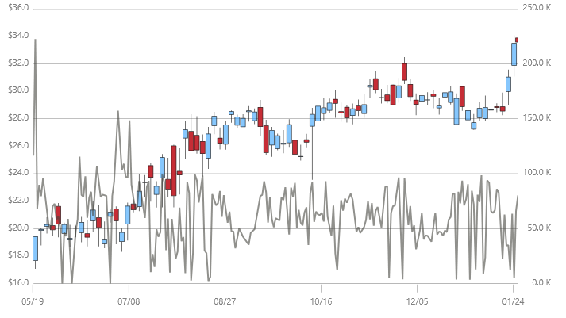

////
|metadata|
{
    "name": "datachart-axis-label-format",
    "controlName": ["{DataChartName}"],
    "tags": ["Application Scenarios","Charting","How Do I"],
    "guid": "d35b5e49-d706-46cb-80e4-f11f244538d1",
    "buildFlags": [],
    "createdOn": "2014-06-05T19:39:00.6003586Z"
}
|metadata|
////

= Configuring Axis Label Format

In the {DataChartName}™ control, axis labels always display simple text without any formatting applied to them. However, you can change the format of axis labels by setting the formatting string to the Axis object’s link:{DataChartLink}.axis{ApiProp}label.html[Label] property. For example, if you are plotting monetary data along y-axis, the default labels will simply display a decimal representation of your monetary values. If you want to display these values with currency symbols, you need to set the Label property such that it uses C format specifier followed by a number specifying decimal precision:

For detailed information on .NET Framework composite format strings please refer to the following online resources:

* link:http://msdn.microsoft.com/en-us/library/dwhawy9k.aspx[Standard Numeric Format Strings]
* link:http://msdn.microsoft.com/en-us/library/az4se3k1(v=VS.100).aspx[Standard Date and Time Format Strings]

The following code example shows how to format labels on CategoryXAxis and NumericYAxis using date fomratting and currency formating:

ifdef::sl,wpf,win-universal[]
.Note:
[NOTE]
====
Curly braces ('{' and '}') in XAML are special characters for markup extensions. If the first value of a string needs to be a curly brace, an empty set of curly braces must be used as an escape sequence. This allows the text following the empty set of curly braces to be taken as a literal value.
====
endif::sl,wpf,win-universal[]

ifdef::sl,wpf,win-universal[]

*In XAML:*

----
<ig:{DataChartName} x:Name="DataChart"   >
    <ig:{DataChartName}.Axes>
        <ig:CategoryXAxis x:Name="commonXAxis" Label="{}{Date:MM/dd}"
                         ItemsSource="{Binding}" >
            <ig:CategoryXAxis.LabelSettings>
                <ig:AxisLabelSettings Location="OutsideBottom"/>
            </ig:CategoryXAxis.LabelSettings>
        </ig:CategoryXAxis>
        <ig:NumericYAxis x:Name="priceYAxis" Label="{}{0:C1}">
            <ig:NumericYAxis.LabelSettings>
                <ig:AxisLabelSettings Location="OutsideLeft"/>
            </ig:NumericYAxis.LabelSettings>
        </ig:NumericYAxis>
        <ig:NumericYAxis x:Name="volumeYAxis" Label="{}{0:#,0} K" >
            <ig:NumericYAxis.LabelSettings>
                <ig:AxisLabelSettings Location="OutsideRight"/>
            </ig:NumericYAxis.LabelSettings>
        </ig:NumericYAxis>
    </ig:{DataChartName}.Axes>
</ig:{DataChartName}>
----

endif::sl,wpf,win-universal[]

ifdef::xamarin[]

*In XAML:*

----
<ig:XFDataChart x:Name="DataChart"   >
    <ig:XFDataChart.Axes>
        <ig:CategoryXAxis x:Name="commonXAxis" Label="Date:MM/dd}
                        LabelLocation="OutsideBottom" ItemsSource="{Binding}" >
        </ig:CategoryXAxis>
        <ig:NumericYAxis x:Name="priceYAxis" Label="0:C1" 
                          LabelLocation="OutsideLeft">
        </ig:NumericYAxis>
        <ig:NumericYAxis x:Name="volumeYAxis"  
                        LabelLocation="OutsideRight">
        </ig:NumericYAxis>
    </ig:XFDataChart.Axes>
</ig:XFDataChart>
----

endif::xamarin[]

ifdef::sl,wpf,win-universal[]

*In C#:*

----
var commonAxis = new CategoryXAxis();
var pricesAxis = new NumericYAxis();
var volumeAxis = new NumericYAxis();
commonAxis.Label = "{Date:MM/dd}";
pricesAxis.Label = "{0:C1}";
volumeAxis.Label = "{0:#,0} K";
----

endif::sl,wpf,win-universal[]

ifdef::xamarin[]

*In C#:*

----
var commonAxis = new CategoryXAxis();
var pricesAxis = new NumericYAxis();
var volumeAxis = new NumericYAxis();
commonAxis.Label = "Date:MM/dd";
commonAxis.FormatLabel += OnCategoryAxisFormatLabel;
// or using an event
string OnCategoryAxisFormatLabel(object sender, object item)
{
    var date = ((DataItem)item).Date;
    return string.Format("{0:MM/dd}", date);
}
pricesAxis.Label = "0:C1";
pricesAxis.FormatLabel += OnPricesAxisFormatLabel;
// or using an event
string OnPricesAxisFormatLabel(object sender, object item)
{
    var value = (double)item;
    return string.Format("{0:C1}", value);
}
volumeAxis.Label = "0:#,0 K";
volumeAxis.FormatLabel += OnVolumeAxisFormatLabel;
// or using an event
string OnVolumeAxisFormatLabel(object sender, object item)
{
    var value = (double)item;
    return string.Format("{0:#,0} K", value);
}
----

endif::xamarin[]

ifdef::win-forms[]

*In C#:*

----
var commonAxis = new CategoryXAxis();
var pricesAxis = new NumericYAxis();
var volumeAxis = new NumericYAxis();
commonAxis.Label = "Date:MM/dd";
commonAxis.FormatLabel += OnCategoryAxisFormatLabel;
// or using an event
string OnCategoryAxisFormatLabel(object sender, object item)
{
    var date = ((DataItem)item).Date;
    return string.Format("{0:MM/dd}", date);
}
pricesAxis.Label = "0:C1";
pricesAxis.FormatLabel += OnPricesAxisFormatLabel;
// or using an event
string OnPricesAxisFormatLabel(object sender, object item)
{
    var value = (double)item;
    return string.Format("{0:C1}", value);
}
volumeAxis.Label = "0:#,0 K";
volumeAxis.FormatLabel += OnVolumeAxisFormatLabel;
// or using an event
string OnVolumeAxisFormatLabel(object sender, object item)
{
    var value = (double)item;
    return string.Format("{0:#,0} K", value);
}
----

endif::win-forms[]

ifdef::sl,wpf,win-universal[]

*In Visual Basic#:*

----
Dim commonAxis As New CategoryXAxis()
Dim pricesAxis As New NumericYAxis()
Dim volumeAxis As New NumericYAxis()
commonAxis.Label = "{Date:MM/dd}"
pricesAxis.Label = "{0:C1}"
volumeAxis.Label = "{0:#,0} K"
----

endif::sl,wpf,win-universal[]

ifdef::win-forms[]

*In Visual Basic:*

----
Dim commonAxis As New CategoryXAxis()
Dim pricesAxis As New NumericYAxis()
Dim volumeAxis As New NumericYAxis()
commonAxis.Label = "Date:MM/dd"
commonAxis.LabelFormat += OnCategoryAxisFormatLabel;
Function OnCategoryAxisFormatLabel(sender As Object, item As Object) As String
    Dim date ((DataItem)item).Date
    Return string.Format("{0:MM/dd}", date)
End Function
pricesAxis.Label = "0:C1"
pricesAxis.LabelFormat += OnPricesAxisFormatLabel
Function OnPricesAxisFormatLabel(sender As Object, item As Object) As String
    Dim value = (CDbl)item
    Return string.Format("{0:C1}", value)
End Function
volumeAxis.Label = "0:#,0 K"
volumeAxis.LabelFormat += OnVolumeAxisFormatLabel
Function OnVolumeAxisFormatLabel(sender As Object, item As Object)
    Dim value = (CDbl)item
    Return string.Format("{0:#,0} K", value)
End Function
----

endif::win-forms[]

ifdef::android[]

*In Java:*

[source,js]
----
CategoryXAxis commonAxis = new CategoryXAxis();
NumericYAxis pricesAxis = new NumericYAxis(); 
NumericYAxis volumeAxis = new NumericYAxis();
commonAxis.setLabel("Date:MM/dd");
pricesAxis.setLabel("0:C1");
volumeAxis.setLabel("0:#,0");
----

endif::android[]

The following image shows how the {DataChartName} control might look with formatted date on CategoryXAxis and formatted currency on NumericYAxis.

== Related Topics:

* link:datachart-axis-label-settings.html[Configuring Axis Label Settings]