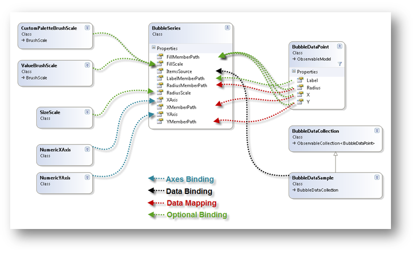
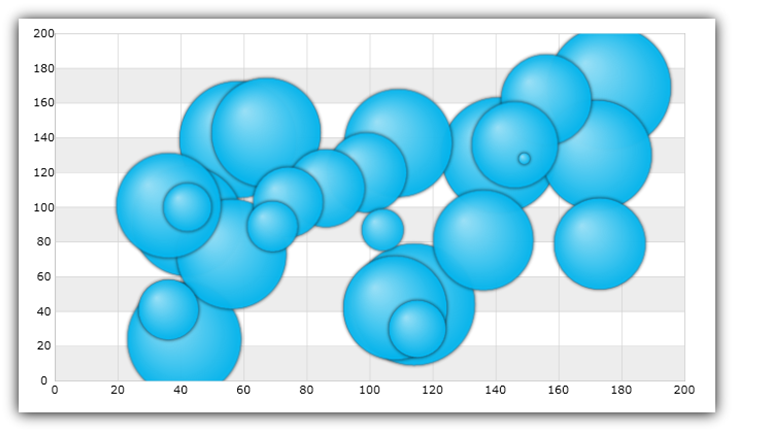
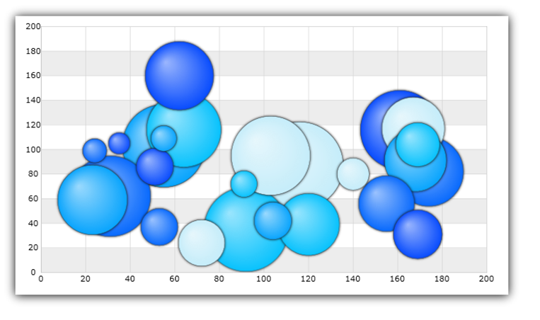
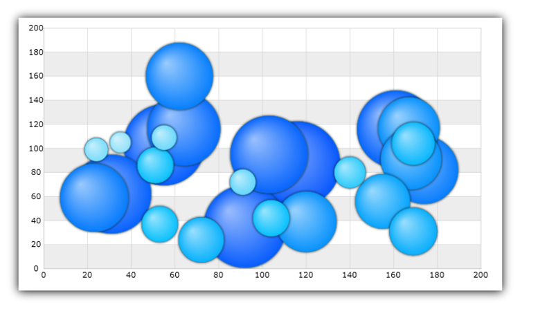

////
|metadata|
{
    "name": "datachart-bubble-series",
    "controlName": ["{DataChartName}"],
    "tags": ["Charting","Data Binding","Data Presentation","Sample Data Source"],
    "guid": "9a664e4b-d479-424c-a3cf-d7d051ff0788",
    "buildFlags": ["wpf,win-universal","ANDROID","WINFORMS"],
    "createdOn": "2014-06-05T19:39:00.5613429Z"
}
|metadata|
////

= Scatter Bubble Series

This topic explains, with code examples, how to use link:{DataChartLink}.bubbleseries.html[BubbleSeries] in the link:{DataChartLink}.{DataChartName}.html[{DataChartName}]™ control. Some important conceptual information is provided as well.

The topic is organized as follows:

* <<Introduction,Introduction>>
* <<DataBinding,Data Binding of the BubbleSeries>>
* <<Features,Features of the BubbleSeries>>

** <<BubbleSizeScaleFeature,The Bubble Size Scale Feature>>
** <<BubbleBrushScaleFeature,The Bubble Brush Scale Feature>>
** <<CustomBrushScale,Custom Brush Scale>>
** <<ValueBrushScale,Value Brush Scale>>

* <<SupportedTypesLegends,Supported Types of Legends>>
* <<RelatedTopics,Related Topics>>

[[Introduction]]
== Introduction

BubbleSeries belongs to a group of link:datachart-scatter-series-overview.html[ItemsSource] pick:[win-forms=" link:{DataChartLink}.series{ApiProp}datasource.html[DataSource]"]  property to bind any data object that implements the IEnumerable interface (e.g. List, Collection, Queue, Stack). However, each item in this object must have one numeric data column (for the size of a bubble) in addition to two numeric data columns (for X and Y values to position a bubble in the Cartesian coordinate system). These data columns are mapped using link:{DataChartLink}.bubbleseries{ApiProp}radiusmemberpath.html[RadiusMemberPath], link:{DataChartLink}.scatterbase{ApiProp}xmemberpath.html[XMemberPath], and link:{DataChartLink}.scatterbase{ApiProp}ymemberpath.html[YMemberPath] properties.

[[DataBinding]]
== Binding Data to the Bubble Series

An example of object that meets the criteria listed above is the BubbleDataSample which you can download from the link:resources-sample-bubble-data.html[Sample Bubble Data] resource and use it in your project. Figure 1 shows a schematic representation of binding data to BubbleSeries in the {DataChartName} control.

ifdef::xaml[]

endif::xaml[]

ifdef::win-forms[]

endif::win-forms[]

Figure 1: Schematic representation of binding data to BubbleSeries in the {DataChartName} control.

This code snippet below demonstrates how to bind sample bubble data to the BubbleSeries.

ifdef::xaml[]

*In XAML:*

----
<ig:{DataChartName} >
    <ig:{DataChartName}.Resources>
        <models:BubbleDataSample x:Key="BubbleDataSample">
            <models:BubbleDataSample.Settings>
                <models:BubbleDataSettings DataPoints="25" XMin="20" XMax="180" YMin="20" YMax="180" 
                                           RadiusMin="15" RadiusMax="100" />
            </models:BubbleDataSample.Settings>
        </models:BubbleDataSample>
    </ig:{DataChartName}.Resources>
    <ig:{DataChartName}.Axes>
        <ig:NumericXAxis x:Name="numericXAxis" MinimumValue="0" MaximumValue="200" Interval="20" />
        <ig:NumericYAxis x:Name="numericYAxis" MinimumValue="0" MaximumValue="200" Interval="20" />
    </ig:{DataChartName}.Axes>
    <ig:{DataChartName}.Series>
        <!-- ========================================================================== -->
        <ig:BubbleSeries ItemsSource="{StaticResource BubbleDataSample}"
                         XAxis="{Binding ElementName=numericXAxis}"
                         YAxis="{Binding ElementName=numericYAxis}"
                         XMemberPath="X" 
                         YMemberPath="Y"
                         RadiusMemberPath="Radius"  >
        </ig:BubbleSeries>
        <!-- ========================================================================== -->
        </ig:{DataChartName}.Series>
</ig:{DataChartName}>
----

endif::xaml[]

ifdef::sl,wpf,win-forms,win-universal,xamarin[]

*In Visual Basic:*

ifdef::sl,wpf,win-universal,xamarin[]
----
Dim bubbleDataSample As New BubbleDataSample()
Dim numericXAxis As New NumericXAxis() With {.Interval = 20, .MinimumValue = 0, .MaximumValue = 200}
Dim numericYAxis As New NumericYAxis() With {.Interval = 20, .MinimumValue = 0, .MaximumValue = 200}
Dim series As New BubbleSeries()
series.XAxis = numericXAxis
series.YAxis = numericYAxis
series.XMemberPath = "X"
series.YMemberPath = "Y"
series.RadiusMemberPath = "Radius"
series.ItemsSource = bubbleDataSampleseries.DataSource = bubbleDataSample
DataChart.Axes.Add(numericXAxis)
DataChart.Axes.Add(numericYAxis)
DataChart.Series.Add(series)
----
endif::sl,wpf,win-universal,xamarin[]

ifdef::win-forms[]
----
Dim bubbleDataSample As New BubbleDataSample()
Dim numericXAxis As New NumericXAxis() With {.Interval = 20, .MinimumValue = 0, .MaximumValue = 200}
Dim numericYAxis As New NumericYAxis() With {.Interval = 20, .MinimumValue = 0, .MaximumValue = 200}
Dim series As New BubbleSeries()
series.XAxis = numericXAxis
series.YAxis = numericYAxis
series.XMemberPath = "X"
series.YMemberPath = "Y"
series.RadiusMemberPath = "Radius"
series.ItemsSource = bubbleDataSampleseries.DataSource = bubbleDataSample
DataChart.Axes.Add(numericXAxis)
DataChart.Axes.Add(numericYAxis)
DataChart.Series.Add(series)
----
endif::win-forms[]

endif::sl,wpf,win-forms,win-universal,xamarin[]

ifdef::sl,wpf,win-forms,win-universal,xamarin[]

*In C#:*

ifdef::sl,wpf,win-universal,xamarin[]
----
var bubbleDataSample = new BubbleDataSample();
var numericXAxis = new NumericXAxis {Interval = 20, MinimumValue = 0, MaximumValue = 200};
var numericYAxis = new NumericYAxis {Interval = 20, MinimumValue = 0, MaximumValue = 200};
var series = new BubbleSeries();
series.XAxis = numericXAxis;
series.YAxis = numericYAxis;
series.XMemberPath = "X";
series.YMemberPath = "Y";
series.RadiusMemberPath = "Radius";
series.ItemsSource = bubbleDataSample;series.DataSource = bubbleDataSample;
DataChart.Axes.Add(numericXAxis);
DataChart.Axes.Add(numericYAxis);
DataChart.Series.Add(series);
----
endif::sl,wpf,win-universal,xamarin[]

ifdef::win-forms[]
----
var bubbleDataSample = new BubbleDataSample();
var numericXAxis = new NumericXAxis {Interval = 20, MinimumValue = 0, MaximumValue = 200};
var numericYAxis = new NumericYAxis {Interval = 20, MinimumValue = 0, MaximumValue = 200};
var series = new BubbleSeries();
series.XAxis = numericXAxis;
series.YAxis = numericYAxis;
series.XMemberPath = "X";
series.YMemberPath = "Y";
series.RadiusMemberPath = "Radius";
series.ItemsSource = bubbleDataSample;series.DataSource = bubbleDataSample;
DataChart.Axes.Add(numericXAxis);
DataChart.Axes.Add(numericYAxis);
DataChart.Series.Add(series);
----
endif::win-forms[]

endif::sl,wpf,win-forms,win-universal,xamarin[]

ifdef::android[]

*In Java:*

[source,js]
----
BubbleDataSample data = new BubbleDataSample();
NumericYAxis yAxis = new NumericYAxis();
NumericXAxis xAxis = new NumericXAxis();
BubbleSeries series = new BubbleSeries();
series.setXAxis(xAxis);
series.setYAxis(yAxis);
series.setXMemberPath("X");
series.setYMemberPath("Y");
series.setRadiusMemberPath("Radius");
series.setDataSource(data);
chart.addAxis(xAxis);
chart.addAxis(yAxis);
chart.addSeries(series);
----

endif::android[]

image::images/xamDataChart_Scatter_Bubble_Series_02.png[]

Figure 2: Sample implementation of the binding data with varius bubble sizes to Bubble Series

[[Features]]
== Features of the BubbleSeries

[[BubbleSizeScaleFeature]]
== The Bubble Size Scale Feature

=== Overview

Bubble Size Scale is an optional feature of BubbleSeries that determines the sizes of bubbles though the link:{DataChartLink}.bubbleseries{ApiProp}radiusscale.html[RadiusScale] property of the series. This feature is implemented through the link:{DataChartLink}.sizescale.html[SizeScale] object. When the radius scale is set, the smallest bubble will be equal to link:{DataChartLink}.sizescale{ApiProp}minimumvalue.html[MinimumValue], the largest bubble will be equal to link:{DataChartLink}.sizescale{ApiProp}maximumvalue.html[MaximumValue], and all the remaining bubbles will be scaled accordingly. The size scale can be either linear or logarithmic. When the radius scale is not set, each bubble’s size is equal to the value of the RadiusMemberPath column.

Figure 3: Sample implementation of the Bubble Size Scale

=== Code Example

This code snippet demonstrates how to scale size of bubbles in the BubbleSeries using SizeScale object.

ifdef::xaml[]

*In XAML:*

----
<ig:BubbleSeries XAxis="{Binding ElementName=numericXAxis}"
                 YAxis="{Binding ElementName=numericYAxis}"
                 XMemberPath="X" 
                 YMemberPath="Y"
                 RadiusMemberPath="Radius" 
                 ItemsSource="{StaticResource bubbleDataSample}" >
    <!-- ========================================================================== -->
    <ig:BubbleSeries.RadiusScale>
        <ig:SizeScale IsLogarithmic=" MaximumValue="120" MinimumValue="20"/>
    </ig:BubbleSeries.RadiusScale>
    <!-- ========================================================================== -->
</ig:BubbleSeries>
----

endif::xaml[]

ifdef::sl[]

*In Visual Basic:*

----
Dim sizeScale As New SizeScale()
sizeScale.IsLogarithmic = False
sizeScale.MinimumValue = 20
sizeScale.MaximumValue = 120
Dim series As New BubbleSeries()
series.RadiusMemberPath = "Radius"
series.RadiusScale = sizeScale
----

endif::sl[]

ifdef::wpf[]

*In Visual Basic:*

----
Dim sizeScale As New SizeScale()
sizeScale.IsLogarithmic = False
sizeScale.MinimumValue = 20
sizeScale.MaximumValue = 120
Dim series As New BubbleSeries()
series.RadiusMemberPath = "Radius"
series.RadiusScale = sizeScale
----

endif::wpf[]

ifdef::win-forms[]

*In Visual Basic:*

----
Dim sizeScale As New SizeScale()
sizeScale.IsLogarithmic = False
sizeScale.MinimumValue = 20
sizeScale.MaximumValue = 120
Dim series As New BubbleSeries()
series.RadiusMemberPath = "Radius"
series.RadiusScale = sizeScale
----

endif::win-forms[]

ifdef::win-universal[]

*In Visual Basic:*

----
Dim sizeScale As New SizeScale()
sizeScale.IsLogarithmic = False
sizeScale.MinimumValue = 20
sizeScale.MaximumValue = 120
Dim series As New BubbleSeries()
series.RadiusMemberPath = "Radius"
series.RadiusScale = sizeScale
----

endif::win-universal[]

ifdef::xamarin[]

*In Visual Basic:*

----
Dim sizeScale As New SizeScale()
sizeScale.IsLogarithmic = False
sizeScale.MinimumValue = 20
sizeScale.MaximumValue = 120
Dim series As New BubbleSeries()
series.RadiusMemberPath = "Radius"
series.RadiusScale = sizeScale
----

endif::xamarin[]

ifdef::sl[]

*In C#:*

----
SizeScale sizeScale = new SizeScale();
sizeScale.IsLogarithmic = false;
sizeScale.MinimumValue = 20;
sizeScale.MaximumValue = 120;
BubbleSeries series = new BubbleSeries();
series.RadiusMemberPath = "Radius";
series.RadiusScale = sizeScale;
----

endif::sl[]

ifdef::wpf[]

*In C#:*

----
SizeScale sizeScale = new SizeScale();
sizeScale.IsLogarithmic = false;
sizeScale.MinimumValue = 20;
sizeScale.MaximumValue = 120;
BubbleSeries series = new BubbleSeries();
series.RadiusMemberPath = "Radius";
series.RadiusScale = sizeScale;
----

endif::wpf[]

ifdef::win-forms[]

*In C#:*

----
SizeScale sizeScale = new SizeScale();
sizeScale.IsLogarithmic = false;
sizeScale.MinimumValue = 20;
sizeScale.MaximumValue = 120;
BubbleSeries series = new BubbleSeries();
series.RadiusMemberPath = "Radius";
series.RadiusScale = sizeScale;
----

endif::win-forms[]

ifdef::win-universal[]

*In C#:*

----
SizeScale sizeScale = new SizeScale();
sizeScale.IsLogarithmic = false;
sizeScale.MinimumValue = 20;
sizeScale.MaximumValue = 120;
BubbleSeries series = new BubbleSeries();
series.RadiusMemberPath = "Radius";
series.RadiusScale = sizeScale;
----

endif::win-universal[]

ifdef::xamarin[]

*In C#:*

----
SizeScale sizeScale = new SizeScale();
sizeScale.IsLogarithmic = false;
sizeScale.MinimumValue = 20;
sizeScale.MaximumValue = 120;
BubbleSeries series = new BubbleSeries();
series.RadiusMemberPath = "Radius";
series.RadiusScale = sizeScale;
----

endif::xamarin[]

[[BubbleBrushScaleFeature]]
== The Bubble Brush Scale Feature

The Bubble Brush Scale is an optional feature which determines the color pattern within a single BubbleSeries though the series object’s link:{DataChartLink}.bubbleseries{ApiProp}fillscale.html[FillScale] property. BubbleSeries support the following brush scales:

* Custom Brush Scale
* Value Brush Scale

Each scale has a collection of brushes which defines color pattern. The scales are explained in the sub-sections that follow.

[[CustomBrushScale]]
=== Custom Brush Scale

==== Overview

link:{DataChartLink}.custompalettebrushscale.html[CustomPaletteBrushScale] uses the index of a bubble marker to select a brush from the link:{DataChartLink}.brushscale{ApiProp}brushes.html[Brushes] collection. When the link:{DataChartLink}.custompalettebrushscale{ApiProp}brushselectionmode.html[BrushSelectionMode] property is set to the link:{DataChartLink}.brushselectionmode.html[Select] enumerable value, the bubbles are colored sequentially. When BrushSelectionMode is set to link:{DataChartLink}.brushselectionmode.html[Interpolate], the brush is interpolated based on the bubble’s index and the number of brushes in the collection.

Figure 4: Sample implementation of the Custom Brush Scale

==== Code Example

This code snippet demonstrates how to fill the color of the bubbles in the BubbleSeries using CustomPaletteBrushScale object.

ifdef::xaml[]

*In XAML:*

----
xmlns:ig="http://schemas.infragistics.com/xaml"
xmlns:igCommon="http://schemas.infragistics.com/xaml"
----

endif::xaml[]

ifdef::xaml[]

*In XAML:*

----
<ig:BubbleSeries XAxis="{Binding ElementName=numericXAxis}"
                 YAxis="{Binding ElementName=numericYAxis}"
                 ItemsSource="{StaticResource bubbleDataSample}" 
                 XMemberPath="X" 
                 YMemberPath="Y"
                 RadiusMemberPath="Radius">
    <!-- ========================================================================== -->
    <ig:BubbleSeries.FillScale>
        <ig:CustomPaletteBrushScale BrushSelectionMode="Interpolate">
            <ig:CustomPaletteBrushScale.Brushes>
                <igCommon:BrushCollection>
                    <SolidColorBrush Color="#FFC6EEFB" />
                    <SolidColorBrush Color="#FF08C3FE" />
                    <SolidColorBrush Color="#FF08A5FE" />
                    <SolidColorBrush Color="#FF086AFE" />
                    <SolidColorBrush Color="#FF084CFE" />
                </igCommon:BrushCollection>
            </ig:CustomPaletteBrushScale.Brushes>
        </ig:CustomPaletteBrushScale>
    </ig:BubbleSeries.FillScale>
    <!-- ========================================================================== -->
</ig:BubbleSeries>
----

endif::xaml[]

ifdef::sl[]

*In Visual Basic:*

----
Dim brushCollection As New BrushCollection()
brushCollection.Add(New SolidColorBrush(Color.FromArgb(&HFF, &HC6, &HEE, &HFB)))
brushCollection.Add(New SolidColorBrush(Color.FromArgb(&HFF, &H8, &HC3, &HFE)))
brushCollection.Add(New SolidColorBrush(Color.FromArgb(&HFF, &H8, &HA5, &HFE)))
brushCollection.Add(New SolidColorBrush(Color.FromArgb(&HFF, &H8, &H6A, &HFE)))
brushCollection.Add(New SolidColorBrush(Color.FromArgb(&HFF, &H8, &H4C, &HFE)))
Dim brushScale As New CustomPaletteBrushScale()
brushScale.BrushSelectionMode = BrushSelectionMode.Interpolate
brushScale.Brushes = brushCollection
Dim series As New BubbleSeries()
series.FillScale = brushScale
----

endif::sl[]

ifdef::wpf[]

*In Visual Basic:*

----
Dim brushCollection As New BrushCollection()
brushCollection.Add(New SolidColorBrush(Color.FromArgb(&HFF, &HC6, &HEE, &HFB)))
brushCollection.Add(New SolidColorBrush(Color.FromArgb(&HFF, &H8, &HC3, &HFE)))
brushCollection.Add(New SolidColorBrush(Color.FromArgb(&HFF, &H8, &HA5, &HFE)))
brushCollection.Add(New SolidColorBrush(Color.FromArgb(&HFF, &H8, &H6A, &HFE)))
brushCollection.Add(New SolidColorBrush(Color.FromArgb(&HFF, &H8, &H4C, &HFE)))
Dim brushScale As New CustomPaletteBrushScale()
brushScale.BrushSelectionMode = BrushSelectionMode.Interpolate
brushScale.Brushes = brushCollection
Dim series As New BubbleSeries()
series.FillScale = brushScale
----

endif::wpf[]

ifdef::win-forms[]

*In Visual Basic:*

----
Dim brushCollection As New BrushCollection()
brushCollection.Add(New SolidColorBrush(Color.FromArgb(&HFF, &HC6, &HEE, &HFB)))
brushCollection.Add(New SolidColorBrush(Color.FromArgb(&HFF, &H8, &HC3, &HFE)))
brushCollection.Add(New SolidColorBrush(Color.FromArgb(&HFF, &H8, &HA5, &HFE)))
brushCollection.Add(New SolidColorBrush(Color.FromArgb(&HFF, &H8, &H6A, &HFE)))
brushCollection.Add(New SolidColorBrush(Color.FromArgb(&HFF, &H8, &H4C, &HFE)))
Dim brushScale As New CustomPaletteBrushScale()
brushScale.BrushSelectionMode = BrushSelectionMode.Interpolate
brushScale.Brushes = brushCollection
Dim series As New BubbleSeries()
series.FillScale = brushScale
----

endif::win-forms[]

ifdef::win-universal[]

*In Visual Basic:*

----
Dim brushCollection As New BrushCollection()
brushCollection.Add(New SolidColorBrush(Color.FromArgb(&HFF, &HC6, &HEE, &HFB)))
brushCollection.Add(New SolidColorBrush(Color.FromArgb(&HFF, &H8, &HC3, &HFE)))
brushCollection.Add(New SolidColorBrush(Color.FromArgb(&HFF, &H8, &HA5, &HFE)))
brushCollection.Add(New SolidColorBrush(Color.FromArgb(&HFF, &H8, &H6A, &HFE)))
brushCollection.Add(New SolidColorBrush(Color.FromArgb(&HFF, &H8, &H4C, &HFE)))
Dim brushScale As New CustomPaletteBrushScale()
brushScale.BrushSelectionMode = BrushSelectionMode.Interpolate
brushScale.Brushes = brushCollection
Dim series As New BubbleSeries()
series.FillScale = brushScale
----

endif::win-universal[]

ifdef::xamarin[]

*In Visual Basic:*

----
Dim brushCollection As New BrushCollection()
brushCollection.Add(New SolidColorBrush(Color.FromArgb(&HFF, &HC6, &HEE, &HFB)))
brushCollection.Add(New SolidColorBrush(Color.FromArgb(&HFF, &H8, &HC3, &HFE)))
brushCollection.Add(New SolidColorBrush(Color.FromArgb(&HFF, &H8, &HA5, &HFE)))
brushCollection.Add(New SolidColorBrush(Color.FromArgb(&HFF, &H8, &H6A, &HFE)))
brushCollection.Add(New SolidColorBrush(Color.FromArgb(&HFF, &H8, &H4C, &HFE)))
Dim brushScale As New CustomPaletteBrushScale()
brushScale.BrushSelectionMode = BrushSelectionMode.Interpolate
brushScale.Brushes = brushCollection
Dim series As New BubbleSeries()
series.FillScale = brushScale
----

endif::xamarin[]

ifdef::sl[]

*In C#:*

----
BrushCollection brushCollection = new BrushCollection();
brushCollection.Add(new SolidColorBrush(Color.FromArgb(0xFF, 0xC6, 0xEE, 0xFB)));
brushCollection.Add(new SolidColorBrush(Color.FromArgb(0xFF, 0x08, 0xC3, 0xFE)));
brushCollection.Add(new SolidColorBrush(Color.FromArgb(0xFF, 0x08, 0xA5, 0xFE)));
brushCollection.Add(new SolidColorBrush(Color.FromArgb(0xFF, 0x08, 0x6A, 0xFE)));
brushCollection.Add(new SolidColorBrush(Color.FromArgb(0xFF, 0x08, 0x4C, 0xFE)));
CustomPaletteBrushScale brushScale = new CustomPaletteBrushScale();
brushScale.BrushSelectionMode = BrushSelectionMode.Interpolate;
brushScale.Brushes = brushCollection;
BubbleSeries series = new BubbleSeries();
series.FillScale = brushScale;
----

endif::sl[]

ifdef::wpf[]

*In C#:*

----
BrushCollection brushCollection = new BrushCollection();
brushCollection.Add(new SolidColorBrush(Color.FromArgb(0xFF, 0xC6, 0xEE, 0xFB)));
brushCollection.Add(new SolidColorBrush(Color.FromArgb(0xFF, 0x08, 0xC3, 0xFE)));
brushCollection.Add(new SolidColorBrush(Color.FromArgb(0xFF, 0x08, 0xA5, 0xFE)));
brushCollection.Add(new SolidColorBrush(Color.FromArgb(0xFF, 0x08, 0x6A, 0xFE)));
brushCollection.Add(new SolidColorBrush(Color.FromArgb(0xFF, 0x08, 0x4C, 0xFE)));
CustomPaletteBrushScale brushScale = new CustomPaletteBrushScale();
brushScale.BrushSelectionMode = BrushSelectionMode.Interpolate;
brushScale.Brushes = brushCollection;
BubbleSeries series = new BubbleSeries();
series.FillScale = brushScale;
----

endif::wpf[]

ifdef::win-forms[]

*In C#:*

----
BrushCollection brushCollection = new BrushCollection();
brushCollection.Add(new SolidColorBrush(Color.FromArgb(0xFF, 0xC6, 0xEE, 0xFB)));
brushCollection.Add(new SolidColorBrush(Color.FromArgb(0xFF, 0x08, 0xC3, 0xFE)));
brushCollection.Add(new SolidColorBrush(Color.FromArgb(0xFF, 0x08, 0xA5, 0xFE)));
brushCollection.Add(new SolidColorBrush(Color.FromArgb(0xFF, 0x08, 0x6A, 0xFE)));
brushCollection.Add(new SolidColorBrush(Color.FromArgb(0xFF, 0x08, 0x4C, 0xFE)));
CustomPaletteBrushScale brushScale = new CustomPaletteBrushScale();
brushScale.BrushSelectionMode = BrushSelectionMode.Interpolate;
brushScale.Brushes = brushCollection;
BubbleSeries series = new BubbleSeries();
series.FillScale = brushScale;
----

endif::win-forms[]

ifdef::win-universal[]

*In C#:*

----
BrushCollection brushCollection = new BrushCollection();
brushCollection.Add(new SolidColorBrush(Color.FromArgb(0xFF, 0xC6, 0xEE, 0xFB)));
brushCollection.Add(new SolidColorBrush(Color.FromArgb(0xFF, 0x08, 0xC3, 0xFE)));
brushCollection.Add(new SolidColorBrush(Color.FromArgb(0xFF, 0x08, 0xA5, 0xFE)));
brushCollection.Add(new SolidColorBrush(Color.FromArgb(0xFF, 0x08, 0x6A, 0xFE)));
brushCollection.Add(new SolidColorBrush(Color.FromArgb(0xFF, 0x08, 0x4C, 0xFE)));
CustomPaletteBrushScale brushScale = new CustomPaletteBrushScale();
brushScale.BrushSelectionMode = BrushSelectionMode.Interpolate;
brushScale.Brushes = brushCollection;
BubbleSeries series = new BubbleSeries();
series.FillScale = brushScale;
----

endif::win-universal[]

ifdef::xamarin[]

*In C#:*

----
BrushCollection brushCollection = new BrushCollection();
brushCollection.Add(new SolidColorBrush(Color.FromArgb(0xFF, 0xC6, 0xEE, 0xFB)));
brushCollection.Add(new SolidColorBrush(Color.FromArgb(0xFF, 0x08, 0xC3, 0xFE)));
brushCollection.Add(new SolidColorBrush(Color.FromArgb(0xFF, 0x08, 0xA5, 0xFE)));
brushCollection.Add(new SolidColorBrush(Color.FromArgb(0xFF, 0x08, 0x6A, 0xFE)));
brushCollection.Add(new SolidColorBrush(Color.FromArgb(0xFF, 0x08, 0x4C, 0xFE)));
CustomPaletteBrushScale brushScale = new CustomPaletteBrushScale();
brushScale.BrushSelectionMode = BrushSelectionMode.Interpolate;
brushScale.Brushes = brushCollection;
BubbleSeries series = new BubbleSeries();
series.FillScale = brushScale;
----

endif::xamarin[]

[[ValueBrushScale]]
=== Value Brush Scale

==== Overview

link:{DataChartLink}.valuebrushscale.html[ValueBrushScale] uses a set of values from one of the numeric columns in the ItemsSource to determine an interpolated brush for bubbles. The column is specified with link:{DataChartLink}.bubbleseries{ApiProp}fillmemberpath.html[FillMemberPath] property. This axis scale can be linear or logarithmic. Also, it can have user-specified link:{DataChartLink}.valuebrushscale{ApiProp}minimumvalue.html[MinimumValue] and link:{DataChartLink}.valuebrushscale{ApiProp}maximumvalue.html[MaximumValue]. When a range is set on this scale, bubbles with values that fall outside the range do not get a brush from the link:{DataChartLink}.brushscale{ApiProp}brushes.html[Brushes] collection and are not colored.

Figure 5: Sample implementation of the Value Brush Scale

==== Code Example

This code snippet demonstrates how to fill the color of the bubbles in the BubbleSeries using ValueBrushScale object.

ifdef::xaml[]

*In XAML:*

----
xmlns:ig="http://schemas.infragistics.com/xaml"
xmlns:igCommon="http://schemas.infragistics.com/xaml"
----

endif::xaml[]

ifdef::xaml[]

*In XAML:*

----
<ig:BubbleSeries XAxis="{Binding ElementName=numericXAxis}"
                 YAxis="{Binding ElementName=numericYAxis}"
                 ItemsSource="{StaticResource bubbleDataSample}" 
                 XMemberPath="X" 
                 YMemberPath="Y"
                 RadiusMemberPath="Radius"
                 FillMemberPath="Radius">
    <!-- ========================================================================== -->
    <ig:BubbleSeries.FillScale>
        <ig:ValueBrushScale IsLogarithmic=" MaximumValue="200" MinimumValue="5">
            <ig:ValueBrushScale.Brushes>
                <igCommon:BrushCollection>
                    <SolidColorBrush Color="#FFC6EEFB" />
                    <SolidColorBrush Color="#FF08C3FE" />
                    <SolidColorBrush Color="#FF08A5FE" />
                    <SolidColorBrush Color="#FF086AFE" />
                    <SolidColorBrush Color="#FF084CFE" />
                </igCommon:BrushCollection>
            </ig:ValueBrushScale.Brushes>
        </ig:ValueBrushScale>
    </ig:BubbleSeries.FillScale>
    <!-- ========================================================================== -->
</ig:BubbleSeries>
----

endif::xaml[]

ifdef::sl[]

*In Visual Basic:*

----
Dim brushCollection As New BrushCollection()
brushCollection.Add(New SolidColorBrush(Color.FromArgb(&HFF, &HC6, &HEE, &HFB)))
brushCollection.Add(New SolidColorBrush(Color.FromArgb(&HFF, &H8, &HC3, &HFE)))
brushCollection.Add(New SolidColorBrush(Color.FromArgb(&HFF, &H8, &HA5, &HFE)))
brushCollection.Add(New SolidColorBrush(Color.FromArgb(&HFF, &H8, &H6A, &HFE)))
brushCollection.Add(New SolidColorBrush(Color.FromArgb(&HFF, &H8, &H4C, &HFE)))
Dim brushScale As New ValueBrushScale()
brushScale.Brushes = brushCollection
brushScale.IsLogarithmic = False
brushScale.MinimumValue = 5
brushScale.MaximumValue = 200
Dim series As New BubbleSeries()
series.FillMemberPath = "Radius"
series.FillScale = brushScale
----

endif::sl[]

ifdef::wpf[]

*In Visual Basic:*

----
Dim brushCollection As New BrushCollection()
brushCollection.Add(New SolidColorBrush(Color.FromArgb(&HFF, &HC6, &HEE, &HFB)))
brushCollection.Add(New SolidColorBrush(Color.FromArgb(&HFF, &H8, &HC3, &HFE)))
brushCollection.Add(New SolidColorBrush(Color.FromArgb(&HFF, &H8, &HA5, &HFE)))
brushCollection.Add(New SolidColorBrush(Color.FromArgb(&HFF, &H8, &H6A, &HFE)))
brushCollection.Add(New SolidColorBrush(Color.FromArgb(&HFF, &H8, &H4C, &HFE)))
Dim brushScale As New ValueBrushScale()
brushScale.Brushes = brushCollection
brushScale.IsLogarithmic = False
brushScale.MinimumValue = 5
brushScale.MaximumValue = 200
Dim series As New BubbleSeries()
series.FillMemberPath = "Radius"
series.FillScale = brushScale
----

endif::wpf[]

ifdef::win-forms[]

*In Visual Basic:*

----
Dim brushCollection As New BrushCollection()
brushCollection.Add(New SolidColorBrush(Color.FromArgb(&HFF, &HC6, &HEE, &HFB)))
brushCollection.Add(New SolidColorBrush(Color.FromArgb(&HFF, &H8, &HC3, &HFE)))
brushCollection.Add(New SolidColorBrush(Color.FromArgb(&HFF, &H8, &HA5, &HFE)))
brushCollection.Add(New SolidColorBrush(Color.FromArgb(&HFF, &H8, &H6A, &HFE)))
brushCollection.Add(New SolidColorBrush(Color.FromArgb(&HFF, &H8, &H4C, &HFE)))
Dim brushScale As New ValueBrushScale()
brushScale.Brushes = brushCollection
brushScale.IsLogarithmic = False
brushScale.MinimumValue = 5
brushScale.MaximumValue = 200
Dim series As New BubbleSeries()
series.FillMemberPath = "Radius"
series.FillScale = brushScale
----

endif::win-forms[]

ifdef::win-universal[]

*In Visual Basic:*

----
Dim brushCollection As New BrushCollection()
brushCollection.Add(New SolidColorBrush(Color.FromArgb(&HFF, &HC6, &HEE, &HFB)))
brushCollection.Add(New SolidColorBrush(Color.FromArgb(&HFF, &H8, &HC3, &HFE)))
brushCollection.Add(New SolidColorBrush(Color.FromArgb(&HFF, &H8, &HA5, &HFE)))
brushCollection.Add(New SolidColorBrush(Color.FromArgb(&HFF, &H8, &H6A, &HFE)))
brushCollection.Add(New SolidColorBrush(Color.FromArgb(&HFF, &H8, &H4C, &HFE)))
Dim brushScale As New ValueBrushScale()
brushScale.Brushes = brushCollection
brushScale.IsLogarithmic = False
brushScale.MinimumValue = 5
brushScale.MaximumValue = 200
Dim series As New BubbleSeries()
series.FillMemberPath = "Radius"
series.FillScale = brushScale
----

endif::win-universal[]

ifdef::xamarin[]

*In Visual Basic:*

----
Dim brushCollection As New BrushCollection()
brushCollection.Add(New SolidColorBrush(Color.FromArgb(&HFF, &HC6, &HEE, &HFB)))
brushCollection.Add(New SolidColorBrush(Color.FromArgb(&HFF, &H8, &HC3, &HFE)))
brushCollection.Add(New SolidColorBrush(Color.FromArgb(&HFF, &H8, &HA5, &HFE)))
brushCollection.Add(New SolidColorBrush(Color.FromArgb(&HFF, &H8, &H6A, &HFE)))
brushCollection.Add(New SolidColorBrush(Color.FromArgb(&HFF, &H8, &H4C, &HFE)))
Dim brushScale As New ValueBrushScale()
brushScale.Brushes = brushCollection
brushScale.IsLogarithmic = False
brushScale.MinimumValue = 5
brushScale.MaximumValue = 200
Dim series As New BubbleSeries()
series.FillMemberPath = "Radius"
series.FillScale = brushScale
----

endif::xamarin[]

ifdef::sl[]

*In C#:*

----
BrushCollection brushCollection = new BrushCollection();
brushCollection.Add(new SolidColorBrush(Color.FromArgb(0xFF, 0xC6, 0xEE, 0xFB)));
brushCollection.Add(new SolidColorBrush(Color.FromArgb(0xFF, 0x08, 0xC3, 0xFE)));
brushCollection.Add(new SolidColorBrush(Color.FromArgb(0xFF, 0x08, 0xA5, 0xFE)));
brushCollection.Add(new SolidColorBrush(Color.FromArgb(0xFF, 0x08, 0x6A, 0xFE)));
brushCollection.Add(new SolidColorBrush(Color.FromArgb(0xFF, 0x08, 0x4C, 0xFE)));
ValueBrushScale brushScale = new ValueBrushScale();
brushScale.Brushes = brushCollection;
brushScale.IsLogarithmic = false;
brushScale.MinimumValue = 5;
brushScale.MaximumValue = 200;
BubbleSeries series = new BubbleSeries();
series.FillMemberPath = "Radius";
series.FillScale = brushScale;
----

endif::sl[]

ifdef::wpf[]

*In C#:*

----
BrushCollection brushCollection = new BrushCollection();
brushCollection.Add(new SolidColorBrush(Color.FromArgb(0xFF, 0xC6, 0xEE, 0xFB)));
brushCollection.Add(new SolidColorBrush(Color.FromArgb(0xFF, 0x08, 0xC3, 0xFE)));
brushCollection.Add(new SolidColorBrush(Color.FromArgb(0xFF, 0x08, 0xA5, 0xFE)));
brushCollection.Add(new SolidColorBrush(Color.FromArgb(0xFF, 0x08, 0x6A, 0xFE)));
brushCollection.Add(new SolidColorBrush(Color.FromArgb(0xFF, 0x08, 0x4C, 0xFE)));
ValueBrushScale brushScale = new ValueBrushScale();
brushScale.Brushes = brushCollection;
brushScale.IsLogarithmic = false;
brushScale.MinimumValue = 5;
brushScale.MaximumValue = 200;
BubbleSeries series = new BubbleSeries();
series.FillMemberPath = "Radius";
series.FillScale = brushScale;
----

endif::wpf[]

ifdef::win-forms[]

*In C#:*

----
BrushCollection brushCollection = new BrushCollection();
brushCollection.Add(new SolidColorBrush(Color.FromArgb(0xFF, 0xC6, 0xEE, 0xFB)));
brushCollection.Add(new SolidColorBrush(Color.FromArgb(0xFF, 0x08, 0xC3, 0xFE)));
brushCollection.Add(new SolidColorBrush(Color.FromArgb(0xFF, 0x08, 0xA5, 0xFE)));
brushCollection.Add(new SolidColorBrush(Color.FromArgb(0xFF, 0x08, 0x6A, 0xFE)));
brushCollection.Add(new SolidColorBrush(Color.FromArgb(0xFF, 0x08, 0x4C, 0xFE)));
ValueBrushScale brushScale = new ValueBrushScale();
brushScale.Brushes = brushCollection;
brushScale.IsLogarithmic = false;
brushScale.MinimumValue = 5;
brushScale.MaximumValue = 200;
BubbleSeries series = new BubbleSeries();
series.FillMemberPath = "Radius";
series.FillScale = brushScale;
----

endif::win-forms[]

ifdef::win-universal[]

*In C#:*

----
BrushCollection brushCollection = new BrushCollection();
brushCollection.Add(new SolidColorBrush(Color.FromArgb(0xFF, 0xC6, 0xEE, 0xFB)));
brushCollection.Add(new SolidColorBrush(Color.FromArgb(0xFF, 0x08, 0xC3, 0xFE)));
brushCollection.Add(new SolidColorBrush(Color.FromArgb(0xFF, 0x08, 0xA5, 0xFE)));
brushCollection.Add(new SolidColorBrush(Color.FromArgb(0xFF, 0x08, 0x6A, 0xFE)));
brushCollection.Add(new SolidColorBrush(Color.FromArgb(0xFF, 0x08, 0x4C, 0xFE)));
ValueBrushScale brushScale = new ValueBrushScale();
brushScale.Brushes = brushCollection;
brushScale.IsLogarithmic = false;
brushScale.MinimumValue = 5;
brushScale.MaximumValue = 200;
BubbleSeries series = new BubbleSeries();
series.FillMemberPath = "Radius";
series.FillScale = brushScale;
----

endif::win-universal[]

ifdef::xamarin[]

*In C#:*

----
BrushCollection brushCollection = new BrushCollection();
brushCollection.Add(new SolidColorBrush(Color.FromArgb(0xFF, 0xC6, 0xEE, 0xFB)));
brushCollection.Add(new SolidColorBrush(Color.FromArgb(0xFF, 0x08, 0xC3, 0xFE)));
brushCollection.Add(new SolidColorBrush(Color.FromArgb(0xFF, 0x08, 0xA5, 0xFE)));
brushCollection.Add(new SolidColorBrush(Color.FromArgb(0xFF, 0x08, 0x6A, 0xFE)));
brushCollection.Add(new SolidColorBrush(Color.FromArgb(0xFF, 0x08, 0x4C, 0xFE)));
ValueBrushScale brushScale = new ValueBrushScale();
brushScale.Brushes = brushCollection;
brushScale.IsLogarithmic = false;
brushScale.MinimumValue = 5;
brushScale.MaximumValue = 200;
BubbleSeries series = new BubbleSeries();
series.FillMemberPath = "Radius";
series.FillScale = brushScale;
----

endif::xamarin[]

[[SupportedTypesLegends]]
== Supported Types of Legends

The BubbleSeries supports the following types of legends:

** link:datachart-configuring-basiclegend.html[Basic Legend] 
** link:datachart-configuring-scalelegend.html[Scale Legend] 
** link:datachart-configuring-itemlegend.html[Item Legend]

For details on the supported legends and how to use them with BubbleSeries, refer to the link:datachart-legends.html[Chart Legends] topic.

[[RelatedTopics]]
== Related Topics

** link:datachart-axes.html[Chart Axes]
** link:datachart-legends.html[Chart Legends]
** link:datachart-series-requirements.html[Series Requirements]
** link:datachart-scatter-series-overview.html[Scatter Series]