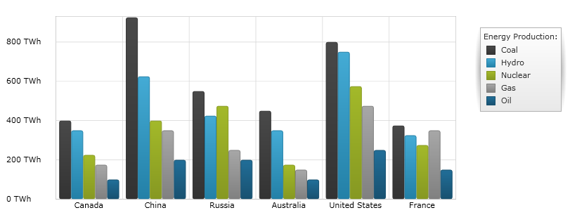
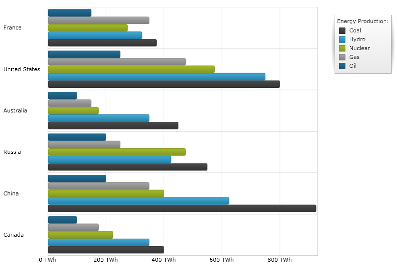
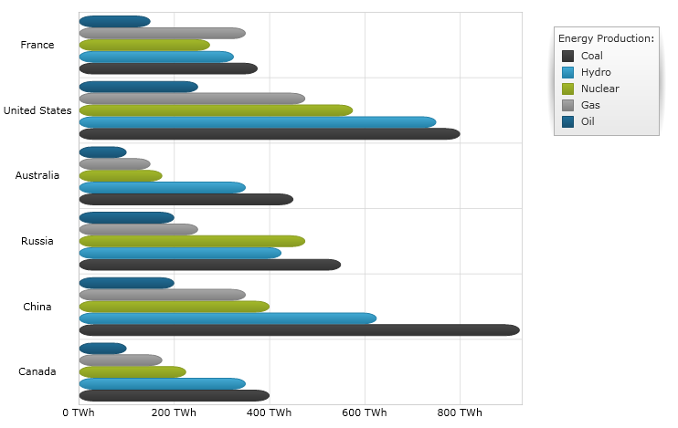

////
|metadata|
{
    "name": "datachart-category-bar-series",
    "controlName": ["{DataChartName}"],
    "tags": ["Charting","Data Presentation","Getting Started","How Do I"],
    "guid": "34c49a0d-810b-4d87-9e26-ba80cb5ff3e3",
    "buildFlags": [],
    "createdOn": "2014-06-05T19:39:00.4072781Z"
}
|metadata|
////

= Bar Series

This topic explains, with code example, how to use the link:{DataChartLink}.barseries.html[BarSeries] in the link:{DataChartLink}.{DataChartName}.html[{DataChartName}]™ control.

== Overview

The topic is organized as follows:

* <<Introduction,Introduction>>
* <<SeriesPreview,Series Preview>>
* <<SeriesRecommendations,Series Recommendations>>
* <<DataRequirements,Data Requirements>>
* <<DataRenderingRules,Data Rendering Rules>>
* <<Examples,Examples>>

** Data Binding
** Corners of Bar Series

* <<RelatedTopics,Related Topics>>

== Introduction

Bar Series belongs to a group of link:datachart-category-series-overview.html[Category Series] and it is rendered using a collection of rectangles that extend from the left to right of the chart towards the values of data points. Bar Series uses the same concepts of data plotting as Column Series but data points are stretched along a vertical line (y-axis) rather than horizontal line (x-axis). In other words, the link:{DataChartLink}.barseries.html[BarSeries] is rendered like the link:{DataChartLink}.columnseries.html[ColumnSeries] but with 90 degrees clockwise rotation. For more conceptual information and comprehension with other types of series and supported types of axes, refer to the link:datachart-category-series-overview.html[Category Series] and link:datachart-axes.html[Chart Axes] topics.

== Preview

Figures 1 and 2 demonstrate how the link:{DataChartLink}.barseries.html[BarSeries] and the link:{DataChartLink}.columnseries.html[ColumnSeries] look when plotted in the {DataChartName} control.

image::images/Bar_Series__01.png[]

Figure 1: Sample implementation of the link:{DataChartLink}.barseries.html[BarSeries] series type.

Figure 2: Sample implementation of the link:{DataChartLink}.columnseries.html[ColumnSeries] series type.

== Series Recommendations

Although the {DataChartName} supports plotting unlimited number of various types of series, it is recommended to use the link:{DataChartLink}.barseries.html[BarSeries] with similar types of series. Refer to the link:datachart-multiple-series.html[Multiple Series] topic for information on what types of series are recommended with the link:{DataChartLink}.barseries.html[BarSeries] and how to plot multiple Ba types of series.

== Data Requirements

While the {DataChartName} control allows you to easily bind it to your own data model, it is important that you are supplying the appropriate amount and type of data that the series requires. If the data does not meet the minimum requirements based on the type of series that you are using, an error will be generated. Refer to the link:datachart-series-requirements.html[Series Requirements] and link:datachart-category-series-overview.html[Category Series] topics for more information on data series requirements.

The following is a list of data requirements for the Bar Series type:

* The data model must contain at least one numeric data column.
* The data model may contain an optional string or date time field for labels.

== Data Rendering Rules

The Bar Series renders data using the following rules:

* Each row in the data column specified as the ValueMemberPath property of the data mapping is drawn as a separate horizontal bar.
* The string or date time column that is specified as the Label property of data mapping on the y-axis is used as the category labels. If the Label token is not specified, default labels are used.
* Category labels are drawn on the y-axis. Data values are drawn on the x-axis.
* When rendering, multiple series of the link:{DataChartLink}.barseries.html[BarSeries] type that share the same x-axis (see the link:datachart-multiple-series.html[Multiple Series] topic) is rendered in clusters where each cluster represents a row of data. The first series in the Series collection of the {DataChartName} control renders as a bar on the bottom of the cluster. Each successive series is rendered on the top of the previous series. However, if a series set does not share the x-axis, they are rendered in layers with each successive series rendered in front of the previous one.
* The link:{DataChartLink}.barseries.html[BarSeries] type supports plotting their bar elements on the left or right side of specific reference value using the ReferenceValue property of the x-axis. For more information on this feature refer to the Axis Reference Value topic.

== Examples

== Data Binding

The code snippet below shows how to bind the link:{DataChartLink}.barseries.html[BarSeries] object to a sample of category data (which is available for download from link:resources-sample-energy-data.html[Sample Energy Data] resource). Refer to the data requirements section of this topic for information about data requirements for the BarSeries.

ifdef::xaml[]

*In XAML:*

----
xmlns:local="clr-namespace:SampleApp;assembly=SampleApp"
----

endif::xaml[]

ifdef::xaml[]

*In XAML:*

ifdef::sl,wpf,win-universal[]
----
<ig:{DataChartName} x:Name="DataChart" >
    <ig:{DataChartName}.Resources>
        <local:EnergyProductionDataSample x:Key="data" />
    </ig:{DataChartName}.Resources>
    <ig:{DataChartName}.Axes>
        <ig:NumericXAxis x:Name="XAxis"  />
        <ig:CategoryYAxis x:Name="YAxis" ItemsSource="{StaticResource data}" 
                        Label="{}{Country}" 
                        Label="Country" >
        </ig:CategoryYAxis>
    </ig:{DataChartName}.Axes>
    <ig:{DataChartName}.Series>
    <!-- ========================================================================== -->
        <ig:BarSeries ItemsSource="{StaticResource data}" ValueMemberPath="Coal" 
                        Title="Coal" 
                        XAxis="{Binding ElementName=XAxis}" 
                        YAxis="{Binding ElementName=YAxis}">
        </ig:BarSeries>
        <ig:BarSeries ItemsSource="{StaticResource data}" ValueMemberPath="Hydro" 
                        Title="Hydro" 
                        XAxis="{Binding ElementName=XAxis}" 
                        YAxis="{Binding ElementName=YAxis}">
        </ig:BarSeries>
        <ig:BarSeries ItemsSource="{StaticResource data}" ValueMemberPath="Nuclear" 
                        Title="Nuclear" 
                        XAxis="{Binding ElementName=XAxis}" 
                        YAxis="{Binding ElementName=YAxis}">
        </ig:BarSeries>
        <ig:BarSeries ItemsSource="{StaticResource data}" ValueMemberPath="Gas" 
                        Title="Gas" 
                        XAxis="{Binding ElementName=XAxis}" 
                        YAxis="{Binding ElementName=YAxis}">
        </ig:BarSeries>
        <ig:BarSeries ItemsSource="{StaticResource data}" ValueMemberPath="Oil" 
                        Title="Oil" 
                        XAxis="{Binding ElementName=XAxis}" 
                        YAxis="{Binding ElementName=YAxis}">
        </ig:BarSeries>
    </ig:{DataChartName}.Series>
    <!-- ========================================================================== -->
</ig:{DataChartName}>
----
endif::sl,wpf,win-universal[]

ifdef::xamarin[]
----
<ig:{DataChartName} x:Name="DataChart" >
    <ig:{DataChartName}.Resources>
        <local:EnergyProductionDataSample x:Key="data" />
    </ig:{DataChartName}.Resources>
    <ig:{DataChartName}.Axes>
        <ig:NumericXAxis x:Name="XAxis"  />
        <ig:CategoryYAxis x:Name="YAxis" ItemsSource="{StaticResource data}" 
                        Label="{}{Country}" 
                        Label="Country" >
        </ig:CategoryYAxis>
    </ig:{DataChartName}.Axes>
    <ig:{DataChartName}.Series>
    <!-- ========================================================================== -->
        <ig:BarSeries ItemsSource="{StaticResource data}" ValueMemberPath="Coal" 
                        Title="Coal" 
                        XAxis="{Binding ElementName=XAxis}" 
                        YAxis="{Binding ElementName=YAxis}">
        </ig:BarSeries>
        <ig:BarSeries ItemsSource="{StaticResource data}" ValueMemberPath="Hydro" 
                        Title="Hydro" 
                        XAxis="{Binding ElementName=XAxis}" 
                        YAxis="{Binding ElementName=YAxis}">
        </ig:BarSeries>
        <ig:BarSeries ItemsSource="{StaticResource data}" ValueMemberPath="Nuclear" 
                        Title="Nuclear" 
                        XAxis="{Binding ElementName=XAxis}" 
                        YAxis="{Binding ElementName=YAxis}">
        </ig:BarSeries>
        <ig:BarSeries ItemsSource="{StaticResource data}" ValueMemberPath="Gas" 
                        Title="Gas" 
                        XAxis="{Binding ElementName=XAxis}" 
                        YAxis="{Binding ElementName=YAxis}">
        </ig:BarSeries>
        <ig:BarSeries ItemsSource="{StaticResource data}" ValueMemberPath="Oil" 
                        Title="Oil" 
                        XAxis="{Binding ElementName=XAxis}" 
                        YAxis="{Binding ElementName=YAxis}">
        </ig:BarSeries>
    </ig:{DataChartName}.Series>
    <!-- ========================================================================== -->
</ig:{DataChartName}>
----
endif::xamarin[]

endif::xaml[]

ifdef::xaml,win-forms[]

*In Visual Basic:*

ifdef::win-forms[]
----
Dim data As New EnergyProductionDataSample()
Dim chart As New {DataChartName}()
Dim xAxis As New NumericXAxis()
Dim yAxis As New CategoryYAxis()
yAxis.DataSource = data
yAxis.ItemsSource = data
yAxis.Label = "{Country}"
yAxis.Label = "Country"
Dim series As New BarSeries()
series.ValueMemberPath = "Coal"
series.Title = "Coal"
series.XAxis = xAxis
series.YAxis = yAxis
series.ItemsSource = data
series.DataSource = data
chart.Axes.Add(xAxis)
chart.Axes.Add(yAxis)
chart.Series.Add(series)
----
endif::win-forms[]

ifdef::xaml[]
----
Dim data As New EnergyProductionDataSample()
Dim chart As New {DataChartName}()
Dim xAxis As New NumericXAxis()
Dim yAxis As New CategoryYAxis()
yAxis.DataSource = data
yAxis.ItemsSource = data
yAxis.Label = "{Country}"
yAxis.Label = "Country"
Dim series As New BarSeries()
series.ValueMemberPath = "Coal"
series.Title = "Coal"
series.XAxis = xAxis
series.YAxis = yAxis
series.ItemsSource = data
series.DataSource = data
chart.Axes.Add(xAxis)
chart.Axes.Add(yAxis)
chart.Series.Add(series)
----
endif::xaml[]

endif::xaml,win-forms[]

ifdef::xaml,win-forms[]

*In C#:*

ifdef::win-forms[]
----
var data = new EnergyProductionDataSample(); 
var chart = new {DataChartName}();
var xAxis = new NumericXAxis();
var yAxis = new CategoryYAxis();
yAxis.DataSource = data;
yAxis.ItemsSource = data;
yAxis.Label = "{Country}";
yAxis.Label = "Country";
var series = new BarSeries();
series.ValueMemberPath = "Coal";
series.Title = "Coal";
series.XAxis = xAxis;
series.YAxis = yAxis;
series.ItemsSource = data;
series.DataSource = data;
chart.Axes.Add(xAxis);
chart.Axes.Add(yAxis);
chart.Series.Add(series);
----
endif::win-forms[]

ifdef::xaml[]
----
var data = new EnergyProductionDataSample(); 
var chart = new {DataChartName}();
var xAxis = new NumericXAxis();
var yAxis = new CategoryYAxis();
yAxis.DataSource = data;
yAxis.ItemsSource = data;
yAxis.Label = "{Country}";
yAxis.Label = "Country";
var series = new BarSeries();
series.ValueMemberPath = "Coal";
series.Title = "Coal";
series.XAxis = xAxis;
series.YAxis = yAxis;
series.ItemsSource = data;
series.DataSource = data;
chart.Axes.Add(xAxis);
chart.Axes.Add(yAxis);
chart.Series.Add(series);
----
endif::xaml[]

endif::xaml,win-forms[]

ifdef::android[]

*In Java:*

[source,js]
----
EnergyProductionDataSample data = new EnergyProductionDataSample();
DataChartView chart = new DataChartView(rootView.getContext());
NumericXAxis xAxis = new NumericXAxis();
CategoryYAxis yAxis = new CategoryYAxis();
yAxis.setDataSource(data);
yAxis.setLabel("Country");
BarSeries series = new BarSeries();
series.setDataSource(data);
series.setValueMemberPath("Coal");
series.setTitle("Coal");
series.setXAxis(xAxis);
series.setYAxis(yAxis);
chart.addAxis(xAxis);
chart.addAxis(yAxis);
chart.addSeries(series);
----

endif::android[]

Figure 3: The link:{DataChartLink}.barseries.html[BarSeries] series type with rectangular corners.

== Corners of Bar Series

Bar Series allow setting corners of visual bar elements using the RadisuX and RadiusY properties. Increasing values of these properties will curve the corners of bar elements while decreasing the value makes bars more rectangular. The following code snippet demonstrates how to set round corners on the BarSeries.

ifdef::sl[]

*In Visual Basic:*

----
Dim series As New BarSeries()
series.RadiusX = 10
series.RadiusY = 10
...
DataChart.Series.Add(series)
----

endif::sl[]

ifdef::wpf[]

*In Visual Basic:*

----
Dim series As New BarSeries()
series.RadiusX = 10
series.RadiusY = 10
...
DataChart.Series.Add(series)
----

endif::wpf[]

ifdef::win-forms[]

*In Visual Basic:*

----
Dim series As New BarSeries()
series.RadiusX = 10
series.RadiusY = 10
...
DataChart.Series.Add(series)
----

endif::win-forms[]

ifdef::win-universal[]

*In Visual Basic:*

----
Dim series As New BarSeries()
series.RadiusX = 10
series.RadiusY = 10
...
DataChart.Series.Add(series)
----

endif::win-universal[]

ifdef::xamarin[]

*In Visual Basic:*

----
Dim series As New BarSeries()
series.RadiusX = 10
series.RadiusY = 10
...
DataChart.Series.Add(series)
----

endif::xamarin[]

ifdef::sl[]

*In C#:*

----
var series = new BarSeries();
series.RadiusX = 10
series.RadiusY = 10
...
DataChart.Series.Add(series);
----

endif::sl[]

ifdef::wpf[]

*In C#:*

----
var series = new BarSeries();
series.RadiusX = 10
series.RadiusY = 10
...
DataChart.Series.Add(series);
----

endif::wpf[]

ifdef::win-forms[]

*In C#:*

----
var series = new BarSeries();
series.RadiusX = 10
series.RadiusY = 10
...
DataChart.Series.Add(series);
----

endif::win-forms[]

ifdef::win-universal[]

*In C#:*

----
var series = new BarSeries();
series.RadiusX = 10
series.RadiusY = 10
...
DataChart.Series.Add(series);
----

endif::win-universal[]

ifdef::xamarin[]

*In C#:*

----
var series = new BarSeries();
series.RadiusX = 10
series.RadiusY = 10
...
DataChart.Series.Add(series);
----

endif::xamarin[]

ifdef::android[]

*In Java:*

[source,js]
----
BarSeries series = new BarSeries();
series.setRadiusX(10);
series.setRadiusY(10);
//...
chart.addSeries(series);
----

endif::android[]

Figure 4: The link:{DataChartLink}.barseries.html[BarSeries] series type with round corners.

== Related Topics

* link:datachart-axes.html[Axes]
* link:datachart-category-series-overview.html[Category Series]
* link:datachart-category-column-series.html[Column Series]
* link:datachart-series-requirements.html[Series Requirements]