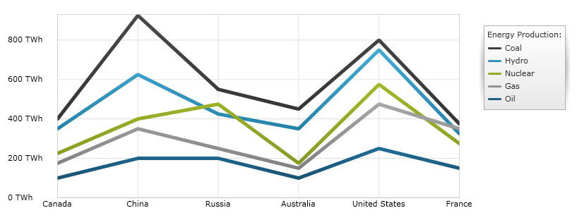
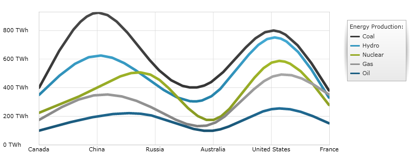

////
|metadata|
{
    "name": "datachart-category-line-series",
    "controlName": ["{DataChartName}"],
    "tags": ["Application Scenarios","Charting","How Do I"],
    "guid": "ae42b565-150c-4f35-b95e-d20065f62a6e",
    "buildFlags": [],
    "createdOn": "2014-06-05T19:39:00.4442938Z"
}
|metadata|
////

= Line Series

This topic explains, with code examples, how to use the link:{DataChartLink}.lineseries.html[LineSeries] in the link:{DataChartLink}.{DataChartName}.html[{DataChartName}]™ control.

== Overview

The topic is organized as follows:

* <<Introduction,Introduction>>
* <<SeriesPreview,Series Preview>>
* <<SeriesRecommendations,Series Recommendations>>
* <<DataRequirements,Data Requirements>>
* <<DataRenderingRules,Data Rendering Rules>>
* <<DataBindingExample,Data Binding Example>>
* <<RelatedTopics,Related Topics>>

== Introduction

Line Series belongs to a group of link:datachart-category-series-overview.html[Category Series] and it is rendered using a collection of points connected by straight line segments. Values are represented on the y-axis (NumericYAxis) and categories are displayed on the x-axis (CategoryXAxis or CategoryDateTimeXAxis). Line Series emphasizes the amount of change over a period of time or compares multiple items as well as the relationship of parts to a whole by displaying the total of the plotted values. The link:{DataChartLink}.lineseries.html[LineSeries] is identical to the link:{DataChartLink}.splineseries.html[SplineSeries] in all aspects except that line connecting data points do not have spline interpolation and smoothing for improved presentation of data. For more conceptual information, comprehension with other types of series, and supported types of axes, refer to the link:datachart-category-series-overview.html[Category Series] and link:datachart-axes.html[Chart Axes] topics.

== Series Preview

Figures 1 and 2 demonstrate how the link:{DataChartLink}.lineseries.html[LineSeries] and link:{DataChartLink}.splineseries.html[SplineSeries] look when plotted in the {DataChartName} control.

Figure 1: Sample implementation of the link:{DataChartLink}.lineseries.html[LineSeries] type.

Figure 2: Sample implementation of the link:{DataChartLink}.splineseries.html[SplineSeries] type.

== Series Recommendations

Although the {DataChartName} supports plotting unlimited number of various types of series, it is recommended to use the Line Series with similar types of series. Refer to the link:datachart-multiple-series.html[Multiple Series] topic for information on what types of series are recommended with the Line Series and how to plot multiple types of series.

== Data Requirements

While the {DataChartName} control allows you to easily bind it to your own data model, make sure you supply the appropriate amount and type of data that the series requires. If the data does not meet the minimum requirements based on the type of series that you are using, the control will encounter an error. Refer to the link:datachart-series-requirements.html[Series Requirements] and link:datachart-category-series-overview.html[Category Series] topics for more information on data series requirements.

The following is a list of data requirements for the link:{DataChartLink}.lineseries.html[LineSeries] type:

* The data model must contain at least one numeric data column. The data model should contain two or more data items so that a line can have two or more points.
* The data model may contain an optional string or date time field for labels.

== Data Rendering Rules

The Line Series renders data using the following rules:

* Each row in the data column specified as the ValueMemberPath property of the data mapping is plotted as a point of a single line on the chart, with the number of points in the line equal to the count of rows in the data model.
* The data points along the line graph are connected by line segments, and represent adjacent rows within a given column.
* The string or date time column that is mapped to the Label property of data mapping on the x-axis is used as the category labels. If the data mapping for Label is not specified, default labels are used.
* Category labels are drawn on the x-axis. Data values are drawn on the y-axis.
* When rendering, multiple series of the link:{DataChartLink}.lineseries.html[LineSeries] type will get rendered in layers with each successive series rendered in front of the previous one in the Series collection of the {DataChartName} control. For more information on this feature, refer to the link:datachart-multiple-series.html[Multiple Series] topic.

== Data Binding Example

The code snippet below shows how to bind the link:{DataChartLink}.lineseries.html[LineSeries] object to sample of category data (which is available for download from link:resources-sample-energy-data.html[Sample Energy Data] resource). Refer to the data requirements section of this topic for information about data requirements for the LineSeries.

ifdef::xaml[]

*In XAML:*

----
xmlns:local="clr-namespace:SampleApp;assembly=SampleApp"
----

endif::xaml[]

ifdef::xaml[]

*In XAML:*

ifdef::sl,wpf,win-universal[]
----
<ig:{DataChartName} x:Name="DataChart" >
    <ig:{DataChartName}.Resources>
        <local:EnergyProductionDataSample x:Key="data" />
    </ig:{DataChartName}.Resources>
    <ig:{DataChartName}.Axes>
        <ig:NumericYAxis x:Name="YAxis"  />
        <ig:CategoryXAxis x:Name="XAxis" ItemsSource="{StaticResource data}" 
                       Label="{}{Country}" 
                       Label="Country" />
    </ig:{DataChartName}.Axes>
    <ig:{DataChartName}.Series>
        <ig:LineSeries ItemsSource="{StaticResource data}" ValueMemberPath="Coal"  
                       Title="Coal" 
                       XAxis="{Binding ElementName=XAxis}"
                         XAxis="{x:Reference XAxis}" 
                       YAxis="{Binding ElementName=YAxis}"
                         YAxis="{x:Reference YAxis}">
        </ig:LineSeries >
        <ig:LineSeries ItemsSource="{StaticResource data}" ValueMemberPath="Hydro" 
                       Title="Hydro" 
                       XAxis="{Binding ElementName=XAxis}"
                         XAxis="{x:Reference XAxis}" 
                       YAxis="{Binding ElementName=YAxis}"
                         YAxis="{x:Reference YAxis}">
        </ig:LineSeries >           
        <ig:LineSeries ItemsSource="{StaticResource data}" ValueMemberPath="Nuclear"  
                       Title="Nuclear" 
                       XAxis="{Binding ElementName=XAxis}"
                         XAxis="{x:Reference XAxis}" 
                       YAxis="{Binding ElementName=YAxis}"
                         YAxis="{x:Reference YAxis}">
        </ig:LineSeries >
        <ig:LineSeries ItemsSource="{StaticResource data}" ValueMemberPath="Gas"  
                       Title="Gas" 
                       XAxis="{Binding ElementName=XAxis}"
                         XAxis="{x:Reference XAxis}" 
                       YAxis="{Binding ElementName=YAxis}"
                         YAxis="{x:Reference YAxis}">
        </ig:LineSeries >
        <ig:LineSeries ItemsSource="{StaticResource data}" ValueMemberPath="Oil"  
                       Title="Oil" 
                       XAxis="{Binding ElementName=XAxis}"
                         XAxis="{x:Reference XAxis}" 
                       YAxis="{Binding ElementName=YAxis}"
                         YAxis="{x:Reference YAxis}">
        </ig:LineSeries >
    </ig:{DataChartName}.Series>
</ig:{DataChartName}>
----
endif::sl,wpf,win-universal[]

ifdef::xamarin[]
----
<ig:{DataChartName} x:Name="DataChart" >
    <ig:{DataChartName}.Resources>
        <local:EnergyProductionDataSample x:Key="data" />
    </ig:{DataChartName}.Resources>
    <ig:{DataChartName}.Axes>
        <ig:NumericYAxis x:Name="YAxis"  />
        <ig:CategoryXAxis x:Name="XAxis" ItemsSource="{StaticResource data}" 
                       Label="{}{Country}" 
                       Label="Country" />
    </ig:{DataChartName}.Axes>
    <ig:{DataChartName}.Series>
        <ig:LineSeries ItemsSource="{StaticResource data}" ValueMemberPath="Coal"  
                       Title="Coal" 
                       XAxis="{Binding ElementName=XAxis}"
                         XAxis="{x:Reference XAxis}" 
                       YAxis="{Binding ElementName=YAxis}"
                         YAxis="{x:Reference YAxis}">
        </ig:LineSeries >
        <ig:LineSeries ItemsSource="{StaticResource data}" ValueMemberPath="Hydro" 
                       Title="Hydro" 
                       XAxis="{Binding ElementName=XAxis}"
                         XAxis="{x:Reference XAxis}" 
                       YAxis="{Binding ElementName=YAxis}"
                         YAxis="{x:Reference YAxis}">
        </ig:LineSeries >           
        <ig:LineSeries ItemsSource="{StaticResource data}" ValueMemberPath="Nuclear"  
                       Title="Nuclear" 
                       XAxis="{Binding ElementName=XAxis}"
                         XAxis="{x:Reference XAxis}" 
                       YAxis="{Binding ElementName=YAxis}"
                         YAxis="{x:Reference YAxis}">
        </ig:LineSeries >
        <ig:LineSeries ItemsSource="{StaticResource data}" ValueMemberPath="Gas"  
                       Title="Gas" 
                       XAxis="{Binding ElementName=XAxis}"
                         XAxis="{x:Reference XAxis}" 
                       YAxis="{Binding ElementName=YAxis}"
                         YAxis="{x:Reference YAxis}">
        </ig:LineSeries >
        <ig:LineSeries ItemsSource="{StaticResource data}" ValueMemberPath="Oil"  
                       Title="Oil" 
                       XAxis="{Binding ElementName=XAxis}"
                         XAxis="{x:Reference XAxis}" 
                       YAxis="{Binding ElementName=YAxis}"
                         YAxis="{x:Reference YAxis}">
        </ig:LineSeries >
    </ig:{DataChartName}.Series>
</ig:{DataChartName}>
----
endif::xamarin[]

endif::xaml[]

ifdef::xaml,win-forms[]

*In C#:*

ifdef::win-forms[]
----
var data = new EnergyProductionDataSample(); 
var chart = new {DataChartName}();
var yAxis = new NumericYAxis();
var xAxis = new CategoryXAxis();
xAxis.DataSource = data;
xAxis.ItemsSource = data;
xAxis.Label = "{Country}";
xAxis.Label = "Country";
var series = new LineSeries();
series.DataSource = data;
series.ItemsSource = data;
series.ValueMemberPath = "Coal";
series.Title = "Coal";
series.XAxis = xAxis;
series.YAxis = yAxis;
chart.Axes.Add(xAxis);
chart.Axes.Add(yAxis);
chart.Series.Add(series);
----
endif::win-forms[]

ifdef::xaml[]
----
var data = new EnergyProductionDataSample(); 
var chart = new {DataChartName}();
var yAxis = new NumericYAxis();
var xAxis = new CategoryXAxis();
xAxis.DataSource = data;
xAxis.ItemsSource = data;
xAxis.Label = "{Country}";
xAxis.Label = "Country";
var series = new LineSeries();
series.DataSource = data;
series.ItemsSource = data;
series.ValueMemberPath = "Coal";
series.Title = "Coal";
series.XAxis = xAxis;
series.YAxis = yAxis;
chart.Axes.Add(xAxis);
chart.Axes.Add(yAxis);
chart.Series.Add(series);
----
endif::xaml[]

endif::xaml,win-forms[]

ifdef::xaml,win-forms[]

*In Visual Basic:*

ifdef::win-forms[]
----
Dim data As New EnergyProductionDataSample()
Dim chart As New {DataChartName}()
Dim yAxis As New NumericYAxis()
Dim xAxis As New CategoryXAxis()
xAxis.DataSource = data
xAxis.ItemsSource = data
xAxis.Label = "{Country}"
xAxis.Label = "Country"
Dim series As New LineSeries()
series.DataSource = data
series.ItemsSource = data
series.ValueMemberPath = "Coal"
series.Title = "Coal"
series.XAxis = xAxis
series.YAxis = yAxis
chart.Axes.Add(xAxis)
chart.Axes.Add(yAxis)
chart.Series.Add(series)
----
endif::win-forms[]

ifdef::xaml[]
----
Dim data As New EnergyProductionDataSample()
Dim chart As New {DataChartName}()
Dim yAxis As New NumericYAxis()
Dim xAxis As New CategoryXAxis()
xAxis.DataSource = data
xAxis.ItemsSource = data
xAxis.Label = "{Country}"
xAxis.Label = "Country"
Dim series As New LineSeries()
series.DataSource = data
series.ItemsSource = data
series.ValueMemberPath = "Coal"
series.Title = "Coal"
series.XAxis = xAxis
series.YAxis = yAxis
chart.Axes.Add(xAxis)
chart.Axes.Add(yAxis)
chart.Series.Add(series)
----
endif::xaml[]

endif::xaml,win-forms[]

ifdef::android[]

*In Java:*

[source,js]
----
EnergyProductionDataSample data = new EnergyProductionDataSample();
DataChartView chart = new DataChartView(rootView.getContext());
NumericYAxis yAxis = new NumericYAxis();
CategoryXAxis xAxis = new CategoryXAxis();
xAxis.setDataSource(data);
xAxis.setLabel("Country");
LineSeries series = new LineSeries();
series.setDataSource(data);
series.setValueMemberPath("Coal");
series.setTitle("Coal");
series.setXAxis(xAxis);
series.setYAxis(yAxis);
chart.addAxis(xAxis);
chart.addAxis(yAxis);
chart.addSeries(series);
rootView.addView(chart);
----

endif::android[]

== Related Topics

* link:datachart-axes.html[Axes]
* link:datachart-category-series-overview.html[Category Series]
* link:datachart-category-spline-series.html[Spline Series]
* link:datachart-series-requirements.html[Series Requirements]