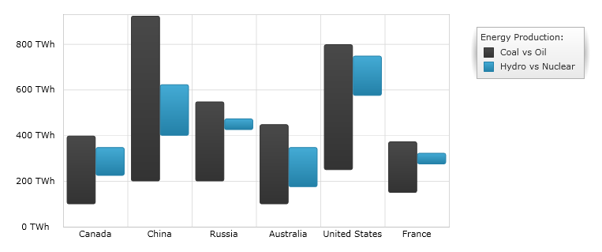
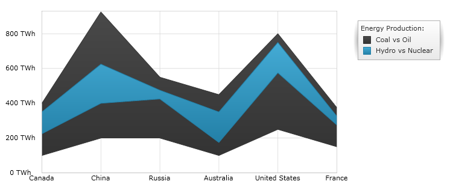

////
|metadata|
{
    "name": "datachart-category-range-column-series",
    "controlName": ["{DataChartName}"],
    "tags": ["Application Scenarios","Charting","How Do I"],
    "guid": "dfe2be76-2333-4f87-9b42-37b67e3a4054",
    "buildFlags": [],
    "createdOn": "2014-06-05T19:39:00.4482953Z"
}
|metadata|
////

= Range Column Series

This topic explains, with code examples, how to use the link:{DataChartLink}.rangecolumnseries.html[RangeColumnSeries] in the link:{DataChartLink}.{DataChartName}.html[{DataChartName}]™ control.

== Overview

The topic is organized as follows:

* <<Introduction,Introduction>>
* <<SeriesPreview,Series Preview>>
* <<SeriesRecommendations,Series Recommendations>>
* <<DataRequirements,Data Requirements>>
* <<DataRenderingRules,Data Rendering Rules>>
* <<DataBindingExample,Data Binding Example>>
* <<RelatedTopics,Related Topics>>

== Introduction

Range Column Series belongs to a group of link:datachart-category-series-overview.html[Category Series] and it is rendered using a collection of vertical columns that show the difference between two values of a data point. This type of series emphasizes the amount of change between low values and high values in the same data point over a period of time or compares multiple items. Range values are represented on the y-axis (NumericYAxis) and categories are displayed on the x-axis (CategoryXAxis or CategoryDateTimeXAxis). The link:{DataChartLink}.rangecolumnseries.html[RangeColumnSeries] is identical to the link:{DataChartLink}.rangeareaseries.html[RangeAreaSeries] in all aspects except that the ranges are represented as a set of vertical columns rather than filled area. For more conceptual information, comprehension with other types of series, and supported types of axes, refer to the link:datachart-category-series-overview.html[Category Series] and link:datachart-axes.html[Chart Axes] topics.

== Series Preview

Figures 1 and 2 demonstrate how the link:{DataChartLink}.rangecolumnseries.html[RangeColumnSeries] and link:{DataChartLink}.rangeareaseries.html[RangeAreaSeries] look when plotted in the {DataChartName} control.

Figure 1: Sample implementation of the link:{DataChartLink}.rangecolumnseries.html[RangeColumnSeries] type.

Figure 2: Sample implementation of the link:{DataChartLink}.rangeareaseries.html[RangeAreaSeries] type.

== Series Recommendations

Although the {DataChartName} supports plotting unlimited number of various types of series, it is recommended to use the Range Column Series with similar types of series. Refer to the link:datachart-multiple-series.html[Multiple Series] topic for information on what types of series are recommended with the Range Column Series and how to plot multiple types of series.

== Data Requirements

While the {DataChartName} control allows you to easily bind it to your own data model, make sure to supply the appropriate amount and type of data that the series requires. If the data does not meet the minimum requirements based on the type of series that you are using, an error is generated by the control. Refer to the link:datachart-series-requirements.html[Series Requirements] and link:datachart-category-series-overview.html[Category Series] topics for more information on data series requirements.

The following is a list of data requirements for the link:{DataChartLink}.rangecolumnseries.html[RangeColumnSeries] type:

* The data model must contain at least two numeric data column for rendering the range between the values.
* The data model may contain an optional string or date time field for labels.

== Data Rendering Rules

The Range Column Series renders data using the following rules:

* Each row with two data values specified as the LowMemberPath and HighMemberPath properties of the data mapping is drawn as a separate vertical column representing the difference between of these data values.
* The string or date time column that is mapped to the Label property of data mapping on the x-axis is used as the category labels. If the data mapping for Label is not specified, default labels are used.
* Category labels are drawn on the x-axis. Data values are drawn on the y-axis.
* When rendering, multiple series of the link:{DataChartLink}.rangecolumnseries.html[RangeColumnSeries] type will get rendered in clusters where each cluster represents a data point. The first series in the Series collection of the {DataChartName} control will render as a column on the left of the cluster. Each successive series is rendered on the right of the previous series. For more information, refer to the link:datachart-multiple-series.html[Multiple Series] topic.

== Data Binding Example

The code snippet below shows how to bind the link:{DataChartLink}.rangecolumnseries.html[RangeColumnSeries] object to sample of category data (which is available for download from link:resources-sample-energy-data.html[Sample Energy Data] resource). Refer to the data requirements section of this topic for information about data requirements for the RangeColumnSeries.

ifdef::xaml[]

*In XAML:*

----
xmlns:local="clr-namespace:SampleApp;assembly=SampleApp"
----

endif::xaml[]

ifdef::xaml[]

*In XAML:*

ifdef::sl,wpf,win-universal[]
----
<ig:{DataChartName} x:Name="DataChart" >
    <ig:{DataChartName}.Resources>
        <local:EnergyProductionDataSample x:Key="data" />
    </ig:{DataChartName}.Resources>
    <ig:{DataChartName}.Axes>
        <ig:NumericYAxis x:Name="YAxis"  />
        <ig:CategoryXAxis x:Name="XAxis" ItemsSource="{StaticResource data}" 
                       Label="{}{Country}" 
                       Label="Country" />
    </ig:{DataChartName}.Axes>
    <ig:{DataChartName}.Series>
        <ig:RangeColumnSeries ItemsSource="{StaticResource data}" 
                       HighemberPath="Coal" HighemberPath="Oil"  
                       Title="Coal vs Oil" 
                       XAxis="{Binding ElementName=XAxis}"
                         XAxis="{x:Reference XAxis}" 
                       YAxis="{Binding ElementName=YAxis}"
                         YAxis="{x:Reference YAxis}">
        </ig:RangeColumnSeries >
        <ig:RangeColumnSeries ItemsSource="{StaticResource data}" 
                       HighemberPath="Hydro" HighemberPath="Nuclear"  
                       Title="Hydro vs Nuclear" 
                       XAxis="{Binding ElementName=XAxis}"
                         XAxis="{x:Reference XAxis}" 
                       YAxis="{Binding ElementName=YAxis}"
                         YAxis="{x:Reference YAxis}">
        </ig:RangeColumnSeries >           
    </ig:{DataChartName}.Series>
</ig:{DataChartName}>
----
endif::sl,wpf,win-universal[]

ifdef::xamarin[]
----
<ig:{DataChartName} x:Name="DataChart" >
    <ig:{DataChartName}.Resources>
        <local:EnergyProductionDataSample x:Key="data" />
    </ig:{DataChartName}.Resources>
    <ig:{DataChartName}.Axes>
        <ig:NumericYAxis x:Name="YAxis"  />
        <ig:CategoryXAxis x:Name="XAxis" ItemsSource="{StaticResource data}" 
                       Label="{}{Country}" 
                       Label="Country" />
    </ig:{DataChartName}.Axes>
    <ig:{DataChartName}.Series>
        <ig:RangeColumnSeries ItemsSource="{StaticResource data}" 
                       HighemberPath="Coal" HighemberPath="Oil"  
                       Title="Coal vs Oil" 
                       XAxis="{Binding ElementName=XAxis}"
                         XAxis="{x:Reference XAxis}" 
                       YAxis="{Binding ElementName=YAxis}"
                         YAxis="{x:Reference YAxis}">
        </ig:RangeColumnSeries >
        <ig:RangeColumnSeries ItemsSource="{StaticResource data}" 
                       HighemberPath="Hydro" HighemberPath="Nuclear"  
                       Title="Hydro vs Nuclear" 
                       XAxis="{Binding ElementName=XAxis}"
                         XAxis="{x:Reference XAxis}" 
                       YAxis="{Binding ElementName=YAxis}"
                         YAxis="{x:Reference YAxis}">
        </ig:RangeColumnSeries >           
    </ig:{DataChartName}.Series>
</ig:{DataChartName}>
----
endif::xamarin[]

endif::xaml[]

ifdef::xaml,win-forms[]

*In C#:*

ifdef::win-forms[]
----
var data = new EnergyProductionDataSample(); 
var chart = new {DataChartName}();
var yAxis = new NumericYAxis();
var xAxis = new CategoryXAxis();
xAxis.DataSource = data;
xAxis.ItemsSource = data;
xAxis.Label = "{Country}";
xAxis.Label = "Country";
var series = new RangeColumnSeries();
series.ItemsSource = data;
series.ValueMemberPath = "Coal";
series.ValueMemberPath = "Oil";
series.Title = "Coal vs Oil";
series.XAxis = xAxis;
series.YAxis = yAxis;
chart.Axes.Add(xAxis);
chart.Axes.Add(yAxis);
chart.Series.Add(series);
----
endif::win-forms[]

ifdef::xaml[]
----
var data = new EnergyProductionDataSample(); 
var chart = new {DataChartName}();
var yAxis = new NumericYAxis();
var xAxis = new CategoryXAxis();
xAxis.DataSource = data;
xAxis.ItemsSource = data;
xAxis.Label = "{Country}";
xAxis.Label = "Country";
var series = new RangeColumnSeries();
series.ItemsSource = data;
series.ValueMemberPath = "Coal";
series.ValueMemberPath = "Oil";
series.Title = "Coal vs Oil";
series.XAxis = xAxis;
series.YAxis = yAxis;
chart.Axes.Add(xAxis);
chart.Axes.Add(yAxis);
chart.Series.Add(series);
----
endif::xaml[]

endif::xaml,win-forms[]

ifdef::xaml,win-forms[]

*In Visual Basic:*

ifdef::win-forms[]
----
Dim data As New EnergyProductionDataSample()
Dim chart As New {DataChartName}()
Dim yAxis As New NumericYAxis()
Dim xAxis As New CategoryXAxis()
xAxis.DataSource = data
xAxis.ItemsSource = data
xAxis.Label = "{Country}"
xAxis.Label = "Country"
Dim series As New RangeColumnSeries()
series.ItemsSource = data
series.ValueMemberPath = "Coal";
series.ValueMemberPath = "Oil";
series.Title = "Coal vs Oil";
series.XAxis = xAxis
series.YAxis = yAxis
chart.Axes.Add(xAxis)
chart.Axes.Add(yAxis)
chart.Series.Add(series)
----
endif::win-forms[]

ifdef::xaml[]
----
Dim data As New EnergyProductionDataSample()
Dim chart As New {DataChartName}()
Dim yAxis As New NumericYAxis()
Dim xAxis As New CategoryXAxis()
xAxis.DataSource = data
xAxis.ItemsSource = data
xAxis.Label = "{Country}"
xAxis.Label = "Country"
Dim series As New RangeColumnSeries()
series.ItemsSource = data
series.ValueMemberPath = "Coal";
series.ValueMemberPath = "Oil";
series.Title = "Coal vs Oil";
series.XAxis = xAxis
series.YAxis = yAxis
chart.Axes.Add(xAxis)
chart.Axes.Add(yAxis)
chart.Series.Add(series)
----
endif::xaml[]

endif::xaml,win-forms[]

ifdef::android[]

*In Java:*

[source,js]
----
EnergyProductionDataSample data = new EnergyProductionDataSample();
DataChartView chart = new DataChartView(rootView.getContext());
NumericYAxis yAxis = new NumericYAxis();
CategoryXAxis xAxis = new CategoryXAxis();
xAxis.setDataSource(data);
xAxis.setLabel("Country");
RangeColumnSeries series = new RangeColumnSeries();
series.setDataSource(data);
series.setHighMemberPath("Coal");
series.setLowMemberPath("Oil");
series.setTitle("Coal vs Oil");
series.setXAxis(xAxis);
series.setYAxis(yAxis);
chart.addAxis(xAxis);
chart.addAxis(yAxis);
chart.addSeries(series);
----

endif::android[]

== Related Topics

* link:datachart-axes.html[Axes]
* link:datachart-category-series-overview.html[Category Series]
* link:datachart-category-range-area-series.html[Range Area Series]
* link:datachart-series-requirements.html[Series Requirements]