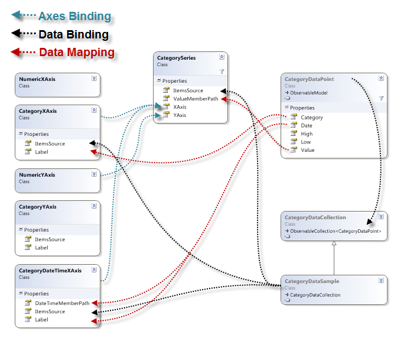
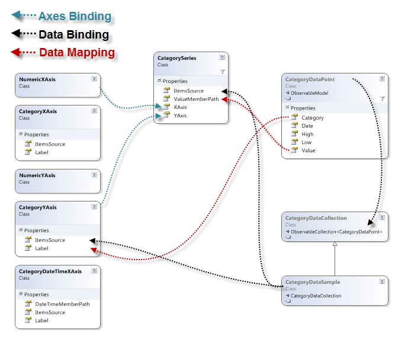
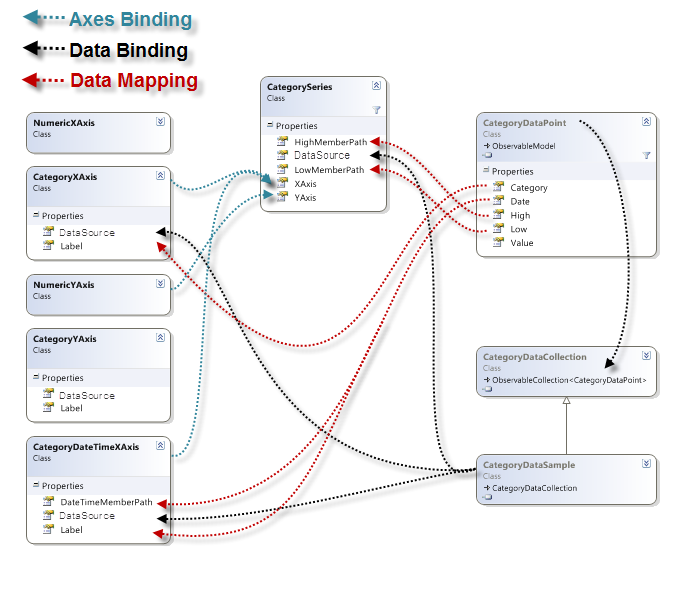
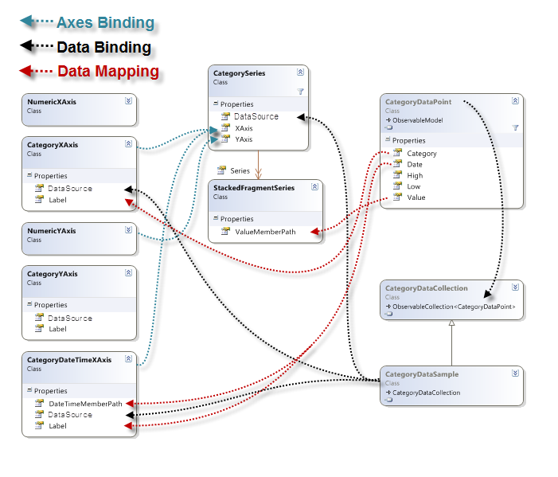
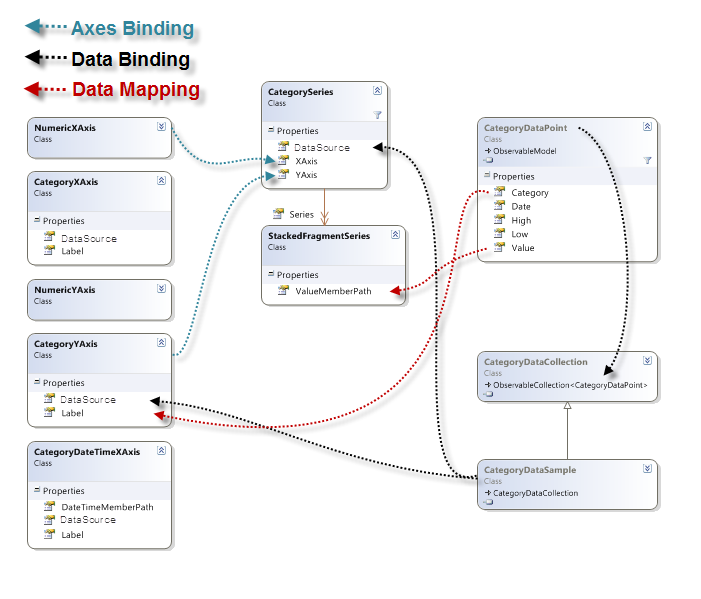

////

|metadata|
{
    "name": "datachart-category-series-overview",
    "controlName": ["{DataChartName}"],
    "tags": ["Charting"],
    "guid": "afeced41-35ad-487b-ba37-98e3b8240d1e",  
    "buildFlags": [],
    "createdOn": "2014-06-05T19:39:00.3992752Z"
}
|metadata|
////

= Category Series

This topic explains various types of Category Series in the link:{DataChartLink}.{DataChartName}.html[{DataChartName}]™ control.

== Overview

The topic is organized as follows:

* <<Introduction,Introduction>>
* <<TypesofCategorySeries,Types of Category Series>>
* <<SupportedAxes,Supported Axes>>
* <<DataBinding,Data Binding>>

** <<DataRequirements,Data Requirements>>
** <<DataSample,Data Sample>>
** <<BindingDiagrams,Binding Diagrams>>

* <<RelatedTopics,Related Topics>>

** link:datachart-axes.html[Axes]
** link:datachart-multiple-axes.html[Using Multiple Axes]
** link:datachart-multiple-series.html[Adding Multiple Series]
** link:datachart-series-requirements.html[Series Requirements]

== Introduction

Category Series is a group of the simplest and most common form of chart series that take data and render it as collection of data points stretched along a horizontal line (e.g. column series) or vertical line (e.g. bar series).

== Types of Category Series

The {DataChartName} control supports the following types of Category Series and each of them is discussed in an individual topic:

* link:datachart-category-area-series.html[Area Series]

ifdef::wpf,win-universal[]
* link:datachart-category-bar-series.html[Bar Series]

endif::wpf,win-universal[]

* link:datachart-category-column-series.html[Column Series]
* link:datachart-category-line-series.html[Line Series]
* link:datachart-category-point-series.html[Point Series]
* link:datachart-category-range-area-series.html[Range Area Series]
* link:datachart-category-range-column-series.html[Range Column Series]
* link:datachart-category-step-area-series.html[Step Area Series]
* link:datachart-category-step-line-series.html[Step Line Series]
* link:datachart-category-spline-series.html[Spline Series]
* link:datachart-category-spline-area-series.html[Spline Area Series]
* link:datachart-category-waterfall-series.html[Waterfall Series]

ifdef::sl,wpf,win-universal,win-phone[]
* link:datachart-category-stacked-100-area-series.html[Stacked 100-Area Series]

endif::sl,wpf,win-universal,win-phone[]

ifdef::sl,wpf,win-universal,win-phone[]
* link:datachart-category-stacked-100-bar-series.html[Stacked 100-Bar Series]

endif::sl,wpf,win-universal,win-phone[]

ifdef::sl,wpf,win-universal,win-phone[]
* link:datachart-category-stacked-100-column-series.html[Stacked 100-Column Series]

endif::sl,wpf,win-universal,win-phone[]

ifdef::sl,wpf,win-universal,win-phone[]
* link:datachart-category-stacked-100-line-series.html[Stacked 100-Line Series]

endif::sl,wpf,win-universal,win-phone[]

ifdef::sl,wpf,win-universal,win-phone[]
* link:datachart-category-stacked-100-spline-area-series.html[Stacked 100-Spline Area Series]

endif::sl,wpf,win-universal,win-phone[]

ifdef::sl,wpf,win-universal,win-phone[]
* link:datachart-category-stacked-100-spline-series.html[Stacked 100-Spline Series]

endif::sl,wpf,win-universal,win-phone[]

ifdef::sl,wpf,win-universal,win-phone[]
* link:datachart-category-stacked-area-series.html[Stacked Area Series]

endif::sl,wpf,win-universal,win-phone[]

ifdef::sl,wpf,win-universal,win-phone[]
* link:datachart-category-stacked-bar-series.html[Stacked Bar Series]

endif::sl,wpf,win-universal,win-phone[]

ifdef::sl,wpf,win-universal,win-phone[]
* link:datachart-category-stacked-column-series.html[Stacked Column Series]

endif::sl,wpf,win-universal,win-phone[]

ifdef::sl,wpf,win-universal,win-phone[]
* link:datachart-category-stacked-line-series.html[Stacked Line Series]

endif::sl,wpf,win-universal,win-phone[]

ifdef::sl,wpf,win-universal,win-phone[]
* link:datachart-category-stacked-spline-area-series.html[Stacked Spline Area Series]

endif::sl,wpf,win-universal,win-phone[]

ifdef::sl,wpf,win-universal,win-phone[]
* link:datachart-category-stacked-spline-series.html[Stacked Spline Series]

endif::sl,wpf,win-universal,win-phone[]

These topics will provide you with useful information on how to use create a specific type of Category Series and bind data to it.

ifdef::sl,wpf,win-universal,win-phone[]
Also, you can create your own types of series by following instructions in the link:datachart-creating-custom-series.html[Creating Custom Series] topic.
endif::sl,wpf,win-universal,win-phone[]

You can also use multiple types of Category Series with link:datachart-series-financial-price-series-overview.html[Financial Series] or link:datachart-financial-indicators-overview.html[Financial Indicators] to create complex charts visuals. Refer to the link:datachart-multiple-series.html[Adding Multiple Series] and link:datachart-multiple-axes.html[Using Multiple Axes] topics for more information on this feature of the {DataChartName} control. 

Table 1 – Types of Category Series

[options="header", cols="a,a,a"]
|====
|Series Type|Preview|Description

| link:datachart-category-line-series.html[Line Series]
|image::images/Using_xamDataChart_Category_Series_01.png[]
|Displays a set of evenly placed points connected by a line. Categories are arranged horizontally and values are plotted vertically. 

Used for showing data or information that changes continuously over time. Useful when emphasizing the relationship between the points is required.

| link:datachart-category-area-series.html[Area Series]
|image::images/Using_xamDataChart_Category_Series_02.png[]
|Same as the Line Series type with except that the area below the line is filled in. Categories are arranged horizontally and values – vertically.

| link:datachart-category-spline-series.html[Spline Series]
|image::images/Using_xamDataChart_Category_Series_03.png[]
|Same as the Line Series type with the added feature of spline interpolation and smoothing for improved presentation of data.

| link:datachart-category-spline-area-series.html[Spline Area Series]
|image::images/Using_xamDataChart_Category_Series_04.png[]
|Same as the Area Series type with the added feature of spline interpolation and smoothing for improved presentation of data.

ifdef::wpf,win-universal[]
| link:datachart-category-bar-series.html[Bar Series]
|image::images/Using_xamDataChart_Category_Series_05.png[]
|Displays discrete data in separate rows. Categories are arranged vertically and values are plotted horizontally. 

Used for showing the changes in a data series over time or for comparing multiple items.
endif::wpf,win-universal[]

| link:datachart-category-column-series.html[Column Series]
|image::images/Using_xamDataChart_Category_Series_08.png[]
|Displays discrete data in separate columns. Categories are arranged horizontally and values are plotted vertically. 

Used for showing the changes in a data series over time or for comparing multiple items.

| link:datachart-category-range-column-series.html[Range Column Series]
|image::images/Using_xamDataChart_Category_Series_11.png[]
|Displays a set of points as vertical columns that show the difference between low values and high values in the same data point. Categories are arranged horizontally and values are plotted vertically. 

Used for showing the range between two data columns of the same data point in a data series over time or for comparing multiple items.

| link:datachart-category-range-area-series.html[Range Area Series]
|image::images/Using_xamDataChart_Category_Series_12.png[]
|Same as the Range Column Series type, except that the ranges are presented as filled area instead of columns showing range between two data columns.

| link:datachart-category-step-line-series.html[Step Line Series]
|image::images/Using_xamDataChart_Category_Series_13.png[]
|Same as the Line Series type, except that the values are connected by continuous vertical and horizontal lines forming a step-like progression instead of a straight line tracing the shortest path between points.

| link:datachart-category-step-area-series.html[Step Area Series]
|image::images/Using_xamDataChart_Category_Series_14.png[]
|Same as the Step Line Series type, except that the area below values is filled out instead of continuous vertical and horizontal lines forming a step-like progression for the changes between data points.

| link:datachart-category-waterfall-series.html[Waterfall Series]
|image::images/Using_xamDataChart_Category_Series_15.png[]
|Displays a set of points as vertical columns that show the difference between values of consecutive data points. The columns are color coded for distinguishing between positive and negative changes in value. Categories are arranged horizontally and values are plotted vertically. 

Used for showing the changes in a consecutive data points over time or for comparing multiple items.

ifdef::sl,wpf,win-universal,win-phone[]
| link:datachart-category-stacked-100-area-series.html[Stacked 100-Area Series]
|image::images/Stacked_100-Area_Series_01.png[]
|The Stacked 100-Area Series is identical to the StackedAreaSeries in all aspects except in their treatment of the values on y-axis. Instead of presenting a direct representation of the data, the Stacked100AreaSeries presents the data in terms of percent of the sum of all values in a data point.
endif::sl,wpf,win-universal,win-phone[]

ifdef::sl,wpf,win-universal,win-phone[]
| link:datachart-category-stacked-100-bar-series.html[Stacked 100-Bar Series]
|image::images/Using_xamDataChart_Category_Series_07.png[]
|Same as the Stacked Bar Series type with the added feature of presenting data in terms of percent of all values in category instead of presenting a direct representation of the data.
endif::sl,wpf,win-universal,win-phone[]

ifdef::sl,wpf,win-universal,win-phone[]
| link:datachart-category-stacked-100-column-series.html[Stacked 100-Column Series]
|image::images/Using_xamDataChart_Category_Series_10.png[]
|Same as the Stacked Column Series type with the added feature of presenting data in terms of percent of all values in the same category instead of presenting a direct representation of the data.
endif::sl,wpf,win-universal,win-phone[]

ifdef::sl,wpf,win-universal,win-phone[]
| link:datachart-category-stacked-100-line-series.html[Stacked 100-Line Series]
|image::images/Stacked_100-Line_Series__01.png[]
|The Stacked 100-Line Series is identical to the StackedLineSeries in all aspects except in their treatment of the values on y-axis. Instead of presenting a direct representation of the data, the Stacked100LineSeries presents the data in terms of percent of the sum of all values in a data point.
endif::sl,wpf,win-universal,win-phone[]

ifdef::sl,wpf,win-universal,win-phone[]
| link:datachart-category-stacked-100-spline-area-series.html[Stacked 100-Spline Area Series]
|image::images/Stacked_100-Spline_Area_Series__01.png[]
|The Stacked 100-Spline Area Series is identical to the StackedSplineAreaSeries in all aspects except in their treatment of the values on y-axis. Instead of presenting a direct representation of the data, the Stacked100SplineAreaSeries presents the data in terms of percent of the sum of all values in a data point.
endif::sl,wpf,win-universal,win-phone[]

ifdef::sl,wpf,win-universal,win-phone[]
| link:datachart-category-stacked-100-spline-series.html[Stacked 100-Spline Series]
|image::images/Using_xamDataChart_Stacked_100-Spline_Series__01.png[]
|The Stacked100SplineSeries is identical to the StackedSplineSeries in all aspects except in their treatment of the values on y-axis. Instead of presenting a direct representation of the data, the Stacked100SplineSeries presents the data in terms of percent of the sum of all values in a data point.
endif::sl,wpf,win-universal,win-phone[]

ifdef::sl,wpf,win-universal,win-phone[]
| link:datachart-category-stacked-area-series.html[Stacked Area Series]
|image::images/Stacked_Area_Series__01.png[]
|Stacked Area Series is rendered using a collection of points connected by line segments (StackedFragmentSeries) with the area below the line filled in and stacked on top of each other. Each stacked fragment in the collection represents one visual element in each stack. Each stack can contain both positive and negative values. All positive values are grouped on the positive side of the y-axis, and all negative values are grouped on the negative side of the y-axis.
endif::sl,wpf,win-universal,win-phone[]

ifdef::sl,wpf,win-universal,win-phone[]
| link:datachart-category-stacked-bar-series.html[Stacked Bar Series]
|image::images/Using_xamDataChart_Category_Series_06.png[]
|Displays discrete data in bars stacked next to each other. Categories are arranged vertically and values are stacked horizontally. 

Used for showing the changes in a data series over time or for comparing multiple items.
endif::sl,wpf,win-universal,win-phone[]

ifdef::sl,wpf,win-universal,win-phone[]
| link:datachart-category-stacked-column-series.html[Stacked Column Series]
|image::images/Using_xamDataChart_Category_Series_09.png[]
|Displays discrete data in columns stacked on top of each other. Categories are arranged horizontally and values are stacked vertically. 

Used for showing the changes in a data series over time or for comparing multiple items.
endif::sl,wpf,win-universal,win-phone[]

ifdef::sl,wpf,win-universal,win-phone[]
| link:datachart-category-stacked-line-series.html[Stacked Line Series]
|image::images/Using_xamDataChart_Stacked_Line_Series__01.png[]
|Stacked Line Series is rendered using a collection of points connected by line segments (StackedFragmentSeries) that are stacked on top of each other. Each stacked fragment in the collection represents one visual element in each stack. Each stack can contain both positive and negative values. All positive values are grouped on the positive side of the y-axis, and all negative values are grouped on the negative side of the y-axis.
endif::sl,wpf,win-universal,win-phone[]

ifdef::sl,wpf,win-universal,win-phone[]
| link:datachart-category-stacked-spline-area-series.html[Stacked Spline Area Series]
|image::images/Using_xamDataChart_Stacked_Spline_Area_Series__01.png[]
|Stacked Spline Area Series is rendered using a collection of points connected by smooth curves of spline segments (StackedFragmentSeries) with the area below the spline filled in and stacked on top of each other. Each stacked fragment in the collection represents one visual element in each stack. Each stack can contain both positive and negative values. All positive values are grouped on the positive side of the y-axis, and all negative values are grouped on the negative side of the y-axis.
endif::sl,wpf,win-universal,win-phone[]

ifdef::sl,wpf,win-universal,win-phone[]
| link:datachart-category-stacked-spline-series.html[Stacked Spline Series]
|image::images/Usin_xamDataChart_Stacked_Spline_Series__01.png[]
|Stacked Spline Series is rendered using a collection of points connected by smooth curves of spline segments (StackedFragmentSeries) that are stacked on top of each other. Each stacked fragment in the collection represents one visual element in each stack. Each stack can contain both positive and negative values. All positive values are grouped on the positive side of the y-axis, and all negative values are grouped on the negative side of the y-axis.
endif::sl,wpf,win-universal,win-phone[]

|====

Each linked topic demonstrates, with code examples, how to create a specific type of Category Series and bind data to it.

== Supported Axes

There are various types of axes in the {DataChartName} control, but only certain types of axes can be used with specific types of Category Series. In addition, each of Category Series must have binding set to one x-axis and one y-axis using the series object’s XAxis and YAxis properties. Refer to the Series Requirements topic for a list of axes supported by different types of Category Series. For more information on axes refer to the Axes topic.

== Data Binding

This section provides information about binding data for all types of Category Series from data requirements through data sample to binding diagrams.

== Data Requirements

Similarly to other types of series in the {DataChartName} control, Category Series also use  pick:[sl,wpf,win-phone,win-universal,xamarin=" link:{ApiPlatform}{DataChartAssembly}{ApiVersion}{DataChartNamespace}.series~itemssource.html[ItemsSource]"]  pick:[win-forms=" link:{ApiPlatform}{DataChartAssembly}{ApiVersion}{DataChartNamespace}.series~datasource.html[DataSource]"]  property to bind data. All series can be bound to any object that implements the link:http://msdn.microsoft.com/en-us/library/system.collections.ienumerable.aspx[IEnumerable] link:http://msdn.microsoft.com/en-us/library/system.collections.ienumerable.aspx[interface (e.g.] link:http://msdn.microsoft.com/en-us/library/6sh2ey19.aspx[List] link:http://msdn.microsoft.com/en-us/library/system.collections.ienumerable.aspx[,] link:http://msdn.microsoft.com/en-us/library/ms132397.aspx[Collection] link:http://msdn.microsoft.com/en-us/library/system.collections.ienumerable.aspx[,] link:http://msdn.microsoft.com/en-us/library/7977ey2c.aspx[Queue] link:http://msdn.microsoft.com/en-us/library/system.collections.ienumerable.aspx[,] link:http://msdn.microsoft.com/en-us/library/system.collections.stack.aspx[Stack]), however, in case of Category Series, each item in this object must have at least one numeric data column which is mapped using the ValueMemberPath property of the series and one category data column which is mapped to the Label property of the category axis (e.g. CategoryXAxis). For more information on the requirements for the specific types of series, refer to the Series Requirements topic.

== Data Sample

An example of object that meets above criteria is the link:resources-sample-category-data.html[Sample Category Data] which you can download from the Category Data Sample resource and use it in your project.

== Binding Diagrams

The type of Category Series determines how the {DataChartName} control is bound to data and what axes will be used. Table 2 lists the types of Category Series and shows diagrams with bindings between data, axes and series.

.Note:
[NOTE]
====
Some of Category Series are the same in terms of binding data and they are listed together.
====

Table 2 – Category Series Binding Diagrams

[options="header", cols="a,a"]
|====
|Type of Category Series|Binding Diagram

|AreaSeries 

ColumnSeries 

LineSeries 

SplineSeries 

SplineAreaSeries 

StepAreaSeries 

StepLineSeries 

WaterfallSeries
|
ifdef::xaml,android[] 

 

endif::xaml,android[] 

ifdef::win-forms[] 

 

endif::win-forms[] 

|BarSeries
|
ifdef::xaml,android[] 

 

endif::xaml,android[] 

ifdef::win-forms[] 

 

endif::win-forms[] 

|RangeAreaSeries 

RangeColumnSeries
|
ifdef::xaml,android[] 

 

endif::xaml,android[] 

ifdef::win-forms[] 

 

endif::win-forms[] 

|StackedColumnSeries 

Stacked100ColumnSeries
|
ifdef::xaml,android[] 

 

endif::xaml,android[] 

ifdef::win-forms[] 

 

endif::win-forms[] 

|StackedBarSeries 

Stacked100BarSeries
|
ifdef::xaml,android[] 

 

endif::xaml,android[] 

ifdef::win-forms[] 

 

endif::win-forms[] 

|====

== Related Topics

* link:datachart-axes.html[Axes]
* link:datachart-multiple-axes.html[Using Multiple Axes]
* link:datachart-multiple-series.html[Adding Multiple Series]
* link:datachart-series-requirements.html[Series Requirements]