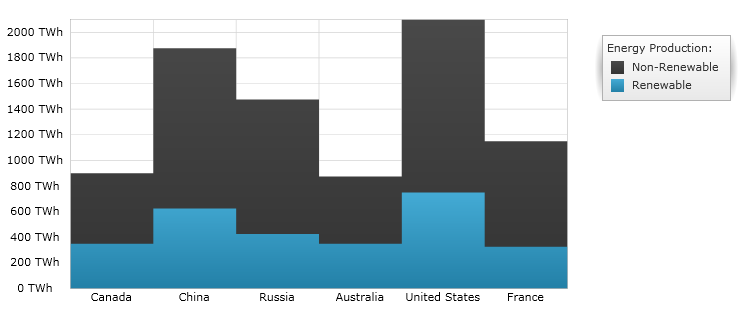
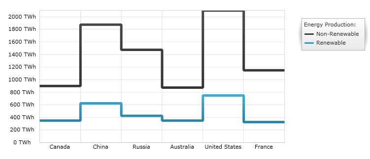

////
|metadata|
{
    "name": "datachart-category-step-area-series",
    "controlName": ["{DataChartName}"],
    "tags": ["Application Scenarios","Charting","How Do I"],
    "guid": "f17c1109-1d3c-41ed-9d17-120610a69f20",
    "buildFlags": [],
    "createdOn": "2014-06-05T19:39:00.425286Z"
}
|metadata|
////

= Step Area Series

This topic explains, with code examples, how to use the link:{DataChartLink}.stepareaseries.html[StepAreaSeries] in the link:{DataChartLink}.{DataChartName}.html[{DataChartName}]™ control.

== Overview

The topic is organized as follows:

* <<Introduction,Introduction>>
* <<SeriesPreview,Series Preview>>
* <<SeriesRecommendations,Series Recommendations>>
* <<DataRequirements,Data Requirements>>
* <<DataRenderingRules,Data Rendering Rules>>
* <<DataBindingExample,Data Binding Example>>
* <<RelatedTopics,Related Topics>>

== Introduction

Step Area Series belongs to a group of link:datachart-category-series-overview.html[Category Series] and it is rendered using a collection of points connected by continuous vertical and horizontal lines with the area below lines filled in. Values are represented on the y-axis (NumericYAxis) and categories are displayed on the x-axis (CategoryXAxis or CategoryDateTimeXAxis). Step Area Series emphasizes the amount of change over a period of time or compares multiple items. The link:{DataChartLink}.stepareaseries.html[StepAreaSeries] is identical to the link:{DataChartLink}.steplineseries.html[StepLineSeries] in all aspects except that the area below the step lines is filled in. For more conceptual information, comprehension with other types of series, and supported types of axes, refer to the link:datachart-category-series-overview.html[Category Series] and link:datachart-axes.html[Chart Axes] topics.

== Series Preview

Figures 1 and 2 demonstrate how the link:{DataChartLink}.stepareaseries.html[StepAreaSeries] and link:{DataChartLink}.steplineseries.html[StepLineSeries] look when plotted in the {DataChartName} control.

Figure 1: Sample implementation of the link:{DataChartLink}.stepareaseries.html[StepAreaSeries] type.

Figure 2: Sample implementation of the link:{DataChartLink}.steplineseries.html[StepLineSeries] type.

== Series Recommendations

Although the {DataChartName} supports plotting unlimited number of various types of series, it is recommended to use the Step Area Series with similar types of series. Refer to the link:datachart-multiple-series.html[Multiple Series] topic for information on what types of series are recommended with the Step Area Series and how to plot multiple types of series.

== Data Requirements

While the {DataChartName} control allows you to easily bind it to your own data model, be sure to supply the appropriate amount and type of data that the series requires. If the data does not meet the minimum requirements based on the type of series that you are using, an error is generated by the control. Refer to the link:datachart-series-requirements.html[Series Requirements] and link:datachart-category-series-overview.html[Category Series] topics for more information on data series requirements.

The following is a list of data requirements for the link:{DataChartLink}.stepareaseries.html[StepAreaSeries] type:

* The data model must contain at least one numeric data column.
* The data model may contain an optional string or date time field for labels.

== Data Rendering Rules

The Step Area Series renders data using the following rules:

* Each row in the data column specified as the ValueMemberPath property of the data mapping is plotted as horizontal line connected with other horizontal lines by vertical lines forming a step-like progression on the chart.
* The area below the step lines is filled in using the brush set to the Brush property of the series.
* The string or date time column that is mapped to the Label property of data mapping on the x-axis is used as the category labels. If the data mapping for Label is not specified, default labels are used.
* Category labels are drawn on the x-axis. Data values are drawn on the y-axis.
* When rendering, multiple series of the link:{DataChartLink}.stepareaseries.html[StepAreaSeries] type will get rendered in layers with each successive series rendered in front of the previous one in the Series collection of the {DataChartName} control. For more information on this feature, refer to the link:datachart-multiple-series.html[Multiple Series] topic.

== Data Binding Example

The code snippet below shows how to bind the link:{DataChartLink}.stepareaseries.html[StepAreaSeries] object to sample of category data (which is available for download from link:resources-sample-energy-data.html[Sample Energy Data] resource). Refer to the data requirements section of this topic for information about data requirements for the StepLineSeries.

ifdef::xaml[]

*In XAML:*

----
xmlns:local="clr-namespace:SampleApp;assembly=SampleApp"
----

endif::xaml[]

ifdef::xaml[]

*In XAML:*

ifdef::sl,wpf,win-universal[]
----
<ig:{DataChartName} x:Name="DataChart" >
    <ig:{DataChartName}.Resources>
        <local:EnergyProductionDataSample x:Key="data" />
    </ig:{DataChartName}.Resources>
    <ig:{DataChartName}.Axes>
        <ig:NumericYAxis x:Name="YAxis"  />
        <ig:CategoryXAxis x:Name="XAxis" ItemsSource="{StaticResource data}" 
                       Label="{}{Country}" 
                       Label="Country" />
    </ig:{DataChartName}.Axes>
    <ig:{DataChartName}.Series>
        <ig:StepAreaSeries ItemsSource="{StaticResource data}" ValueMemberPath="NonRenewable"  
                       Title="Non-Renewable" 
                       XAxis="{Binding ElementName=XAxis}"
                         XAxis="{x:Reference XAxis}" 
                       YAxis="{Binding ElementName=YAxis}"
                         YAxis="{x:Reference YAxis}">
        </ig:StepAreaSeries >
        <ig:StepAreaSeries ItemsSource="{StaticResource data}" ValueMemberPath="Renewable" 
                       Title="Renewable" 
                       XAxis="{Binding ElementName=XAxis}"
                         XAxis="{x:Reference XAxis}" 
                       YAxis="{Binding ElementName=YAxis}"
                         YAxis="{x:Reference YAxis}">
        </ig:StepAreaSeries >           
    </ig:{DataChartName}.Series>
</ig:{DataChartName}>
----
endif::sl,wpf,win-universal[]

ifdef::xamarin[]
----
<ig:{DataChartName} x:Name="DataChart" >
    <ig:{DataChartName}.Resources>
        <local:EnergyProductionDataSample x:Key="data" />
    </ig:{DataChartName}.Resources>
    <ig:{DataChartName}.Axes>
        <ig:NumericYAxis x:Name="YAxis"  />
        <ig:CategoryXAxis x:Name="XAxis" ItemsSource="{StaticResource data}" 
                       Label="{}{Country}" 
                       Label="Country" />
    </ig:{DataChartName}.Axes>
    <ig:{DataChartName}.Series>
        <ig:StepAreaSeries ItemsSource="{StaticResource data}" ValueMemberPath="NonRenewable"  
                       Title="Non-Renewable" 
                       XAxis="{Binding ElementName=XAxis}"
                         XAxis="{x:Reference XAxis}" 
                       YAxis="{Binding ElementName=YAxis}"
                         YAxis="{x:Reference YAxis}">
        </ig:StepAreaSeries >
        <ig:StepAreaSeries ItemsSource="{StaticResource data}" ValueMemberPath="Renewable" 
                       Title="Renewable" 
                       XAxis="{Binding ElementName=XAxis}"
                         XAxis="{x:Reference XAxis}" 
                       YAxis="{Binding ElementName=YAxis}"
                         YAxis="{x:Reference YAxis}">
        </ig:StepAreaSeries >           
    </ig:{DataChartName}.Series>
</ig:{DataChartName}>
----
endif::xamarin[]

endif::xaml[]

ifdef::xaml,win-forms[]

*In C#:*

ifdef::win-forms[]
----
var data = new EnergyProductionDataSample(); 
var chart = new {DataChartName}();
var yAxis = new NumericYAxis();
var xAxis = new CategoryXAxis();
xAxis.DataSource = data;
xAxis.ItemsSource = data;
xAxis.Label = "{Country}";
xAxis.Label = "Country";
var series = new StepAreaSeries();
series.DataSource = data;
series.ItemsSource = data;
series.ValueMemberPath = "Renewable";
series.Title = "Renewable";
series.XAxis = xAxis;
series.YAxis = yAxis;
chart.Axes.Add(xAxis);
chart.Axes.Add(yAxis);
chart.Series.Add(series);
----
endif::win-forms[]

ifdef::xaml[]
----
var data = new EnergyProductionDataSample(); 
var chart = new {DataChartName}();
var yAxis = new NumericYAxis();
var xAxis = new CategoryXAxis();
xAxis.DataSource = data;
xAxis.ItemsSource = data;
xAxis.Label = "{Country}";
xAxis.Label = "Country";
var series = new StepAreaSeries();
series.DataSource = data;
series.ItemsSource = data;
series.ValueMemberPath = "Renewable";
series.Title = "Renewable";
series.XAxis = xAxis;
series.YAxis = yAxis;
chart.Axes.Add(xAxis);
chart.Axes.Add(yAxis);
chart.Series.Add(series);
----
endif::xaml[]

endif::xaml,win-forms[]

ifdef::xaml,win-forms[]

*In Visual Basic:*

ifdef::win-forms[]
----
Dim data As New EnergyProductionDataSample()
Dim chart As New {DataChartName}()
Dim yAxis As New NumericYAxis()
Dim xAxis As New CategoryXAxis()
xAxis.DataSource = data
xAxis.ItemsSource = data
xAxis.Label = "{Country}"
xAxis.Label = "Country"
Dim series As New StepAreaSeries()
series.DataSource = data
series.ItemsSource = data
series.ValueMemberPath = "Renewable"
series.Title = "Renewable"
series.XAxis = xAxis
series.YAxis = yAxis
chart.Axes.Add(xAxis)
chart.Axes.Add(yAxis)
chart.Series.Add(series)
----
endif::win-forms[]

ifdef::xaml[]
----
Dim data As New EnergyProductionDataSample()
Dim chart As New {DataChartName}()
Dim yAxis As New NumericYAxis()
Dim xAxis As New CategoryXAxis()
xAxis.DataSource = data
xAxis.ItemsSource = data
xAxis.Label = "{Country}"
xAxis.Label = "Country"
Dim series As New StepAreaSeries()
series.DataSource = data
series.ItemsSource = data
series.ValueMemberPath = "Renewable"
series.Title = "Renewable"
series.XAxis = xAxis
series.YAxis = yAxis
chart.Axes.Add(xAxis)
chart.Axes.Add(yAxis)
chart.Series.Add(series)
----
endif::xaml[]

endif::xaml,win-forms[]

ifdef::android[]

*In Java:*

[source,js]
----
EnergyProductionDataSample data = new EnergyProductionDataSample();
DataChartView chart = new DataChartView(rootView.getContext());
NumericYAxis yAxis = new NumericYAxis();
CategoryXAxis xAxis = new CategoryXAxis();
xAxis.setDataSource(data);
xAxis.setLabel("Country");
StepAreaSeries series = new StepAreaSeries();
series.setDataSource(data);
series.setValueMemberPath("Renewable");
series.setTitle("Renewable");
series.setXAxis(xAxis);
series.setYAxis(yAxis);
chart.addAxis(xAxis);
chart.addAxis(yAxis);
chart.addSeries(series);
----

endif::android[]

== Related Topics

link:datachart-axes.html[Axes]

link:datachart-category-step-line-series.html[Step Line Series]

link:datachart-category-series-overview.html[Category Series]

link:datachart-series-requirements.html[Series Requirements]