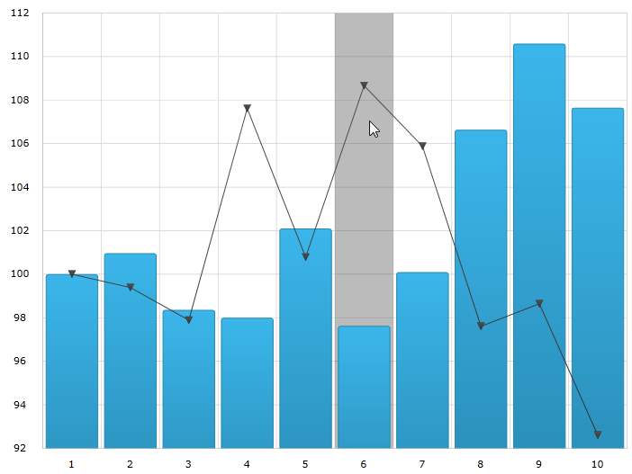
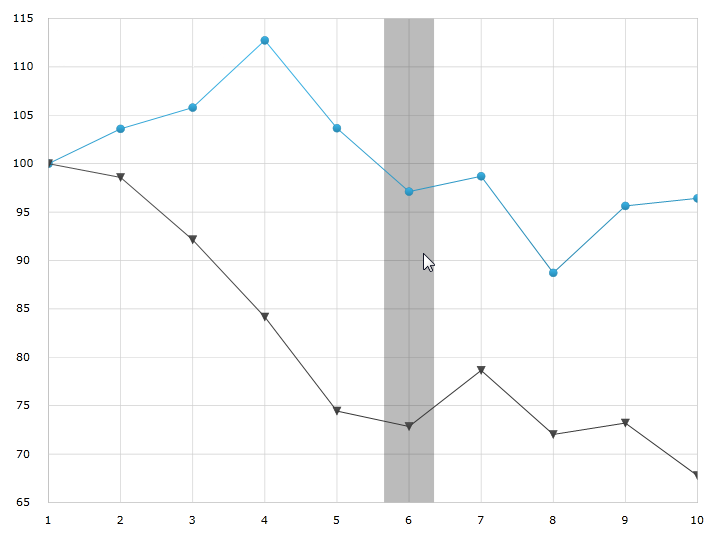

////

|metadata|
{
    "name": "datachart-categoryhighlightlayer",
    "controlName": ["{DataChartName}"],
    "tags": ["Charting","Getting Started","How Do I"],
    "guid": "4fb63863-ed39-497c-a8eb-9cb0b17e16cd",  
    "buildFlags": ["ANDROID","SL","WPF","WINFORMS"],
    "createdOn": "2014-06-05T19:39:00.6213683Z"
}
|metadata|
////

= Category Highlight Layer

== Topic Overview

=== Purpose

This topic provides information about the category highlight layer which is used for hover interactions. It describes the properties of the category highlight layer and provides an example of its implementation.

=== Required background

The following topics are prerequisites to understanding this topic:

[options="header", cols="a,a"]
|====
|Topic|Purpose

|_ link:datachart-getting-started-with-datachart.html[Getting Started with Data Chart]_
|The _{DataChartName}_ control requires a data object model to be mapped to control's DataContext property. This article will provide a simple data object model but you can create your own and use it with this sample code instead.

| link:datachart-category-series-overview.html[Category Series]
|This topic explains various types of Category Series in the _{DataChartName}_ control.

|====

=== In this topic

This topic contains the following sections:

* <<Overview,Overview>>
* <<Preview,Preview>>
* <<Properties,Properties>>
* <<Example,Example>>
* <<RelatedContent,Related Content>>

[[Overview]]
== Overview

=== Category highlight layer overview

The link:{DataChartLink}.categoryhighlightlayer_members.html[CategoryHighlightLayer] targets a category axis, or all category axes in the  _xamDataChart_  control. If the axis contains any series that are aligned between major gridlines of the axis, for example, link:{DataChartLink}.columnseries.html[ColumnSeries] series, this will render a shape that fills the current category.

For other series, such as link:{DataChartLink}.lineseries.html[LineSeries] series, it will render a band with an adjustable thickness at the closest gridline to the mouse position. In this situation if the link:{DataChartLink}.categoryhighlightlayer{ApiProp}useinterpolation.html[UseInterpolation] property is enabled this will cause the x position to become affixed to the x position of the cursor.

You can change the color of the highlighting area by setting the link:{DataChartLink}.series{ApiProp}brush.html[Brush] property. For more information on this property see the link:datachart-commonproperties.html[Common Properties] topic.

[[Preview]]

=== Preview

The following image is a preview of the  _{DataChartName}_  control rendered with the link:{DataChartLink}.categoryhighlightlayer_members.html[CategoryHighlightLayer] added.

[[Properties]]
== Properties

=== Category highlight layer summary

The following table summarizes the properties of the link:{DataChartLink}.categoryhighlightlayer_members.html[CategoryHighlightLayer] layer.

[options="header", cols="a,a,a"]
|====
|Property Name|Property Type|Description

| link:{DataChartLink}.categoryhighlightlayer{ApiProp}bandhighlightwidth.html[BandHighlightWidth]
|`double`
|This property specifies the width of the highlight area for series that are aligned on gridlines. For example, link:{DataChartLink}.lineseries.html[LineSeries], link:{DataChartLink}.areaseries.html[AreaSeries] and link:{DataChartLink}.splineseries.html[SplineSeries]. 

This property has no effect if there are series present aligned between gridlines. For example link:{DataChartLink}.columnseries.html[ColumnSeries] and link:{DataChartLink}.waterfallseries.html[WaterfallSeries]. 

When this property is set, it highlights a banded shape of the specified size around the gridline.

| link:{DataChartLink}.categoryhighlightlayer{ApiProp}targetaxis.html[TargetAxis]
|`CategoryAxisBase`
|This property specifies which axis should have the enabled category highlight layer.

| link:{DataChartLink}.categoryhighlightlayer{ApiProp}useinterpolation.html[UseInterpolation]
|`bool`
|This property specifies if the highlight band should snap-to-cursor, instead of snap-to-gridlines. 

This property has no effect if there are series present aligned between gridlines. For example, link:{DataChartLink}.columnseries.html[ColumnSeries] and link:{DataChartLink}.waterfallseries.html[WaterfallSeries].

|====

[[Example]]
== Example

=== Example

The following screenshot illustrates how the  _{DataChartName}_  control with the link:{DataChartLink}.categoryhighlightlayer{ApiProp}bandhighlightwidth.html[BandHighlightWidth] property of the link:{DataChartLink}.categoryhighlightlayer_members.html[CategoryHighlightLayer] object looks as a result of the following setting:

[options="header", cols="a,a"]
|====
|Property|Value

|BandHighlightWidth
|50

|====

Following is the code used to implement this example

ifdef::wpf,win-universal[]

*In XAML:*

[source,xaml]
----
<ig:{DataChartName} x:Name="theChart" Margin="5,0,5,0" >
   <ig:{DataChartName}.Axes>
      <ig:CategoryXAxis x:Name="xmCategoryXAxis"
                        ItemsSource="{StaticResource CategoryData1}"
                        Label="{}{Category}">
         <ig:CategoryXAxis.LabelSettings>
            <ig:AxisLabelSettings x:Name="xmCategoryXAxisLabel" Extent="25" VerticalAlignment="Bottom" FontSize="11" />
            </ig:CategoryXAxis.LabelSettings>
         </ig:CategoryXAxis>
         <ig:NumericYAxis x:Name="xmNumericYAxis1">
            <ig:NumericYAxis.LabelSettings>
               <ig:AxisLabelSettings x:Name="xmNumericYAxisLabel" Extent="50" Location="OutsideLeft" />
               </ig:NumericYAxis.LabelSettings>
            </ig:NumericYAxis>
    </ig:{DataChartName}.Axes>
    <ig:{DataChartName}.Series>
       <ig:CategoryHighlightLayer 
          BandHighlightWidth="50"
       />
    <ig:LineSeries ItemsSource="{StaticResource CategoryData1}" ValueMemberPath="Value" 
XAxis="{Binding ElementName=xmCategoryXAxis}" YAxis="{Binding ElementName=xmNumericYAxis1}">
    </ig:LineSeries>
    <ig:LineSeries ItemsSource="{StaticResource CategoryData2}" ValueMemberPath="Value" 
 XAxis="{Binding ElementName=xmCategoryXAxis}" YAxis="{Binding ElementName=xmNumericYAxis1}">
    </ig:LineSeries>
  </ig:{DataChartName}.Series>
</ig:{DataChartName}>
----

endif::wpf,win-universal[]

ifdef::wpf[]

*In C#:*

----
var catHighlightLayerSeries = new CategoryHighLightLayer();
catHighLightLayerSeries.BandHighlightWidth = 50;
chart.Series.Add(catHighLightLayerSeries);
----

endif::wpf[]

ifdef::win-forms[]

*In C#:*

----
var catHighlightLayerSeries = new CategoryHighLightLayer();
catHighLightLayerSeries.BandHighlightWidth = 50;
chart.Series.Add(catHighLightLayerSeries);
----

endif::win-forms[]

ifdef::xamarin[]

*In C#:*

----
var catHighlightLayerSeries = new CategoryHighLightLayer();
catHighLightLayerSeries.BandHighlightWidth = 50;
chart.Series.Add(catHighLightLayerSeries);
----

endif::xamarin[]

[[RelatedContent]]
== Related Content

=== Topics

[options="header", cols="a,a"]
|====
|Topic|Purpose

| link:datachart-chartannotationlayers.html[Chart Annotation Layers]
|This topic provides conceptual information about the hover interactions available on the link:{DataChartLink}.{DataChartName}.html[{DataChartName}™] control including the different types of hover interaction layers available.

| link:datachart-commonproperties.html[Common Properties]
|This topic provides information about the properties and methods that the hover interaction feature uses for highlighting, hovering and interacting with the tooltip interactions inherited from the link:{DataChartLink}.series_members.html[Series] class.

| link:datachart-crosshairlayer.html[Crosshair Layer]
|This topic provides information about the crosshair layer used for hover interactions. It describes the properties of the crosshair layer and provides an implementation example.

| link:datachart-categoryitemhighlightlayer.html[Category Item Highlight Layer]
|This topic provides information about the category item highlight layer used for hover interactions. It describes the properties of the category item highlight layer and provides an example of its implementation.

| link:datachart-categorytooltiplayer.html[Category Tooltip Layer]
|This topic provides information about the category tooltip layer used for hover interactions. It describes the properties of the category tooltip layer and provides an example of its implementation.

| link:datachart-itemtooltiplayer.html[Item Tooltip Layer]
|This topic provides information about the item tooltip layer which is used for hover interactions. It describes the properties of the item tooltip layer and also provides an example of its implementation.

|====

ifdef::sl[]

[[_Ref345510473]]

=== Samples

ifdef::sl[]

The following samples provide additional information related to this topic.

[options="header", cols="a,a"]
|====
|Sample|Purpose

| link:{SamplesURL}/data-chart/#/hover-interactions-category-highlight-layer[Hover Interactions – Category Highlight Layer]
|This sample demonstrates the Category Highlight Layer that targets a category axis, or all category axes in the {DataChartName}™ control. The sample options pane allows you to edit the properties of the Category Highlight Layer, such as changing the color of the highlight, outline, thickness and more.

| link:{SamplesURL}/data-chart/#/hover-interactions-category-item-highlight-layer[Hover Interactions – Category Item Highlight Layer] link:{SamplesURL}/data-chart/#/hover-interactions-category-item-highlight-layer[]
|This sample demonstrates the Category Item Highlight Layer that highlights items in a series that use a category axis either by drawing a banded shape at their position or by rendering a marker at their position.The sample options pane allows you to edit the properties of the Category Item Highlight Layer, such as changing the color of the highlight, outline, thickness and more.

| link:{SamplesURL}/data-chart/#/hover-interactions-category-tooltip-layer[Hover Interactions – Category Tooltip Layer] link:{SamplesURL}/data-chart/#/hover-interactions-category-tooltip-layer[]
|This sample demonstrates the Category Tooltip Layer that displays grouped tooltips for series that use a category axis. The sample options pane allows you to edit the properties of the layer, such as changing the position of the tooltip.

| link:{SamplesURL}/data-chart/#/hover-interactions-crosshair-layer[Hover Interactions – Crosshair Layer] link:{SamplesURL}/data-chart/#/hover-interactions-crosshair-layer[]
|This sample demonstrates the Crosshair Layer that provides crossing lines that meet at the actual value of every series that they are targeting. The sample options pane allows you to edit the properties of the layer, such as changing the thickness of the crosshair.

| link:{SamplesURL}/data-chart/#/hover-interactions-item-tooltip-layer[Hover Interactions – Item Tooltip Layer] link:{SamplesURL}/data-chart/#/hover-interactions-item-tooltip-layer[]
|This sample demonstrates the Item Tooltip Layer that displays tooltips for all target series individually. The sample options pane allows you to edit the properties of the layer, such as changing the transition duration.

| link:{SamplesURL}/data-chart/#/hover-interactions-multiple-layers[Hover Interactions – Multiple Layers] link:{SamplesURL}/data-chart/#/hover-interactions-multiple-layers[]
|This sample demonstrates how multiple layers interact within the {DataChartName} control. This sample displays the Item Tooltip Layer, the Crosshair layer and the Category Highlight Layer.

| link:{SamplesURL}/data-chart/#/hover-interactions-synchronized-layers[Hover Interactions – Synchronized Layers] link:{SamplesURL}/data-chart/#/hover-interactions-synchronized-layers[]
|This sample demonstrates how the layers between two charts remain synchronized with each other.

|====

endif::sl[]

endif::sl[]