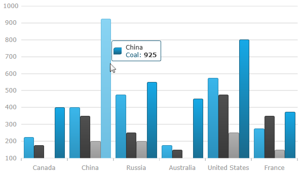
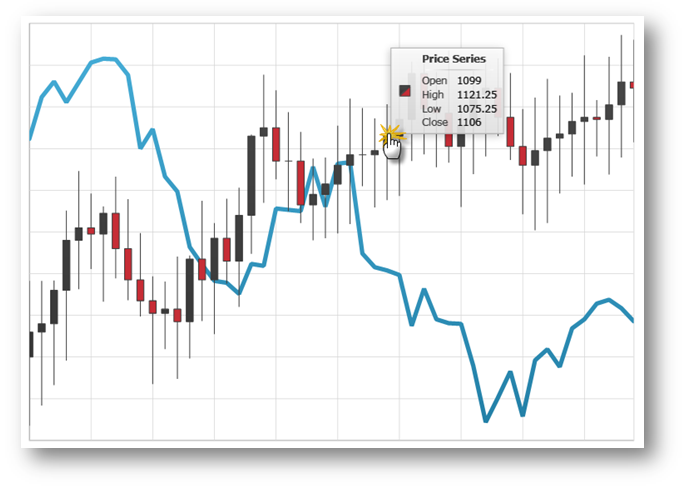

////

|metadata|
{
    "name": "datachart-chart-tooltips",
    "controlName": ["{DataChartName}"],
    "tags": ["Application Scenarios","Charting","How Do I"],
    "guid": "01682312-7c06-469f-87e6-c0cea516c9a6",  
    "buildFlags": ["wpf,win-universal"],
    "createdOn": "2014-06-05T19:39:00.6673846Z"
}
|metadata|
////

= Chart Tooltips

This topic explains, with code examples, how to enable the default tooltips in the link:{DataChartLink}.{DataChartName}.html[{DataChartName}]™ control and how create custom ones.

== Introduction

In the {DataChartName} control,  pick:[sl,wpf="tooltips are displayed as long as mouse cursor hovers over series in the {DataChartName} control"]   pick:[win-phone,win-universal="tooltips are displayed when the tap and hold gesture is performed within chart plot area. Also, tapping and holding and then moving the finger without releasing will update tooltips values"] .

== Tooltips Overview

ifdef::sl,wpf[]
The {DataChartName}Controls provides default tooltips for each type of series. Default tooltips are enabled by setting the link:{DataChartLink}.series{ApiProp}showdefaulttooltip.html[ShowDefaultTooltip] property to True. The default tooltips display all the information relevant to the particular series item (series title, data values, axis values etc.) and are styled to match the series' style.
endif::sl,wpf[]

pick:[sl,wpf="If default tooltips are not sufficient, custom tooltips can be configured as well."]  Tooltips can be customized in the following aspects:

* tooltip content
* tooltip look-and-feel

The tooltip content is customized by providing custom content to the link:{DataChartLink}.series{ApiProp}tooltip.html[ToolTip] property of the Series object.  pick:[xaml="Tooltip look-and-feel is managed through the"]   pick:[xaml=" link:{DataChartLinkBase}.{DataChartBase}{ApiProp}tooltipstyle.html[ToolTipStyle]"]   pick:[xaml="property"]   pick:[win-phone="and"]   pick:[win-phone=" link:{DataChartLinkBase}{ApiProp}tooltipinfoboxstyle.html[ToolTipInfoBoxStyle]"]   pick:[win-phone="property"]   pick:[xaml="of the {DataChartName} control."]

ifdef::sl,wpf[]
Note:{label} If a custom link:{DataChartLink}.series{ApiProp}tooltip.html[ToolTip] is set, the link:{DataChartLink}.series{ApiProp}showdefaulttooltip.html[ShowDefaultTooltip] setting is disregarded.
endif::sl,wpf[]

ifdef::sl,wpf[]
== Default Tooltip
endif::sl,wpf[]

ifdef::sl,wpf[]
The following screenshot demontrates the default tooltip for category series.
endif::sl,wpf[]

ifdef::sl,wpf,win-phone[]

endif::sl,wpf,win-phone[]

== Code Example: Displaying Custom Tooltips

This example demonstrates how to deliver in tooltips information about the open, high, low, and close sales volumes for any point of a financial graph. This is achieved by creating custom tooltips that will display the volume value on link:{DataChartLink}.lineseries.html[LineSeries] and the open, high, low, and close values on link:{DataChartLink}.financialpriceseries.html[FinancialPriceSeries].

=== Preview

Figure 1: The {DataChartName} control with custom tooltip showing values of Financial Price Series

== Steps

ifdef::win-phone[]
.Note:
[NOTE]
====
This example assumes that you already added references to xamInfoBox and xamMessageBox control assemblies to your project.
====
endif::win-phone[]

[start=1]
. Add a custom style for the chart’s Tooltip.

ifdef::wpf[]

*In XAML:*

----
<UserControl.Resources>
   
</UserControl.Resources>
----

endif::wpf[]

ifdef::win-universal[]

*In XAML:*

----
<UserControl.Resources>
   
</UserControl.Resources>
----

endif::win-universal[]

[start=2]
. Set the custom tooltip style to the {DataChartName} control.  pick:[win-phone="`CrosshairVisibility` must be set to `Visible` in order to enable tooltips in {DataChartName}."] 

ifdef::wpf[]

*In XAML:*

----
<ig:{DataChartName} x:Name="DataChart"
                 ToolTipStyle="{StaticResource ToolTipStyle}">
        <!--TODO: Add Series with custom tooltip content -->
</ig:{DataChartName}>
----

endif::wpf[]

ifdef::win-universal[]

*In XAML:*

----
<ig:{DataChartName} x:Name="DataChart"
                 ToolTipStyle="{StaticResource ToolTipStyle}">
        <!--TODO: Add Series with custom tooltip content -->
</ig:{DataChartName}>
----

endif::win-universal[]

[start=3]
. Add custom tooltip content to the link:{DataChartLink}.series{ApiProp}tooltip.html[ToolTip] property of the link:{DataChartLink}.series.html[Series] object.

ifdef::wpf,win-universal[]

*In XAML:*

[source]
----
<ig:{DataChartName}.Series>
    <ig:LineSeries ItemsSource="{Binding}"
                   ValueMemberPath="Volume"
                   XAxis="{Binding ElementName=commonXAxis}"
                   YAxis="{Binding ElementName=volumeYAxis}">
            <!--Simple Tooltip showing volume on LineSeries -->
        <ig:LineSeries.ToolTip>
            <StackPanel Orientation="Vertical">
                <TextBlock Text="{Binding Series.Title}" FontWeight="Bold" />
                <StackPanel Orientation="Horizontal">
                    <TextBlock Text="Value:" />
                    <TextBlock Text="{Binding Item.Volume}"/>
                </StackPanel>
            </StackPanel>
        </ig:LineSeries.ToolTip>
    </ig:LineSeries>
    <ig:FinancialPriceSeries DisplayType="Candlestick"
                             ItemsSource="{Binding}"
                             OpenMemberPath="Open"
                             CloseMemberPath="Close"
                             HighMemberPath="High"
                             LowMemberPath="Low"
                             VolumeMemberPath="Volume"
                             XAxis="{Binding ElementName=commonXAxis}"
                             YAxis="{Binding ElementName=priceYAxis}">
            <!--Complex Tooltip showing all (OHLC) values on FinancialPriceSeries  -->
        <ig:FinancialPriceSeries.ToolTip>
            <StackPanel Orientation="Vertical">
                <TextBlock Text="{Binding Series.Title}" FontWeight="Bold" />
                <StackPanel Orientation="Horizontal">
                    <TextBlock Text="Open:" Width="40" />
                    <TextBlock Text="{Binding Item.Open}" />
                </StackPanel>
                <StackPanel Orientation="Horizontal">
                    <TextBlock Text="High:" Width="40" />
                    <TextBlock Text="{Binding Item.High}" />
                </StackPanel>
                <StackPanel Orientation="Horizontal">
                    <TextBlock Text="Low:" Width="40" />
                    <TextBlock Text="{Binding Item.Low}" />
                </StackPanel>
                <StackPanel Orientation="Horizontal">
                    <TextBlock Text="Close:" Width="40" />
                    <TextBlock Text="{Binding Item.Close}" />
                </StackPanel>
            </StackPanel>
        </ig:FinancialPriceSeries.ToolTip>
    </ig:FinancialPriceSeries>
----

[source]
----
</ig:{DataChartName}.Series>
----

endif::wpf,win-universal[]

[[RelatedTopics]]
== Related Topics

* link:datachart-chart-navigation.html[Chart Navigation]

ifdef::wpf,win-universal,win-forms[]
* link:datachart-chart-synchronization.html[Chart Synchronization]

endif::wpf,win-universal,win-forms[]

* link:datachart-series-types.html[Series Types]
* link:datachart-series-requirements.html[Series Requirements]