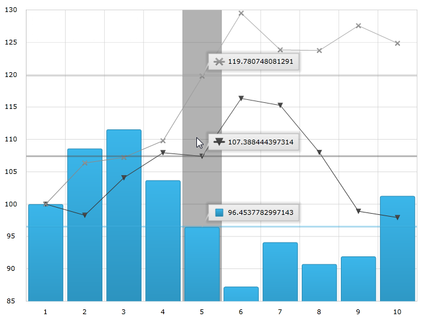
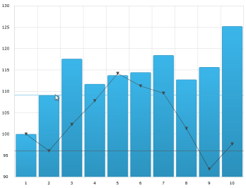
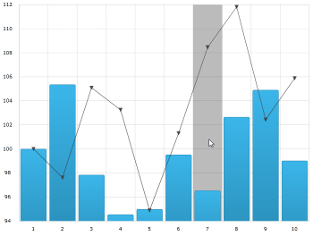
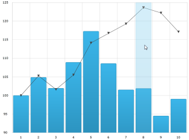
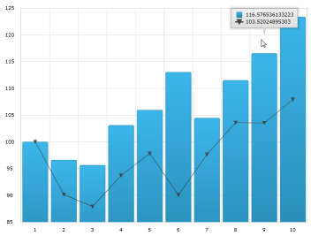
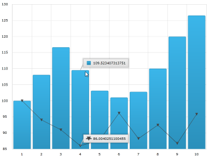

////

|metadata|
{
    "name": "datachart-chartannotationlayers",
    "controlName": ["{DataChartName}"],
    "tags": ["Charting","Getting Started","How Do I"],
    "guid": "210e57ae-6232-462f-89bf-76844d6e08f7",  
    "buildFlags": ["WINFORMS","ANDROID","WPF","SL"],
    "createdOn": "2014-06-05T19:39:00.6333735Z"
}
|metadata|
////

= Chart Annotation Layers

== Topic Overview

=== Purpose

This topic provides conceptual information about the annotations and hover interactions available on the link:{DataChartLink}.{DataChartName}.html[{DataChartName}™] control including the different types of hover interaction layers available. These layers are not supported by the following chart series:

* Scatter
* Polar
* Radial
* Stacked

=== Required background

The following topics are prerequisites to understanding this topic:

[options="header", cols="a,a"]
|====
|Topic|Purpose

| link:datachart-getting-started-with-datachart.html[Getting Started with Data Chart]
|The _{DataChartName}_ control requires a data object model to be mapped to control's DataContext property. This article will provide a simple data object model but you can create your own and use it with this sample code instead.

| link:datachart-category-series-overview.html[Category Series]
|This topic explains various types of Category Series in the _{DataChartName}_ control.

|====

=== In this topic

This topic contains the following sections:

* <<Overview,Overview>>
* <<CommonProperties,Common Properties>>
* <<TypesofLayers,Types of Layers>>

** <<CrosshairLayer,Crosshair Layer>>
** <<CategoryHighlightLayer,Category Highlight Layer>>
** <<CategoryItemHighlightLayer,Category Item Highlight Layer>>
** <<CategoryTooltipLayer,Category Tooltip Layer>>
** <<ItemTooltipLayer,Item Tooltip Layer>>

* <<RelatedContent,Related Content>>

[[Overview]]
== Overview

=== Hover interactions summary

Hover interactions are implemented through hover interaction layers which are series that are added to the series collection. These layers are dependent on the cursor position. Adding the hover interaction layers to the  _xamDataC_  _hart_  control disables the default behavior of the crosshairs and/or tooltips (depending on which type of layer added).

The default behavior is disabled because it prevents visual confusion as the hover interaction layers perform a similar visual function compared to the built in behavior as the cursor moves. You can, however, override this behavior and allow the default crosshair functionality to perform in addition to the hover interaction layer functionality. Also of note, only target a series by one tooltip layer at a time. If you target more than one tooltip layer at a series, the hover interaction layers that use tooltips will not function as expected. This is due to the fact that series tooltips are `UIElements` and can only be attached to the visual tree in one place at a time. Using a tooltip for a series in more than one location at once is not allowed.

The following screenshot displays the  _{DataChartName}_  control with the category highlight layer, the crosshair layer and the item tooltip layer implemented.

[[CommonProperties]]
== Common Properties

=== Common properties and methods overview

Since the hover interaction layers inherit from the link:{DataChartLink}.series_members.html[Series] object, they gain a lot of the properties and methods that are available on the link:{DataChartLink}.series_members.html[Series] base class. However, not everything from the link:{DataChartLink}.series_members.html[Series] class is meaningful for the hover interaction layers. For example, hover interaction layers are not designed to interact with the mouse and should not be hit testable; consequently they will not raise mouse related events.

For more information on the common properties and methods, see the link:datachart-commonproperties.html[Common Properties] topic.

[[TypesofLayers]]
== Types of Layers

=== Introduction

Currently there are 5 different hover interaction layers available on the  _{DataChartName}_  control. Each of these hover interactions layers provides a different highlight, hover and tooltip interactions that may be used individually or combined with one another providing powerful hover interactions.

=== Types of Layers

The following table summarizes the different types of layers available on the  _{DataChartName}_  control.

[options="header", cols="a,a"]
|====
|Layer Type|Description

|[[CrosshairLayer]] 

link:{DataChartLink}.crosshairlayer_members.html[CrosshairLayer]
|The link:{DataChartLink}.crosshairlayer_members.html[CrosshairLayer] provides crossing lines that meet at the actual value of every targeted series. 

 

For more information, see the link:datachart-crosshairlayer.html[Crosshair Layer] topic.

|[[CategoryHighlightLayer]] 

link:{DataChartLink}.categoryhighlightlayer_members.html[CategoryHighlightLayer]
|The link:{DataChartLink}.categoryhighlightlayer_members.html[CategoryHighlightLayer] targets a category axis, or all category axes in the _{DataChartName}_ control. They draw a shape that illuminates the area of the axis closest to the cursor position. 

 

For more information, see the link:datachart-categoryhighlightlayer.html[Category Highlight Layer] topic.

|[[CategoryItemHighlightLayer]] 

link:{DataChartLink}.categoryitemhighlightlayer_members.html[CategoryItemHighlightLayer]
|The link:{DataChartLink}.categoryitemhighlightlayer_members.html[CategoryItemHighlightLayer] layer highlights items in a series that use a category axis either by drawing a banded shape at their position or by rendering a marker at their position. 

 

For more information, see the link:datachart-categoryitemhighlightlayer.html[Category Item Highlight Layer] topic.

|[[CategoryToolTipLayer]] 

link:{DataChartLink}.categorytooltiplayer_members.html[CategoryToolTipLayer]
|The link:{DataChartLink}.categorytooltiplayer_members.html[CategoryToolTipLayer] displays grouped tooltips for series using a category axis. 

 

For more information, see the link:datachart-categorytooltiplayer.html[Category Tooltip Layer] topic.

|[[ItemToolTipLayer]] 

link:{DataChartLink}.itemtooltiplayer_members.html[ItemToolTipLayer]
|The link:{DataChartLink}.itemtooltiplayer_members.html[ItemToolTipLayer] displays tooltips for all target series individually. 

 

For more information, see the link:datachart-itemtooltiplayer.html[Item Tooltip Layer] topic.

|====

[[_Ref345510469]]

[[RelatedContent]]
== Related Content

=== Topics

[options="header", cols="a,a"]
|====
|Topic|Purpose

| link:datachart-commonproperties.html[Common Properties]
|This topic provides information about the properties and methods that the hover interaction feature uses for highlighting, hovering and interacting with the tooltip interactions inherited from the link:{DataChartLink}.series_members.html[Series] class.

| link:datachart-crosshairlayer.html[Crosshair Layer]
|This topic provides information about the crosshair layer used for hover interactions. It describes the properties of the crosshair layer and provides an implementation example.

| link:datachart-categoryhighlightlayer.html[Category Highlight Layer]
|This topic provides information about the category highlight layer which is used for hover interactions. It describes the properties of the category highlight layer and provides an example of its implementation.

| link:datachart-categoryitemhighlightlayer.html[Category Item Highlight Layer]
|This topic provides information about the category item highlight layer used for hover interactions. It describes the properties of the category item highlight layer and provides an example of its implementation.

| link:datachart-categorytooltiplayer.html[Category Tooltip Layer]
|This topic provides information about the category tooltip layer used for hover interactions. It describes the properties of the category tooltip layer and provides an example of its implementation.

| link:datachart-itemtooltiplayer.html[Item Tooltip Layer]
|This topic provides information about the item tooltip layer which is used for hover interactions. It describes the properties of the item tooltip layer and also provides an example of its implementation.

|====

ifdef::sl[]

[[_Ref345510473]]

=== Samples

ifdef::sl[]

The following samples provide additional information related to this topic.

[options="header", cols="a,a"]
|====
|Sample|Purpose

| link:{SamplesURL}/data-chart/#/hover-interactions-category-highlight-layer[Hover Interactions – Category Highlight Layer]
|This sample demonstrates the Category Highlight Layer that targets a category axis, or all category axes in the {DataChartName}™ control. The sample options pane allows you to edit the properties of the Category Highlight Layer, such as changing the color of the highlight, outline, thickness and more.

| link:{SamplesURL}/data-chart/#/hover-interactions-category-item-highlight-layer[Hover Interactions – Category Item Highlight Layer] link:{SamplesURL}/data-chart/#/hover-interactions-category-item-highlight-layer[]
|This sample demonstrates the Category Item Highlight Layer that highlights items in a series that use a category axis either by drawing a banded shape at their position or by rendering a marker at their position.The sample options pane allows you to edit the properties of the Category Item Highlight Layer, such as changing the color of the highlight, outline, thickness and more.

| link:{SamplesURL}/data-chart/#/hover-interactions-category-tooltip-layer[Hover Interactions – Category Tooltip Layer] link:{SamplesURL}/data-chart/#/hover-interactions-category-tooltip-layer[]
|This sample demonstrates the Category Tooltip Layer that displays grouped tooltips for series that use a category axis. The sample options pane allows you to edit the properties of the layer, such as changing the position of the tooltip.

| link:{SamplesURL}/data-chart/#/hover-interactions-crosshair-layer[Hover Interactions – Crosshair Layer] link:{SamplesURL}/data-chart/#/hover-interactions-crosshair-layer[]
|This sample demonstrates the Crosshair Layer that provides crossing lines that meet at the actual value of every series that they are targeting. The sample options pane allows you to edit the properties of the layer, such as changing the thickness of the crosshair.

| link:{SamplesURL}/data-chart/#/hover-interactions-item-tooltip-layer[Hover Interactions – Item Tooltip Layer] link:{SamplesURL}/data-chart/#/hover-interactions-item-tooltip-layer[]
|This sample demonstrates the Item Tooltip Layer that displays tooltips for all target series individually. The sample options pane allows you to edit the properties of the layer, such as changing the transition duration.

| link:{SamplesURL}/data-chart/#/hover-interactions-multiple-layers[Hover Interactions – Multiple Layers] link:{SamplesURL}/data-chart/#/hover-interactions-multiple-layers[]
|This sample demonstrates how multiple layers interact within the {DataChartName} control. This sample displays the Item Tooltip Layer, the Crosshair layer and the Category Highlight Layer.

| link:{SamplesURL}/data-chart/#/hover-interactions-synchronized-layers[Hover Interactions – Synchronized Layers] link:{SamplesURL}/data-chart/#/hover-interactions-synchronized-layers[]
|This sample demonstrates how the layers between two charts remain synchronized with each other.

|====

endif::sl[]

endif::sl[]