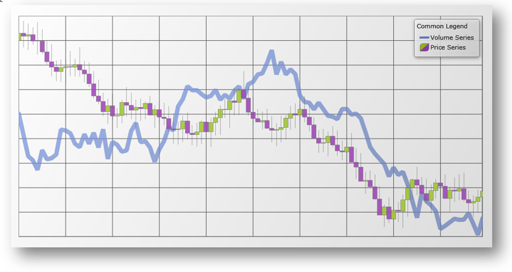

////

|metadata|
{
    "name": "datachart-common-legend",
    "controlName": ["{DataChartName}"],
    "tags": ["Application Scenarios","Charting","How Do I"],
    "guid": "41bed3d3-e267-4b63-bef1-2aefa06efc64",  
    "buildFlags": ["wpf,win-universal"],
    "createdOn": "2014-06-05T19:39:00.6763883Z"
}
|metadata|
////

= Adding Common Legend

By default, the link:{DataChartLink}.{DataChartName}.html[{DataChartName}]™ does not display link:datachart-legends.html[Chart Legends] for any series in the chart control. If you want to show a common Legend for multiple Series, you need to add a legend object to your application and then bind it to the {DataChartName} control’s Legend property. In addition, you must set the link:{DataChartLink}.series{ApiProp}title.html[Title] property for each Series object or else its corresponding legend item will use a default Series title.

ifdef::wpf,win-universal[]
The link:{ApiPlatform}datavisualization{ApiVersion}~infragistics.controls.xamdock.html[xamDock]™ control is one way to display a legend position next to or in front of the chart. For more information on this, please refer to the link:datachart-docking-legends.html[Docking Legends] topic.
endif::wpf,win-universal[]

The following example code demonstrates how to add a common Legend for multiple series defined in the {DataChartName} control’s Series collection.

ifdef::wpf,win-universal[]

*In XAML:*

----
<Grid >
    <ig:{DataChartName} x:Name="xmDataChart"
                     Legend="{Binding ElementName=xmLegend}">
        <ig:{DataChartName}.Series>
            <ig:LineSeries Title="Volume Series"
                           ItemsSource="{Binding}"
                           ValueMemberPath="Volume"
                           XAxis="{Binding ElementName=xmXAxis}"
                           YAxis="{Binding ElementName=xmYAxis2}">
            </ig:LineSeries>
            <ig:FinancialPriceSeries Title="Price Series"
                                     DisplayType="Candlestick"
                                     ItemsSource="{Binding}"
                                     OpenMemberPath="Open"
                                     CloseMemberPath="Close"
                                     HighMemberPath="High"
                                     LowMemberPath="Low"
                                     VolumeMemberPath="Volume"
                                     XAxis="{Binding ElementName=xmXAxis}"
                                     Axis="{Binding ElementName=xmYAxis}">
                    </ig:FinancialPriceSeries>
            </ig:{DataChartName}.Series>
        </ig:{DataChartName}>
        <!-- ========================================================================== -->
        <ig:Legend x:Name="xmLegend"
                   Content="Common Legend"
                   Margin="10"
                   ig:XamDock.Edge="InsideRight">
        </ig:Legend>
        <!-- ========================================================================== -->
</Grid>
----

endif::wpf,win-universal[]

The following image shows how the {DataChartName} control might look like with a common legend for multiple series.

== Related Topics

ifdef::wpf,win-universal[]
* link:datachart-docking-legends.html[Docking Legends]

endif::wpf,win-universal[]

* link:datachart-multiple-legends.html[Adding Multiple Legends]