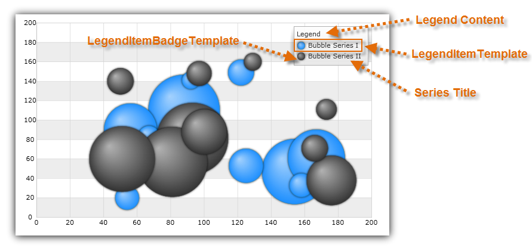

////

|metadata|
{
    "name": "datachart-configuring-basiclegend",
    "controlName": [],
    "tags": [],
    "guid": "0c3ffb62-af90-4722-91c1-c94067110757",  
    "buildFlags": [],
    "createdOn": "2015-09-22T18:26:08.6567627Z"
}
|metadata|
////

= Configuring Basic Legend

This topic provides information on how to configure  pick:[wpf,win-universal=" link:{DataChartLink}.legend.html[Legend]"]  pick:[win-forms=" link:{DataChartLink}.ultralegend.html[UltraLegend]"]  pick:[xamarin=" link:{DataChartLink}.xflegend.html[XFLegend]"]  pick:[android=" link:{DataChartLink}.legendview.html[LegendView]"]  control and explains, with code examples, how to use it with link:datachart-series.html[Chart Series] in the link:{DataChartLink}.{DataChartName}.html[{DataChartName}]™ control.

[[Overview]]
== Overview

The topic is organized as follows:

* <<Introduction,Introduction>>
* <<Properties,Properties>>
* <<Requirements,Requirements>>
* <<CodeExample,Code Example>>

ifdef::wpf,win-universal,win-forms,android[]
* <<RelatedTopics,Related Topics>>

endif::wpf,win-universal,win-forms,android[]

[[Introduction]]
== Introduction

The basic Legend control identify the title of a series with its visual representation of data in chart plot area. Legend's visuals consist of a list of legend items that have legend badge representing color of series as well as legend text that matches title of a series.  pick:[wpf,win-universal="Also, legend has a legend title that is displayed above legend items."]

[[Properties]]
== Properties

The basic Legend control shares common properties with other type of chart legends. Refer to the link:datachart-legends.html[Chart Legends] topic for a complete list of these common properties.  pick:[wpf,win-universal,android="The following table list all properties that are specific to the basic legend."]

ifdef::android,wpf,win-universal[]

[options="header", cols="a,a,a"]
|====
|Property Name|Property Type|Description

ifdef::wpf,win-universal[]
| link:{DataChartLink}.legend{ApiProp}orientation.html[Orientation]
|Orientation
|Determines vertical/horizontal orientation of legend items in the legend.
endif::wpf,win-universal[]

ifdef::android[]
| link:{DataChartLink}.legendviewbase{ApiProp}textsize.html[TextSize]
|double
|Determines text size in the legend.
endif::android[]

ifdef::android[]
| link:{DataChartLink}.legendviewbase{ApiProp}textcolor.html[TextColor]
|int
|Determines text color in the legend.
endif::android[]

ifdef::wpf,win-universal[]
|Series. pick:[wpf,win-universal=" link:{DataChartLink}.series{ApiProp}legenditemtemplate.html[LegendItemTemplate]"]
|DataTemplate
|Determines a template for the legend item of a given chart series.
endif::wpf,win-universal[]

|====

endif::android,wpf,win-universal[]

[[Requirements]]
== Requirements

The Legend control supports any type of link:datachart-series.html[Chart Series] and it will display legend item for each series in the chart plot area.

[[CodeExample]]
== Code Example

This code snippet demonstrates how to share Legend between two link:{DataChartLink}.bubbleseries.html[BubbleSeries] objects as shown on Figure 1.

Figure 1: Basic Legend with two Bubble Series

ifdef::wpf,win-universal[]

*In XAML:*

----
<ig:{DataChartName} >
    <ig:{DataChartName}.Series>
        <ig:BubbleSeries Title="Bubble Series I"
                         Legend="{Binding ElementName=TitleLegend}"
                         XAxis="{Binding ElementName=numericXAxis}"
                         YAxis="{Binding ElementName=numericYAxis}"
                         ItemsSource="{StaticResource bubbleDataSample1}" 
                         MarkerType="Circle"
                         XMemberPath="X" 
                         YMemberPath="Y"
                         RadiusMemberPath="Radius" >
        </ig:BubbleSeries>
        <ig:BubbleSeries Title="Bubble Series II"
                         Legend="{Binding ElementName=TitleLegend}"
                         XAxis="{Binding ElementName=numericXAxis}"
                         YAxis="{Binding ElementName=numericYAxis}"
                         ItemsSource="{StaticResource bubbleDataSample2}" 
                         MarkerType="Circle"
                         XMemberPath="X" 
                         YMemberPath="Y"
                         RadiusMemberPath="Radius" >
        </ig:BubbleSeries>
    </ig:{DataChartName}.Series>
</ig:{DataChartName}>
<!-- ========================================================================== -->
<ig:Legend x:Name="TitleLegend" Content="Legend" >
</ig:Legend>
<!-- ========================================================================== -->
----

endif::wpf,win-universal[]

ifdef::xamarin[]

*In XAML:*

----
<ig:{DataChartName} >
    <ig:{DataChartName}.Series>
        <ig:BubbleSeries Title="Bubble Series I"
                         Legend="{x:Reference TitleLegend}"
                         XAxis="{x:Reference numericXAxis}"
                         YAxis="{x:Reference numericYAxis}"
                         ItemsSource="{StaticResource bubbleDataSample1}" 
                         MarkerType="Circle"
                         XMemberPath="X" 
                         YMemberPath="Y"
                         RadiusMemberPath="Radius" >
        </ig:BubbleSeries>
        <ig:BubbleSeries Title="Bubble Series II"
                         Legend="{x:Reference TitleLegend}"
                         XAxis="{x:Reference numericXAxis}"
                         YAxis="{x:Reference numericYAxis}"
                         ItemsSource="{StaticResource bubbleDataSample2}" 
                         MarkerType="Circle"
                         XMemberPath="X" 
                         YMemberPath="Y"
                         RadiusMemberPath="Radius" >
        </ig:BubbleSeries>
    </ig:{DataChartName}.Series>
</ig:{DataChartName}>
<!-- ========================================================================== -->
<ig:XFLegend x:Name="TitleLegend"  >
</ig:XFLegend>
<!-- ========================================================================== -->
----

endif::xamarin[]

ifdef::xamarin[]

*In C#:*

----
using Infragistics.XF.Controls;
using Infragistics.XF; 
var legend = new XFLegend;
var series1 = new BubbleSeries();
series1.Title = "Bubble Series I";
series1.Legend = legend;
var series2 = new BubbleSeries();
series2.Title = "Bubble Series II";
series2.Legend = legend;
var DataChart = new {DataChartName}();
dataChart.Series.Add(series1);
dataChart.Series.Add(series2);
----

endif::xamarin[]

ifdef::xamarin[]

*In Visual Basic:*

----
Imports Infragistics.XF.Controls
Imports Infragistics.XF
Dim legend As New XFLegend() With { 
    .Content = "Legend" 
}
Dim series1 As New BubbleSeries()
series1.Title = "Bubble Series I"
series1.Legend = legend
Dim series2 As New BubbleSeries()
series2.Title = "Bubble Series II"
series2.Legend = legend
Dim dataChart As New {DataChartName}()
dataChart.Series.Add(series1)
dataChart.Series.Add(series2)
----

endif::xamarin[]

ifdef::wpf,win-universal[]

*In C#:*

----
using Infragistics.Controls.Charts;
using Infragistics; 
var legend = new Legend
{
    Content = "Legend" 
};
var series1 = new BubbleSeries();
series1.Title = "Bubble Series I";
series1.Legend = legend;
var series2 = new BubbleSeries();
series2.Title = "Bubble Series II";
series2.Legend = legend;
var DataChart = new {DataChartName}();
dataChart.Series.Add(series1);
dataChart.Series.Add(series2);
----

endif::wpf,win-universal[]

ifdef::win-forms[]

*In C#:*

----
using Infragistics.Win.DataVisualization;
var legend = new UltraLegend;
var series1 = new BubbleSeries();
series1.Title = "Bubble Series I";
series1.Legend = legend;
var series2 = new BubbleSeries();
series2.Title = "Bubble Series II";
series2.Legend = legend;
var DataChart = new {DataChartName}();
dataChart.Series.Add(series1);
dataChart.Series.Add(series2);
----

endif::win-forms[]

ifdef::wpf,win-universal[]

*In Visual Basic:*

----
Imports Infragistics.Controls.Charts
Imports Infragistics
Dim legend As New Legend() With { 
    .Content = "Legend" 
}
Dim series1 As New BubbleSeries()
series1.Title = "Bubble Series I"
series1.Legend = legend
Dim series2 As New BubbleSeries()
series2.Title = "Bubble Series II"
series2.Legend = legend
Dim dataChart As New {DataChartName}()
dataChart.Series.Add(series1)
dataChart.Series.Add(series2)
----

endif::wpf,win-universal[]

ifdef::android[]

*In Java:*

[source,js]
----import com.infragistics.controls.LegendView;
DataChartView chart = new DataChartView(rootView.getContext());
chart.setId(1111); //any integer to identify the view
LegendView legend = new LegendView(rootView.getContext());
RelativeLayout.LayoutParams legendParams = new RelativeLayout.LayoutParams(ViewGroup.LayoutParams.WRAP_CONTENT, ViewGroup.LayoutParams.WRAP_CONTENT);
legend.setContentDescription("Legend");
legendParams.addRule(RelativeLayout.ALIGN_TOP, chart.getId());
legendParams.addRule(RelativeLayout.ALIGN_RIGHT, chart.getId());
legend.setLayoutParams(legendParams);
BubbleSeries series1 = new BubbleSeries();
series1.setTitle("Bubble Series I");
series1.setLegend(legend);
BubbleSeries series2 = new BubbleSeries();
series2.setTitle("Bubble Series II");
series2.setLegend(legend);
chart.addSeries(series1);
chart.addSeries(series2);
----

endif::android[]

[[RelatedTopics]]

ifdef::wpf,win-universal,win-forms,android[]
== Related Topics
endif::wpf,win-universal,win-forms,android[]

ifdef::wpf,win-universal,win-forms,android[]
* link:datachart-configuring-itemlegend.html[Configuring Item Legend]

endif::wpf,win-universal,win-forms,android[]

ifdef::wpf,win-universal,win-forms[]
* link:datachart-configuring-scalelegend.html[Configuring Scale Legend]

endif::wpf,win-universal,win-forms[]

ifdef::wpf,win-universal[]
* link:datachart-common-legend.html[Adding Common Legend]

endif::wpf,win-universal[]

ifdef::wpf,win-universal[]
* link:datachart-multiple-legends.html[Adding Multiple Legends]

endif::wpf,win-universal[]

ifdef::wpf,win-universal[]
* link:datachart-docking-legends.html[Docking Legends]

endif::wpf,win-universal[]