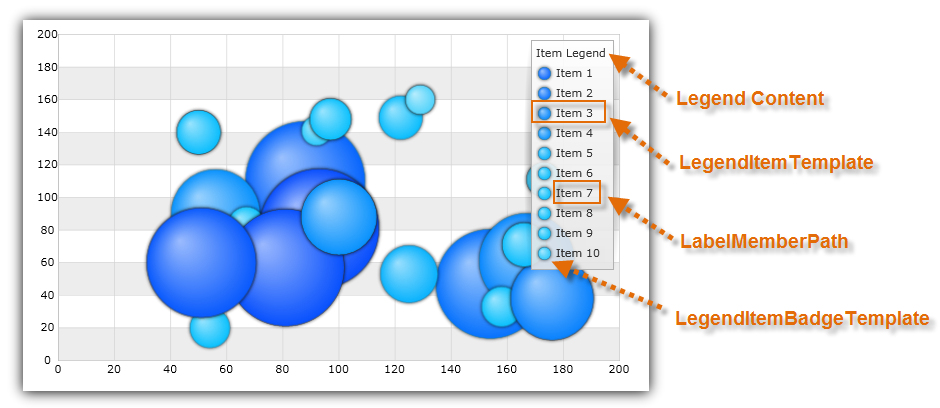

////

|metadata|
{
    "name": "datachart-configuring-itemlegend",
    "controlName": [],
    "tags": [],
    "guid": "5f976875-5ecd-457f-bd5a-194115a651ed",  
    "buildFlags": ["wpf,win-universal","WINFORMS","ANDROID"],
    "createdOn": "2015-09-22T18:25:38.5030504Z"
}
|metadata|
////

= Configuring Item Legend

This topic provides information on how to configure  pick:[wpf,win-universal=" link:{DataChartLink}.itemlegend.html[ItemLegend]"]  pick:[win-forms=" link:{DataChartLink}.ultraitemlegend.html[UltraItemLegend]"]  pick:[xamarin=" link:{DataChartLink}.xfitemlegend.html[XFItemLegend]"]  pick:[android=" link:{DataChartLink}.itemlegendview.html[ItemLegendView]"]  control and explains, with code examples, how to use it with link:datachart-series.html[Chart Series] in the link:{DataChartLink}.{DataChartName}.html[{DataChartName}]™ control.

[[Overview]]
== Overview

The topic is organized as follows:

* <<Introduction,Introduction>>
* <<Requirements,Requirements>>
* <<CodeExample,Code Example>>
* <<RelatedTopics,Related Topics>>

[[Introduction]]
== Introduction

The Item Legend control identify data items bound to link:{DataChartLink}.bubbleseries.html[BubbleSeries] with thier visual representation in chart plot area. Legend's visuals consist of a list of legend items that have legend badge representing a color of series as well as legend text that matches link:{DataChartLink}.bubbleseries{ApiProp}labelmemberpath.html[LabelMemberPath] property of data item.  pick:[wpf,win-universal="Also, legend has a legend title that is displayed above legend items."]

[[Properties]]
== Properties

The Item Legend control shares common properties with other type of chart legends. Refer to the link:datachart-legends.html[Chart Legends] topic for a complete list of these common properties.

[[Requirements]]
== Requirements

The Item Legend control supports only BubbleSeries and it displays legend item for each data member bound to the series. The following table lists all requirements for this legend.

ifdef::win-forms,wpf,win-universal,android[]

[options="header", cols="a,a,a"]
|====
|Series Property|Property Type|Description

| link:{DataChartLink}.series{ApiProp}legend.html[Legend]
|
ifdef::win-forms,wpf,win-universal[] 

LegendBase 

endif::win-forms,wpf,win-universal[] 

ifdef::android[] 

LegendViewBase 

endif::android[]
|Determines which Item Legend to bind to the series

| link:{DataChartLink}.bubbleseries{ApiProp}labelmemberpath.html[LabelMemberPath]
|string
|Data column determining labels for bubbles

ifdef::wpf,win-universal[]
|pick:[wpf,win-universal=" link:{DataChartLink}.series{ApiProp}legenditemtemplate.html[LegendItemTemplate]"]
|DataTemplate
|Determines a template for the legend item of a given chart series.
endif::wpf,win-universal[]

|====

endif::win-forms,wpf,win-universal,android[]

[[CodeExample]]
== Code Example

This code snippet demonstrates how to bind ItemLegend to link:{DataChartLink}.bubbleseries.html[BubbleSeries] with LabelMemberPath mapped to a Label data column. (Figure 3)

Figure 1: Item Legend bound to BubbleSeries with LabelMemberPath mapped to a Label data column

ifdef::wpf,win-universal[]

*In XAML:*

----
<ig:{DataChartName} >
    <ig:{DataChartName}.Series>
        <ig:BubbleSeries XAxis="{Binding ElementName=numericXAxis}"
                         YAxis="{Binding ElementName=numericYAxis}"
                         ItemsSource="{StaticResource bubbleDataSample}" 
                         XMemberPath="X" 
                         YMemberPath="Y"
                         RadiusMemberPath="Radius"
                         Legend="{Binding ElementName=ItemLegend}"
                         LabelMemberPath="Label">
        </ig:BubbleSeries>
    </ig:{DataChartName}.Series>
</ig:{DataChartName}>
<!-- ========================================================================== -->
<ig:ItemLegend x:Name="ItemLegend" Content="Item Legend" >
</ig:ItemLegend>
<!-- ========================================================================== -->
----

endif::wpf,win-universal[]

ifdef::xamarin[]

*In XAML:*

----
<ig:{DataChartName} >
    <ig:{DataChartName}.Series>
        <ig:BubbleSeries LabelMemberPath="Label"
                         Legend="{x:Reference ItemLegend}"
                         XAxis="{x:Reference numericXAxis}"
                         YAxis="{x:Reference numericYAxis}"
                         ItemsSource="{StaticResource bubbleDataSample}" 
                         MarkerType="Circle"
                         XMemberPath="X" 
                         YMemberPath="Y"
                         RadiusMemberPath="Radius" >
        </ig:BubbleSeries>
    </ig:{DataChartName}.Series>
</ig:{DataChartName}>
<!-- ========================================================================== -->
<ig:XFItemLegend x:Name="ItemLegend"  >
</ig:XFItemLegend>
<!-- ========================================================================== -->
----

endif::xamarin[]

ifdef::xamarin[]

*In C#:*

----
using Infragistics.XF.Controls;
using Infragistics.XF;
var itemLegend = new XFItemLegend();
var series = new BubbleSeries();
series.LabelMemberPath = "Label";
series.Legend = itemLegend;
var DataChart = new {DataChartName}();
dataChart.Series.Add(series);
----

endif::xamarin[]

ifdef::wpf,win-universal[]

*In C#:*

----
using Infragistics.Controls.Charts;
using Infragistics;
var itemLegend = new ItemLegend
{
    Content = "Item Legend" 
};
var series = new BubbleSeries();
series.LabelMemberPath = "Label";
series.Legend = itemLegend;
var DataChart = new {DataChartName}();
dataChart.Series.Add(series);
----

endif::wpf,win-universal[]

ifdef::win-forms[]

*In C#:*

----
using Infragistics.Win.DataVisualization;
var itemLegend = new UltraItemLegend;
var series = new BubbleSeries();
series.LabelMemberPath = "Label";
series.Legend = itemLegend;
var DataChart = new {DataChartName}();
dataChart.Series.Add(series);
----

endif::win-forms[]

ifdef::wpf,win-universal[]

*In Visual Basic:*

----
Imports Infragistics.Controls.Charts
Imports Infragistics
Dim itemLegend As New ItemLegend() With { .Content = "Item Legend" }
Dim series As New BubbleSeries()
series.LabelMemberPath = "Label"
series.Legend = itemLegend
Dim dataChart As New {DataChartName}()
dataChart.Series.Add(series)
----

endif::wpf,win-universal[]

ifdef::android[]

*In Java:*

[source,js]
----import com.infragistics.controls.ItemLegendView;
DataChartView chart = new DataChartView(rootView.getContext());
chart.setId(1111); //any integer to identify the view
ItemLegendView legend = new ItemLegendView(rootView.getContext());
RelativeLayout.LayoutParams legendParams = new RelativeLayout.LayoutParams(ViewGroup.LayoutParams.WRAP_CONTENT, ViewGroup.LayoutParams.WRAP_CONTENT);
legend.setContentDescription("Legend");
legendParams.addRule(RelativeLayout.ALIGN_TOP, chart.getId());
legendParams.addRule(RelativeLayout.ALIGN_RIGHT, chart.getId());
legend.setLayoutParams(legendParams);
legend.setLebelMemberPath("Lebel");
BubbleSeries series1 = new BubbleSeries();
series1.setLegend(legend);
chart.addSeries(series1);
----

endif::android[]

[[RelatedTopics]]
== Related Topics

* link:datachart-configuring-basiclegend.html[Configuring Basic Legend]

ifdef::wpf,win-universal,win-forms[]
* link:datachart-configuring-scalelegend.html[Configuring Scale Legend]

endif::wpf,win-universal,win-forms[]

ifdef::wpf,win-universal[]
* link:datachart-common-legend.html[Adding Common Legend]

endif::wpf,win-universal[]

ifdef::wpf,win-universal[]
* link:datachart-multiple-legends.html[Adding Multiple Legends]

endif::wpf,win-universal[]

ifdef::wpf,win-universal[]
* link:datachart-docking-legends.html[Docking Legends]

endif::wpf,win-universal[]