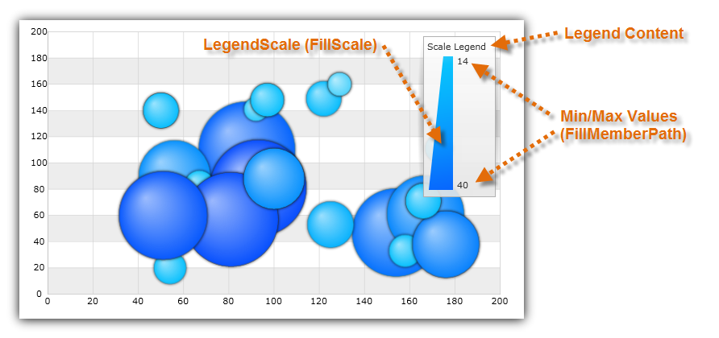

////

|metadata|
{
    "name": "datachart-configuring-scalelegend",
    "controlName": [],
    "tags": [],
    "guid": "fb64119c-2a97-4999-814b-d214043bcb96",  
    "buildFlags": ["wpf,win-universal","WINFORMS"],
    "createdOn": "2015-09-22T18:24:32.8696181Z"
}
|metadata|
////

= Configuring Scale Legend

This topic provides information on how to configure  pick:[wpf,win-universal=" link:{DataChartLink}.scalelegend.html[ScaleLegend]"]  pick:[win-forms=" link:{DataChartLink}.ultrascalelegend.html[UltraScaleLegend]"]  pick:[xamarin=" link:{DataChartLink}.xfscalelegend.html[XFScaleLegend]"]  pick:[android=" link:{DataChartLink}.scalelegendview.html[ScaleLegendView]"]  control and explains, with code examples, how to use it with link:datachart-series.html[Chart Series] in the link:{DataChartLink}.{DataChartName}.html[{DataChartName}]™ control.

The topic is organized as follows:

* <<Introduction,Introduction>>
* <<Requirements,Requirements>>
* <<CodeExample,Code Example>>
* <<RelatedTopics,Related Topics>>

[[Introduction]]
== Introduction

The Scale Legend is a special type of legend that shows how the colors in the link:{DataChartLink}.brushscale{ApiProp}brushes.html[Brushes] collection of the link:{DataChartLink}.valuebrushscale.html[ValueBrushScale] or link:{DataChartLink}.custompalettebrushscale.html[CustomPaletteBrushScale] are distributed among bubbles of the link:{DataChartLink}.bubbleseries.html[BubbleSeries]. It also displays the lowest and the highest values from a data column that is mapped to the link:{DataChartLink}.bubbleseries{ApiProp}fillmemberpath.html[FillMemberPath] property of BubbleSeries. For more information on how to use brush scales, please refer to the link:datachart-bubble-series.html[Scatter Bubble Series] topic.  pick:[wpf,win-universal="Also, legend has a legend title that is displayed above legend items."]

[[Properties]]
== Properties

The Item Legend control shares common properties with other type of chart legends. Refer to the link:datachart-legends.html[Chart Legends] topic for a complete list of these common properties.

[[Requirements]]
== Requirements

The Scale Legend can be used with BubbleSeries only if the series meet the binding requirements listed in the following table.

[options="header", cols="a,a,a"]
|====
|Series Property|Property Type|Object to bind to

| link:{DataChartLink}.series{ApiProp}legend.html[Legend]
|
ifdef::win-forms,wpf,win-universal[] 

LegendBase 

endif::win-forms,wpf,win-universal[] 

ifdef::android[] 

LegendViewBase 

endif::android[]
|Determines which Scale Legend to bind to the series

| link:{DataChartLink}.bubbleseries{ApiProp}fillscale.html[FillScale]
|BrushScale
| link:{DataChartLink}.valuebrushscale.html[ValueBrushScale] or link:{DataChartLink}.custompalettebrushscale.html[CustomPaletteBrushScale] defining brush scale for bubbles

| link:{DataChartLink}.bubbleseries{ApiProp}fillmemberpath.html[FillMemberPath]
|string
|Specifies data column for interpolating brush of bubbles if the link:{DataChartLink}.valuebrushscale.html[ValueBrushScale] is bound to link:{DataChartLink}.bubbleseries{ApiProp}fillscale.html[FillScale] property

|====

[[CodeExample]]
== Code Example

This code snippet demonstrates how to bind Scale Legend to Bubble Series with ValueBrushScale as a fill scale of bubbles

Figure 2: A ScaleLegend bound to BubbleSeries with ValueBrushScale as a fill scale of bubbles

ifdef::wpf,win-universal[]

*In XAML:*

----
<ig:{DataChartName} >
    <ig:{DataChartName}.Series>
        <ig:BubbleSeries XAxis="{Binding ElementName=numericXAxis}"
                         YAxis="{Binding ElementName=numericYAxis}"
                         ItemsSource="{StaticResource bubbleDataSample}" 
                         XMemberPath="X" 
                         YMemberPath="Y"
                         RadiusMemberPath="Radius"
                         FillMemberPath="Radius"  
                         Legend="{Binding ElementName=ScaleLegend}" >
            <ig:BubbleSeries.FillScale>
                <ig:ValueBrushScale IsLogarithmic=" MaximumValue="50" MinimumValue="5">
                    <ig:ValueBrushScale.Brushes>
                        <igCommon:BrushCollection>
                            <SolidColorBrush Color="#FFC6EEFB" />
                            <SolidColorBrush Color="#FF08C3FE" />
                            <SolidColorBrush Color="#FF08A5FE" />
                            <SolidColorBrush Color="#FF086AFE" />
                            <SolidColorBrush Color="#FF084CFE" />
                        </igCommon:BrushCollection>
                    </ig:ValueBrushScale.Brushes>
                </ig:ValueBrushScale>
            </ig:BubbleSeries.FillScale>
        </ig:BubbleSeries>
    </ig:{DataChartName}.Series>
</ig:{DataChartName}>
<!-- ========================================================================== -->
<ig:ScaleLegend x:Name="ScaleLegend" Content="Scale Legend" 
                Margin="20" Height="200" Width="120" VerticalAlignment="Top" HorizontalAlignment="Right">
</ig:ScaleLegend >
<!-- ========================================================================== -->
----

endif::wpf,win-universal[]

ifdef::wpf,win-universal[]

*In Visual Basic:*

----
Imports Infragistics.Controls.Charts
Imports Infragistics
Dim scaleLegend As New ScaleLegend() With { _
    .Content = "Scale Legend", _
    .Margin = New Thickness(20), _
    .VerticalAlignment = VerticalAlignment.Top, _
    .HorizontalAlignment = HorizontalAlignment.Right _
}
Dim brushCollection As New BrushCollection()
brushCollection.Add(New SolidColorBrush(Color.FromArgb(&Hff, &Hc6, &Hee, &Hfb)))
brushCollection.Add(New SolidColorBrush(Color.FromArgb(&Hff, &H8, &Hc3, &Hfe)))
brushCollection.Add(New SolidColorBrush(Color.FromArgb(&Hff, &H8, &Ha5, &Hfe)))
brushCollection.Add(New SolidColorBrush(Color.FromArgb(&Hff, &H8, &H6a, &Hfe)))
brushCollection.Add(New SolidColorBrush(Color.FromArgb(&Hff, &H8, &H4c, &Hfe)))
Dim brushScale As New ValueBrushScale()
brushScale.Brushes = brushCollection
brushScale.IsLogarithmic = False
brushScale.MinimumValue = 5
brushScale.MaximumValue = 200
Dim series As New BubbleSeries()
series.FillScale = brushScale
series.FillMemberPath = "Radius"
series.Legend = scaleLegend
Dim dataChart As New {DataChartName}()
dataChart.Series.Add(series)
----

endif::wpf,win-universal[]

ifdef::wpf,win-universal[]

*In C#:*

----
using Infragistics.Controls.Charts;
using Infragistics;
var scaleLegend = new ScaleLegend
{
    Content = "Scale Legend",
    Margin = new Thickness(20),
    VerticalAlignment = VerticalAlignment.Top,
    HorizontalAlignment = HorizontalAlignment.Right
};
var brushCollection = new BrushCollection();
brushCollection.Add(new SolidColorBrush(Color.FromArgb(0xFF, 0xC6, 0xEE, 0xFB)));
brushCollection.Add(new SolidColorBrush(Color.FromArgb(0xFF, 0x08, 0xC3, 0xFE)));
brushCollection.Add(new SolidColorBrush(Color.FromArgb(0xFF, 0x08, 0xA5, 0xFE)));
brushCollection.Add(new SolidColorBrush(Color.FromArgb(0xFF, 0x08, 0x6A, 0xFE)));
brushCollection.Add(new SolidColorBrush(Color.FromArgb(0xFF, 0x08, 0x4C, 0xFE)));
var brushScale = new ValueBrushScale();
brushScale.Brushes = brushCollection;
brushScale.IsLogarithmic = false;
brushScale.MinimumValue = 5;
brushScale.MaximumValue = 200;
var series = new BubbleSeries();
series.FillScale = brushScale;
series.FillMemberPath = "Radius";
series.Legend = scaleLegend;
var DataChart = new {DataChartName}();
dataChart.Series.Add(series);
----

endif::wpf,win-universal[]

ifdef::win-forms[]

*In C#:*

----
using Infragistics.Win.DataVisualization;
var scaleLegend = new UltraScaleLegend;
var brushCollection = new BrushCollection();
brushCollection.Add(new SolidColorBrush(Color.FromArgb(0xFF, 0xC6, 0xEE, 0xFB)));
brushCollection.Add(new SolidColorBrush(Color.FromArgb(0xFF, 0x08, 0xC3, 0xFE)));
brushCollection.Add(new SolidColorBrush(Color.FromArgb(0xFF, 0x08, 0xA5, 0xFE)));
brushCollection.Add(new SolidColorBrush(Color.FromArgb(0xFF, 0x08, 0x6A, 0xFE)));
brushCollection.Add(new SolidColorBrush(Color.FromArgb(0xFF, 0x08, 0x4C, 0xFE)));
var brushScale = new ValueBrushScale();
brushScale.Brushes = brushCollection;
brushScale.IsLogarithmic = false;
brushScale.MinimumValue = 5;
brushScale.MaximumValue = 200;
var series = new BubbleSeries();
series.FillScale = brushScale;
series.FillMemberPath = "Radius";
series.Legend = scaleLegend;
var DataChart = new {DataChartName}();
dataChart.Series.Add(series);
----

endif::win-forms[]

[[RelatedTopics]]
== Related Topics

* link:datachart-configuring-basiclegend.html[Configuring Basic Legend]

ifdef::wpf,win-universal,win-forms,android[]
* link:datachart-configuring-itemlegend.html[Configuring Item Legend]

endif::wpf,win-universal,win-forms,android[]

ifdef::wpf,win-universal[]
* link:datachart-common-legend.html[Adding Common Legend]

endif::wpf,win-universal[]

ifdef::wpf,win-universal[]
* link:datachart-multiple-legends.html[Adding Multiple Legends]

endif::wpf,win-universal[]

ifdef::wpf,win-universal[]
* link:datachart-docking-legends.html[Docking Legends]

endif::wpf,win-universal[]