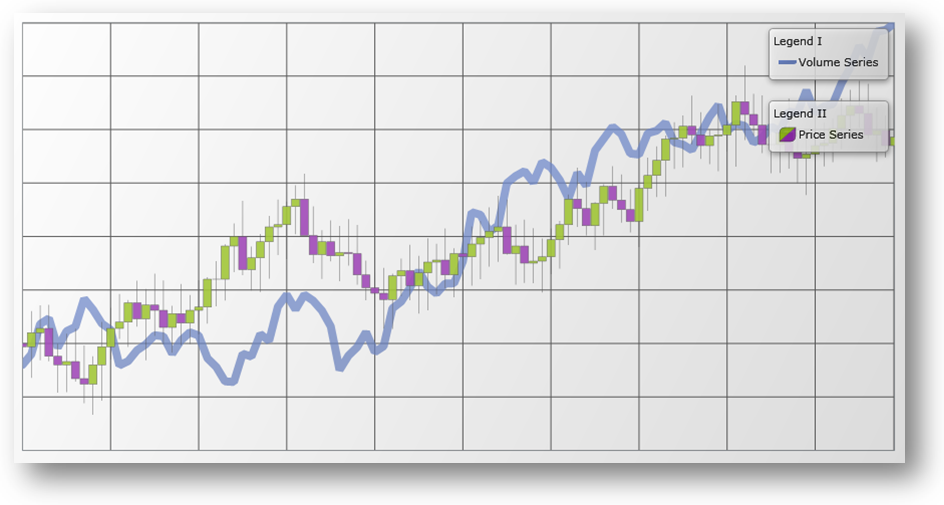

////

|metadata|
{
    "name": "datachart-multiple-legends",
    "controlName": ["{DataChartName}"],
    "tags": ["Application Scenarios","Charting","How Do I"],
    "guid": "177a0735-6ef5-40f6-af24-16d8d5c4b4d4",  
    "buildFlags": ["wpf,win-universal"],
    "createdOn": "2014-06-05T19:39:00.6803898Z"
}
|metadata|
////

= Adding Multiple Legends

By default, the link:{DataChartLink}.{DataChartName}.html[{DataChartName}]™ does not display a link:{DataChartLink}.series{ApiProp}legend.html[Legend] for series added in chart plot area. If you want to show an individual Legend for each series, you need to add a number of Legend objects to the container of {DataChartName} control and then bind each Legend to corresponding link:{DataChartLink}.series.html[Series] object’s link:{DataChartLink}.series{ApiProp}legend.html[Legend] property. In addition, you must set the link:{DataChartLink}.series{ApiProp}title.html[Title] property for each Series object otherwise its corresponding legend item will display a default series title.

ifdef::xaml[]
You can also specify the location of the Legend in relationship to the {DataChartName} control’s plot area. For more information on this, please refer to link:datachart-docking-legends.html[Docking Legends] topic.
endif::xaml[]

The following example code demonstrates how to add individual Legend for each series defined in the {DataChartName} control.

ifdef::wpf,win-universal[]

*In XAML:*

----
<ig:XamDock x:Name="xmDockContainer"
            Margin="10">
    <ig:{DataChartName} x:Name="xmDataChart">
        <ig:{DataChartName}.Series>
            <ig:LineSeries Title="Volume Series"
                           MarkerType="None"
                           ItemsSource="{Binding}"
                           ValueMemberPath="Volume"
                           Legend="{Binding ElementName=xmVolumeLegend}"
                           XAxis="{Binding ElementName=xmXAxis}"
                           YAxis="{Binding ElementName=xmVolumeYAxis}">
            </ig:LineSeries>
            <ig:FinancialPriceSeries Title="Price Series"
                                     DisplayType="Candlestick"
                                     ItemsSource="{Binding}"
                                     OpenMemberPath="Open"
                                     CloseMemberPath="Close"
                                     HighMemberPath="High"
                                     LowMemberPath="Low"
                                     VolumeMemberPath="Volume"
                                     Legend="{Binding ElementName=xmPriceLegend}"
                                     XAxis="{Binding ElementName=xmXAxis}"
                                     YAxis="{Binding ElementName=xmPriceYAxis}">
            </ig:FinancialPriceSeries>
        </ig:{DataChartName}.Series>
    </ig:{DataChartName}>
    <!-- ========================================================================== -->
    <ig:Legend x:Name="xmVolumeLegend"
               Content="Legend I"
               Style="{StaticResource LegendStyle}"
               Margin="10"
               g:XamDock.Edge="InsideRight">
    </ig:Legend>
    <ig:Legend x:Name="xmPriceLegend"
               Content="Legend II"
               Style="{StaticResource LegendStyle}"
               Margin="10"
               ig:XamDock.Edge="InsideRight">
    </ig:Legend>
    <!-- ========================================================================== -->
</ig:XamDock>
----

endif::wpf,win-universal[]

The following image shows how the {DataChartName} control might look like with multiple legends.

== Related Topics

* link:datachart-common-legend.html[Adding Common Legend]

ifdef::wpf,win-universal[]
* link:datachart-docking-legends.html[Docking Legends]

endif::wpf,win-universal[]