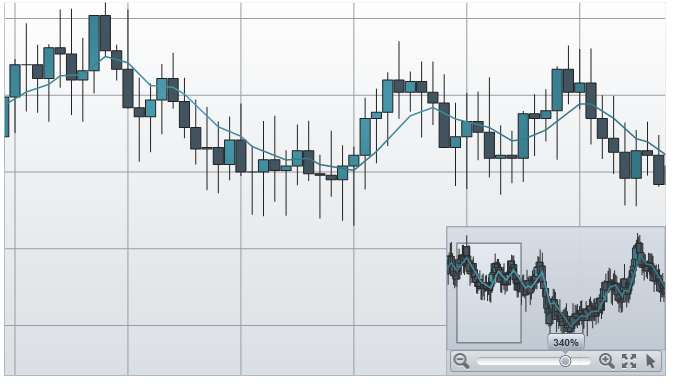
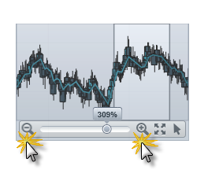
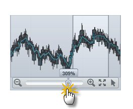
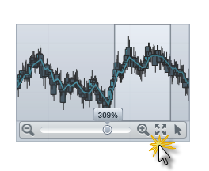
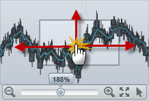
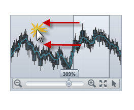
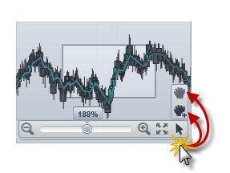

////

|metadata|
{
    "name": "datachart-navigating-chart-using-overview-plus-detail-pane",
    "controlName": ["{DataChartName}"],
    "tags": ["Charting","Tips and Tricks"],
    "guid": "9a69e44c-e6c7-4c18-8cea-271aed9a5d73",  
    "buildFlags": ["WPF","SL"],
    "createdOn": "2014-06-05T19:39:00.7094021Z"
}
|metadata|
////

= Navigating Chart Using Overview Plus Detail Pane

== Topic Overview

=== Purpose

This topic provides information how to use the link:{ApiPlatform}datavisualization{ApiVersion}~infragistics.controls.xamoverviewplusdetailpane_members.html[xamOverviewPlusDetailPane]™ control to navigate content in the link:{DataChartLink}.{DataChartName}.html[{DataChartName}]™ control.

=== Required background

The following table lists the topics required as a prerequisite to understanding this topic.

[options="header", cols="a,a"]
|====
|Topic|Purpose

| link:datachart-datachart.html[{DataChartName}]
|This topic provides an overview of key features in the _{DataChartName}_ control.

| link:datachart-chart-navigation.html[Chart Navigation]
|This topic provides information on using navigation in the _{DataChartName}_ control.

|====

=== In this topic

This topic contains the following sections

* <<_Ref321140025, Chart Overview Pane >>

** <<_Ref320185129,Introduction>>
** <<_Ref321140031,Preview>>
** <<_Ref321140034,Example>>

* <<_Ref321140037, User Interaction and Usability >>

** <<_Ref321140041,User interactions summary>>
** <<_Ref321140043,Zooming chart incrementally>>
** <<_Ref321140046,Zooming chart to specific level>>
** <<_Ref321140051,Resetting chart to 100% zoom level>>
** <<_Ref321140055,Panning chart in all directions>>
** <<_Ref321140058,Panning to specific region of chart>>
** <<_Ref321140062,Changing mouse drag interaction with chart>>

* <<_Ref320185294, Related Content >>

[[_Ref321140025]]
== Chart Overview Pane

[[_Ref320185129]]

=== Introduction

In the  _{DataChartName}_   control, an overview of chart content is represented by the xamOverviewPlusDetailPane control. This control provides a preview of all types of supported series as well as navigation functionalities.

[[_Ref321140031]]

=== Preview

The following is previews of the  _xamOverviewPlusDetailPane_   control with an overview of the  _{DataChartName}_   control displaying financial data using link:{DataChartLink}.financialpriceseries_members.html[FinancialPriceSeries].

[[_Ref321140034]]

=== Example

The following code demonstrates how to display the xamOverviewPlusDetailPane control in upper right corner of the  _{DataChartName}_   control.

ifdef::wpf,win-universal[]

*In XAML:*

[source,xaml]
----
<ig:{DataChartName} x:Name="DataChart" 
      OverviewPlusDetailPaneVisibility="Visible"
      OverviewPlusDetailPaneHorizontalAlignment="Right"
      OverviewPlusDetailPaneVerticalAlignment="Top">
</ig:{DataChartName}>
----

endif::wpf,win-universal[]

ifdef::wpf[]

*In Visual Basic:*

[source,vb]
----
Dim DataChart As New {DataChartName}()
DataChart.OverviewPlusDetailPaneHorizontalAlignment = HorizontalAlignment.Right
DataChart.OverviewPlusDetailPaneVerticalAlignment = VerticalAlignment.Top
DataChart.OverviewPlusDetailPaneVisibility = Visibility.Visible
----

endif::wpf[]

ifdef::win-forms[]

*In Visual Basic:*

[source,vb]
----
Dim DataChart As New {DataChartName}()
DataChart.OverviewPlusDetailPaneHorizontalAlignment = HorizontalAlignment.Right
DataChart.OverviewPlusDetailPaneVerticalAlignment = VerticalAlignment.Top
DataChart.OverviewPlusDetailPaneVisibility = Visibility.Visible
----

endif::win-forms[]

ifdef::xamarin[]

*In Visual Basic:*

[source,vb]
----
Dim DataChart As New {DataChartName}()
DataChart.OverviewPlusDetailPaneHorizontalAlignment = HorizontalAlignment.Right
DataChart.OverviewPlusDetailPaneVerticalAlignment = VerticalAlignment.Top
DataChart.OverviewPlusDetailPaneVisibility = Visibility.Visible
----

endif::xamarin[]

ifdef::wpf[]

*In C#:*

[source,csharp]
----
var DataChart = new {DataChartName}();
DataChart.OverviewPlusDetailPaneHorizontalAlignment = HorizontalAlignment.Right;
DataChart.OverviewPlusDetailPaneVerticalAlignment = VerticalAlignment.Top;
DataChart.OverviewPlusDetailPaneVisibility = Visibility.Visible;
----

endif::wpf[]

ifdef::win-forms[]

*In C#:*

[source,csharp]
----
var DataChart = new {DataChartName}();
DataChart.OverviewPlusDetailPaneHorizontalAlignment = HorizontalAlignment.Right;
DataChart.OverviewPlusDetailPaneVerticalAlignment = VerticalAlignment.Top;
DataChart.OverviewPlusDetailPaneVisibility = Visibility.Visible;
----

endif::win-forms[]

ifdef::xamarin[]

*In C#:*

[source,csharp]
----
var DataChart = new {DataChartName}();
DataChart.OverviewPlusDetailPaneHorizontalAlignment = HorizontalAlignment.Right;
DataChart.OverviewPlusDetailPaneVerticalAlignment = VerticalAlignment.Top;
DataChart.OverviewPlusDetailPaneVisibility = Visibility.Visible;
----

endif::xamarin[]

[[_Ref321140037]]
== User Interaction and Usability

[[_Ref321140041]]

=== User interactions summary

The following table summarizes the user interaction capabilities of the xamOverviewPlusDetailPane control.

[options="header", cols="a,a,a"]
|====
|The user can…|Using…|Details

|Zoom a chart incrementally
|The mouse scroll wheel or zoom in/out buttons of the xamOverviewPlusDetailPane control.
|Clicking on the zoom in/out buttons of the xamOverviewPlusDetailPane control or scrolling mouse wheel over the preview area zooms in/out the chart content.

|Zoom a chart to a specific level
|The zoom slider of the xamOverviewPlusDetailPane control.
|Changing the zoom slider of the _xamOverviewPlusDetailPane_ control zooms in/out the chart content to a specific zoom level.

|Reset a chart to 100% zoom level
|The zoom reset button of the xamOverviewPlusDetailPane control.
|Clicking on the zoom reset button of the _xamOverviewPlusDetailPane_ control resets the chart to its 100% zoom level.

|Pan chart in all directions
|The window rectangle of the xamOverviewPlusDetailPane control.
|Dragging the window rectangle in preview area of the _xamOverviewPlusDetailPane_ control pans the chart content in a given direction.

|Pan to a specific region of a chart
|The preview area of the xamOverviewPlusDetailPane control.
|Clicking outside of the window rectangle in preview area of the _xamOverviewPlusDetailPane_ control pans the chart content to chart region where the mouse cursor was clicked.

|Change mouse drag interaction with a chart
|The cursor button of the xamOverviewPlusDetailPane control.
|Clicking on the cursor button of the _xamOverviewPlusDetailPane_ control changes mouse drag interaction with chart to pan on mouse dragging or to zoom on mouse dragging interactions.

|====

[[_Ref321140043]]

=== Zooming a chart incrementally

The following picture illustrates how to zoom chart incrementally using the mouse zoom in/out buttons of the  _xamOverviewPlusDetailPane_   control.

[[_Ref321140046]]

=== Zooming a chart to a specific level

The following picture illustrates how to zoom chart to a specific level using the zoom slider of the  _xamOverviewPlusDetailPane_   control.

[[_Ref321140051]]

=== Resetting a chart to 100% zoom level

The following picture illustrates how to chart to 100% zoom level using the zoom reset button of the  _xamOverviewPlusDetailPane_   control.

[[_Ref321140055]]

=== Panning a chart in all directions

The following picture illustrates how to pan chart in all directions using the window rectangle of the  _xamOverviewPlusDetailPane_   control.

[[_Ref321140058]]

=== Panning to a specific region of a chart

The following picture illustrates how to pan chart to a specific region of chart using the window rectangle of the  _xamOverviewPlusDetailPane_   control.

[[_Ref321140062]]

=== Changing mouse drag interaction with a chart

The following picture illustrates how to change a mouse drag interaction with a chart using the cursor button of the  _xamOverviewPlusDetailPane_   control.

[[_Ref320185294]]
== Related Content

=== Topics

The following topics provide additional information related to this topic.

[options="header", cols="a,a"]
|====
| *Topic* | *Purpose* 

| link:datachart-navigating-chart-using-code.html[Navigating Chart Using Code]
|This topic provides information

ifdef::sl,wpf,win-universal,win-forms[]
| link:datachart-navigating-chart-using-moue-and-keyboard.html[Navigating Chart Using Mouse and Keyboard]
|This topic provides information
endif::sl,wpf,win-universal,win-forms[]

ifdef::wpf,win-phone,win-universal[]
| link:datachart-navigating-chart-using-touch-gestures.html[Navigating Chart Using Touch Gestures]
|This topic provides information
endif::wpf,win-phone,win-universal[]

|====