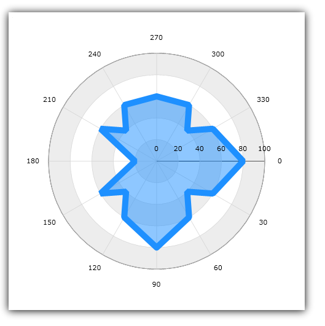
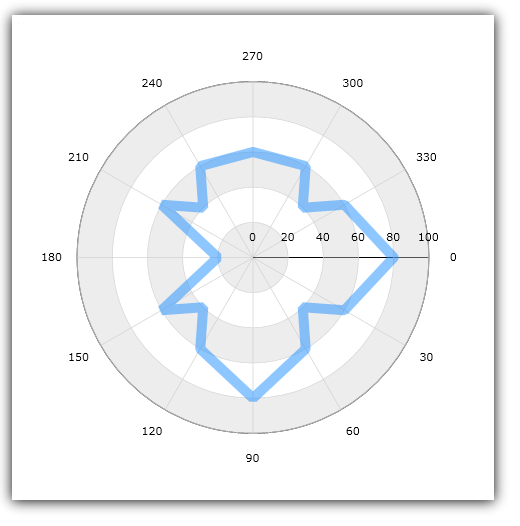
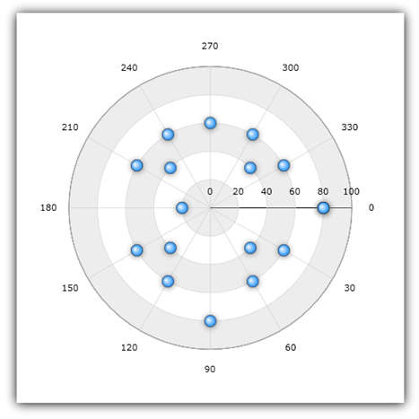
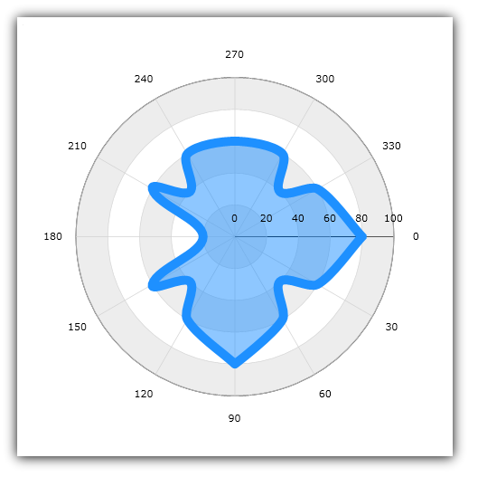
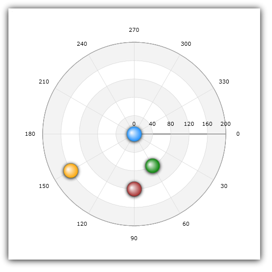
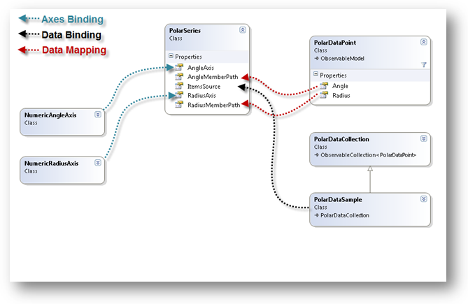

////

|metadata|
{
    "name": "datachart-polar-series-overview",
    "controlName": ["{DataChartName}"],
    "tags": ["Charting","Getting Started"],
    "guid": "86568801-db3c-4336-9f89-04c8942853d9",  
    "buildFlags": [],
    "createdOn": "2014-06-05T19:39:00.5493377Z"
}
|metadata|
////

= Polar Series

This topic explains the common properties for Polar Series in the link:{DataChartLink}.{DataChartName}.html[{DataChartName}]™ control.

The topic is organized as follows:

* <<Introduction,Introduction>>
* <<Series,Types of Polar Series>>
* <<Axes,Polar Axes>>
* <<Coordinate,Polar Coordinate System>>
* <<DataBinding,Data Binding>>
* <<RelatedTopics,Related Topics>>

[[Introduction]]
== Introduction

Polar Series is a group of series that uses the polar (angle, radius) coordinate system instead of the Cartesian (x, y) coordinate system to plot data in chart. In other words, Polar Series take concepts of link:datachart-scatter-series-overview.html[Scatter Series] and wrap them around a circle rather than stretching along a horizontal line. This group of series is used to show the relationship among the items in several distinct series of data using the polar coordinates system.

Polar Series draw attention to uneven intervals or clusters of data. They are often used to plot scientific data (e.g. wind direction and speed, direction, and strength of magnetic field, location of objects in solar system), and can highlight the deviation of collected data from predicted results.

[[Series]]
== Types of Polar Series

The {DataChartName} control supports the following types of Polar Series and each of them is discussed in an individual topic:

* link:datachart-polar-area-series.html[Polar Area Series]
* link:datachart-polar-line-series.html[Polar Line Series]
* link:datachart-polar-scatter-series.html[Polar Scatter Series]
* link:datachart-polar-spline-series.html[Polar Spline Series]
* link:datachart-polar-spline-area-series.html[Polar Spline Area Series]

All these topics demonstrate how to create a specific type of Polar Series and bind data to it.

Figure 1: Sample Polar Area Series

Figure 2: Sample Polar Line Series

Figure 3: Sample Polar Scatter Series

image::images/xamDataChart_Polar_Series_04.png[]

Figure 4: Sample Polar Spline Series

Figure 5: Sample Polar Spline Area Series

Some Polar Series have a rough equivalent to Scatter Series and the following table shows an analogy between these types of series.

Table 1: Mapping of the Polar Series Types to the Scatter Series Types

[options="header", cols="a,a"]
|====
|Radial Series Type|Scatter Series Type

| link:{DataChartLink}.polarareaseries.html[PolarAreaSeries]
|None

| link:{DataChartLink}.polarlineseries.html[PolarLineSeries]
| link:{DataChartLink}.scatterlineseries.html[ScatterLineSeries]

| link:{DataChartLink}.polarscatterseries.html[PolarScatterSeries]
| link:{DataChartLink}.scatterseries.html[ScatterSeries]

| link:{DataChartLink}.polarsplineareaseries.html[PolarSplineAreaSeries]
|None

| link:{DataChartLink}.polarsplineseries.html[PolarSplineSeries]
| link:{DataChartLink}.scattersplineseries.html[ScatterSplineSeries]

|====

[[Axes]]
== Polar Axes

There are many types of polar axes supported by the {DataChartName} control, but only the link:{DataChartLink}.numericradiusaxis.html[NumericRadiusAxis] and link:{DataChartLink}.numericangleaxis.html[NumericAngleAxis] can be used with any of the polar series. The basic requirement for implementating a PolarSeries involves binding a NumericRadiusAxis to the RadiusAxis property exposed from the PolarSeries as well as binding a NumericAngleAxis to the AngleAxis property of the PolarSeries. For more information on how to use polar axes, refer to the link:datachart-using-numeric-angle-axis.html[Using Numeric Angle Axis] and link:datachart-using-numeric-radius-axis.html[Using Numeric Radius Axis] topics or to the link:datachart-axes.html[Chart Axes] topic for a list of all supported axis types.

[[Coordinate]]
== Polar Coordinate System

In polar coordinate systems, the location of data points is determined by an angle (angular coordinate) from a fixed direction and distance (radial coordinate) from a fixed point (analogous to the origin of a Cartesian coordinate) which is called “the pole”. The lines that start from the pole and point outwards are gridlines of the angular axis (NumericAngleAxis) and the concentric rings that surround the pole are gridlines of the radius axis (NumericRadiusAxis). For more information on how to use axes with polar series, refer to the link:datachart-axes.html[Chart Axes] topic.

Figure 6 shows link:{DataChartLink}.polarscatterseries.html[PolarScatterSeries] with four data points at various locations in polar coordinate system:

* the blue point is located at the center of the polar chart (0,0 is the pole in the polar coordinate system)
* the red point has a radial coordinate of 120 and angular coordinate of 90 (120, 90)
* the green point has a radial coordinate of 80 and angular coordinate of 60 (80, 60)
* the orange point has a radial coordinate of 160 and angular coordinate of 150 (160, 150)

Figure 6: Schematic representation of data ploting in polar coordinate system in the {DataChartName} control

[[DataBinding]]
== Data Binding

Similar to all other types of series in the {DataChartName} control, the Polar Series, too, uses the  pick:[xaml=" link:{DataChartLink}.series{ApiProp}itemssource.html[ItemsSource]"]  pick:[win-forms,android=" link:{DataChartLink}.series{ApiProp}datasource.html[DataSource]"]  property to bind data. In fact, all series can be bound to any object that implements the link:http://msdn.microsoft.com/en-us/library/system.collections.ienumerable.aspx[IEnumerable] interface (e.g. link:http://msdn.microsoft.com/en-us/library/6sh2ey19.aspx[List], link:http://msdn.microsoft.com/en-us/library/ms132397.aspx[Collection], link:http://msdn.microsoft.com/en-us/library/7977ey2c.aspx[Queue], link:http://msdn.microsoft.com/en-us/library/system.collections.stack.aspx[Stack]). However, with the Polar Series, each item in this object must have two numeric properties (for angle and radius coordinates) that will be mapped using the link:{DataChartLink}.polarbase{ApiProp}anglememberpath.html[AngleMemberPath] and link:{DataChartLink}.polarbase{ApiProp}radiusmemberpath.html[RadiusMemberPath] properties. For more information on the requirements for a specific type of series, refer to the link:datachart-series-requirements.html[Series Requirements] topic.

An example of an object that meets the above criteria is the PolarDataSample object which you can download from the link:resources-sample-polar-data.html[Sample Polar Data] resource and use it in your project. Figure 7 shows how binding data to Polar Series works in the {DataChartName} control.

ifdef::xaml,xamarin[]

endif::xaml,xamarin[]

ifdef::win-forms,android[]

endif::win-forms,android[]

Figure 7: Schematic representation of data binding to Polar Series in the {DataChartName} control

[[RelatedTopics]]
== Related Topics

* link:datachart-series-requirements.html[Series Requirements]
* link:datachart-using-numeric-angle-axis.html[Using Numeric Angle Axis]
* link:datachart-using-numeric-radius-axis.html[Using Numeric Radius Axis]
* link:datachart-polar-area-series.html[Polar Area Series]
* link:datachart-polar-line-series.html[Polar Line Series]
* link:datachart-polar-scatter-series.html[Polar Scatter Series]
* link:datachart-polar-spline-series.html[Polar Spline Series]
* link:datachart-polar-spline-area-series.html[Polar Spline Area Series]