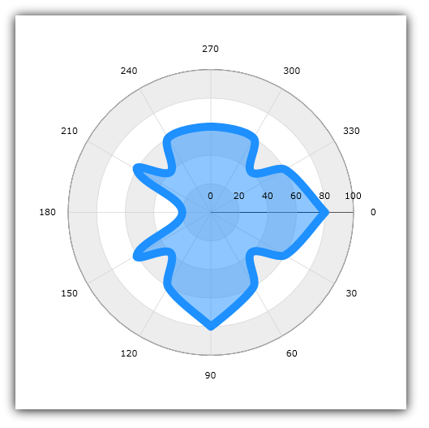

////
|metadata|
{
    "name": "datachart-polar-spline-area-series",
    "controlName": ["{DataChartName}"],
    "tags": ["Charting","Data Binding","Data Presentation","Sample Data Source"],
    "guid": "555108b2-9d84-47e9-bb5e-79a0e8edbf38",
    "buildFlags": [],
    "createdOn": "2014-06-05T19:39:00.5593422Z"
}
|metadata|
////

= Polar Spline Area Series

This topic explains, with code examples, how to use Polar Spline Area Series in the link:{DataChartLink}.{DataChartName}.html[{DataChartName}]™ control.

== Introduction

Polar Spline Area Series has a shape of a filled region enclosed by a collection of spline lines connecting data points which are located at the polar (angle/radius) coordinates. The link:{DataChartLink}.polarsplineareaseries.html[PolarSplineAreaSeries] uses the same concepts of data plotting as the link:{DataChartLink}.scattersplineseries.html[ScatterSplineSeries] but wraps data points around a circle rather than stretching them along a horizontal line. Like with other series types, multiple PolarAreaSeries can be plotted in the same data chart and they can be overlaid on each other to show the differences and similarities between data sets. For more information on this group of series, refer to the Radial Series topic.

== Preview

Figure 1 demonstrates what Polar Spline Area Series looks like when plotted in the {DataChartName} control.

Figure 1: Sample implementation of a PolarSplineAreaSeries

== Data Binding

The code snippet below shows how to bind sample polar data (which is available for download from the link:resources-sample-polar-data.html[Sample Polar Data] resource) to the PolarSplineAreaSeries. The example assumes that you have already configured your project for the {DataChartName} control.

ifdef::xaml[]

*In XAML:*

[source]
----
<ig:{DataChartName} x:Name="DataChart" >
    <ig:{DataChartName}.Resources>
        <models:PolarDataSample x:Key="polarDataSample" />
    </ig:{DataChartName}.Resources>
    <ig:{DataChartName}.Axes>
        <ig:NumericAngleAxis x:Name="numericAngleAxis" MinimumValue="0" MaximumValue="360" Interval="30" />
        <ig:NumericRadiusAxis x:Name="numericRadiusAxis" MinimumValue="0" MaximumValue="100" Interval="20" />
    </ig:{DataChartName}.Axes>
    <ig:{DataChartName}.Series>
    <!-- ========================================================================== -->
        <ig:PolarSplineAreaSeries AngleAxis="{Binding ElementName=numericAngleAxis}" 
                                  RadiusAxis="{Binding ElementName=numericRadiusAxis}" 
                                  AngleMemberPath="Angle" 
                                  RadiusMemberPath="Radius" 
                                  ItemsSource="{StaticResource polarDataSample}"
                                  Thickness="5" 
                                  MarkerType="None" 
                                  Brush="#7F58A6C7" >
        </ig:PolarSplineAreaSeries>
    </ig:{DataChartName}.Series>
    <!-- ========================================================================== -->
</ig:{DataChartName}>
----

endif::xaml[]
ifdef::wpf,xamarin[]

*In Visual Basic:*

[source]
----
Dim polarDataSample As New PolarDataSample()
Dim numericAngleAxis As New NumericAngleAxis()
Dim numericRadiusAxis As New NumericRadiusAxis()
Me.DataChart.Axes.Add(numericAngleAxis)
Me.DataChart.Axes.Add(numericRadiusAxis)
Dim series As New PolarSplineAreaSeries()
series.ItemsSource = polarDataSample
series.AngleMemberPath = "Angle"
series.RadiusMemberPath = "Radius"
series.AngleAxis = numericAngleAxis
series.RadiusAxis = numericRadiusAxis;
this.DataChart.Series.Add(series)
----

endif::wpf,xamarin[]

ifdef::win-forms[]

*In Visual Basic:*

[source]
----
Dim polarDataSample As New PolarDataSample()
Dim numericAngleAxis As New NumericAngleAxis()
Dim numericRadiusAxis As New NumericRadiusAxis()
Me.DataChart.Axes.Add(numericAngleAxis)
Me.DataChart.Axes.Add(numericRadiusAxis)
Dim series As New PolarSplineAreaSeries()
series.DataSource = polarDataSample
series.AngleMemberPath = "Angle"
series.RadiusMemberPath = "Radius"
series.AngleAxis = numericAngleAxis
series.RadiusAxis = numericRadiusAxis;
this.DataChart.Series.Add(series)
----

endif::win-forms[]

ifdef::wpf,xamarin[]

*In C#:*

[source]
----
var polarDataSample = new PolarDataSample();
var numericAngleAxis = new NumericAngleAxis();
var numericRadiusAxis = new NumericRadiusAxis();
this.DataChart.Axes.Add(numericAngleAxis);
this.DataChart.Axes.Add(numericRadiusAxis);
var series = new PolarSplineAreaSeries();
series.ItemsSource = polarDataSample;
series.AngleMemberPath = "Angle";
series.RadiusMemberPath = "Radius";
series.AngleAxis = numericAngleAxis;  
series.RadiusAxis = numericRadiusAxis; 
this.DataChart.Series.Add(series);
----
endif::wpf,xamarin[]

ifdef::win-forms[]

*In C#:*

[source]
----
var polarDataSample = new PolarDataSample();
var numericAngleAxis = new NumericAngleAxis();
var numericRadiusAxis = new NumericRadiusAxis();
this.DataChart.Axes.Add(numericAngleAxis);
this.DataChart.Axes.Add(numericRadiusAxis);
var series = new PolarSplineAreaSeries();
series.DataSource = polarDataSample;
series.AngleMemberPath = "Angle";
series.RadiusMemberPath = "Radius";
series.AngleAxis = numericAngleAxis;  
series.RadiusAxis = numericRadiusAxis; 
this.DataChart.Series.Add(series);
----
endif::win-forms[]

ifdef::android[]

*In Java:*

[source,js]
----
DataChartView dataChart = new DataChartView(rootView.getContext());
PolarDataSample data = new PolarDataSample();
NumericAngleAxis numericAngleAxis = new NumericAngleAxis();
NumericRadiusAxis numericRadiusAxis = new NumericRadiusAxis();
dataChart.addAxis(numericAngleAxis);
dataChart.addAxis(numericRadiusAxis);
PolarSplineAreaSeries series = new PolarSplineAreaSeries();
series.setDataSource(data);
series.setAngleMemberPath("Angle");
series.setRadiusMemberPath("Radius");
series.setAngleAxis(numericAngleAxis);
series.setRadiusAxis(numericRadiusAxis);
dataChart.addSeries(series);
----

endif::android[]

== Related Topics

* link:datachart-series-requirements.html[Series Requirements]
* link:datachart-using-numeric-angle-axis.html[Using Numeric Angle Axis]
* link:datachart-using-numeric-radius-axis.html[Using Numeric Radius Axis]