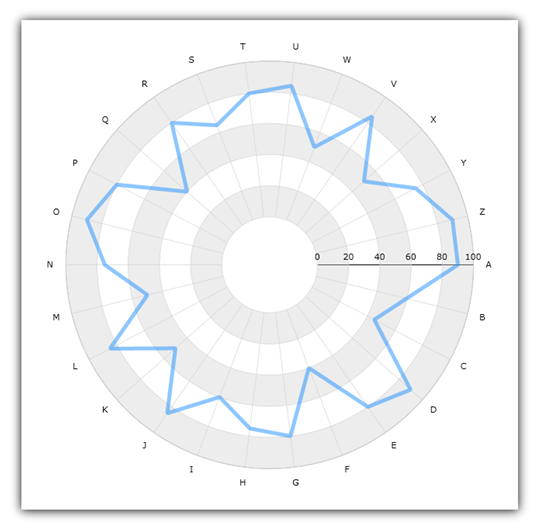

////
|metadata|
{
    "name": "datachart-radial-line-series",
    "controlName": ["{DataChartName}"],
    "tags": ["Charting","Data Binding","Data Presentation","Sample Data Source"],
    "guid": "1b57d54f-f064-4bfc-8f78-7e19ba82e6c3",
    "buildFlags": [],
    "createdOn": "2014-06-05T19:39:00.5433355Z"
}
|metadata|
////

= Radial Line Series

This topic explains, with code examples, how to use Radial Line Series in the link:{DataChartLink}.{DataChartName}.html[{DataChartName}]™ control.

== Introduction

Radial Area Series is rendered using a collection of straight lines connecting data points. The link:{DataChartLink}.radiallineseries.html[RadialLineSeries] uses the same concepts of data plotting as the link:{DataChartLink}.lineseries.html[LineSeries], but wraps data points around a circle rather than stretching them along a horizontal line. For more information on this group of series, refer to the link:datachart-radial-series-overview.html[Radial Series] topic.

== Preview

Figure 1 demonstrates what Radial Line Series looks like when plotted in the {DataChartName} control.

Figure 1: Sample implementation of a RadialLineSeries

== Data Binding

The code snippet below shows how to bind sample radial data (which is available for download from the link:resources-sample-category-data.html[Sample Category Data] resource) to the RadialLineSeries. The example assumes that you have already configured your project for the {DataChartName} control.

ifdef::xaml[]

*In XAML:*

[source,xaml]
----
<ig:{DataChartName} x:Name="DataChart">
    <ig:{DataChartName}.Resources>
        <models:CategoryDataSample x:Name="categoryData" />
        <SolidColorBrush x:Key="AxisStripBrush" Color="LightGray" Opacity=".4" />
    </ig:{DataChartName}.Resources>
    <ig:{DataChartName}.Axes>
        <ig:CategoryAngleAxis x:Name="angleAxis"
                              Interval="1"
                              Label="{}{Category}" 
                              ItemsSource="{StaticResource categoryData}">
        </ig:CategoryAngleAxis>
        <ig:NumericRadiusAxis x:Name="radiusAxis" 
                              Strip="{StaticResource AxisStripBrush}"                                      
                              MinimumValue="0"
                              MaximumValue="150"
                              Interval="50"
                              RadiusExtentScale="0.8"
                              InnerRadiusExtentScale="0.2">
        </ig:NumericRadiusAxis>
    </ig:{DataChartName}.Axes>
    <ig:{DataChartName}.Series>
        <ig:RadialLineSeries AngleAxis="{Binding ElementName=angleAxis}"
                             ValueAxis="{Binding ElementName=radiusAxis}"
                             ValueMemberPath="Value"
                             Brush="#7F58A6C7"
                             MarkerType="None"
                             Outline="#FF58A6C7"
                             Thickness="5"
                             ItemsSource="{StaticResource categoryData}">
        </ig:RadialLineSeries>
    </ig:{DataChartName}.Series>
</ig:{DataChartName}>
----

endif::xaml[]

ifdef::wpf,win-forms,xamarin[]

*In Visual Basic:*

ifdef::wpf[]
----
Dim DataChart As New {DataChartName}()
Dim categoryDataSample As New CategoryDataSample()
Dim var As New CategoryAngleAxis()
categoryAngleAxis.ItemsSource = categoryDataSample
categoryAngleAxis.Label = "{Category}"
categoryAngleAxis.Interval = 1
Dim numericRadiusAxis As New NumericRadiusAxis()
numericRadiusAxis.MinimumValue = 0
numericRadiusAxis.MaximumValue = 150
numericRadiusAxis.Interval = 50
numericRadiusAxis.RadiusExtentScale = 0.8
numericRadiusAxis.InnerRadiusExtentScale = 0.2
DataChart.Axes.Add(categoryAngleAxis)
DataChart.Axes.Add(numericRadiusAxis)
Dim series As New RadialLineSeries()
series.ItemsSource = categoryDataSample 
 
series.ValueMemberPath = "Value"
series.AngleAxis = categoryAngleAxis
series.ValueAxis = numericRadiusAxis
series.MarkerType = MarkerType.None
series.Thickness = 5
'...
DataChart.Series.Add(series)
----
endif::wpf[]

ifdef::win-universal[]
----
Dim DataChart As New {DataChartName}()
Dim categoryDataSample As New CategoryDataSample()
Dim var As New CategoryAngleAxis()
categoryAngleAxis.ItemsSource = categoryDataSample
categoryAngleAxis.Label = "{Category}"
categoryAngleAxis.Interval = 1
Dim numericRadiusAxis As New NumericRadiusAxis()
numericRadiusAxis.MinimumValue = 0
numericRadiusAxis.MaximumValue = 150
numericRadiusAxis.Interval = 50
numericRadiusAxis.RadiusExtentScale = 0.8
numericRadiusAxis.InnerRadiusExtentScale = 0.2
DataChart.Axes.Add(categoryAngleAxis)
DataChart.Axes.Add(numericRadiusAxis)
Dim series As New RadialLineSeries()
series.ItemsSource = categoryDataSample 
 
series.ValueMemberPath = "Value"
series.AngleAxis = categoryAngleAxis
series.ValueAxis = numericRadiusAxis
series.MarkerType = MarkerType.None
series.Thickness = 5
'...
DataChart.Series.Add(series)
----
endif::win-universal[]

ifdef::android[]
----
Dim DataChart As New {DataChartName}()
Dim categoryDataSample As New CategoryDataSample()
Dim var As New CategoryAngleAxis()
categoryAngleAxis.ItemsSource = categoryDataSample
categoryAngleAxis.Label = "{Category}"
categoryAngleAxis.Interval = 1
Dim numericRadiusAxis As New NumericRadiusAxis()
numericRadiusAxis.MinimumValue = 0
numericRadiusAxis.MaximumValue = 150
numericRadiusAxis.Interval = 50
numericRadiusAxis.RadiusExtentScale = 0.8
numericRadiusAxis.InnerRadiusExtentScale = 0.2
DataChart.Axes.Add(categoryAngleAxis)
DataChart.Axes.Add(numericRadiusAxis)
Dim series As New RadialLineSeries()
series.ItemsSource = categoryDataSample 
 
series.ValueMemberPath = "Value"
series.AngleAxis = categoryAngleAxis
series.ValueAxis = numericRadiusAxis
series.MarkerType = MarkerType.None
series.Thickness = 5
'...
DataChart.Series.Add(series)
----
endif::android[]

ifdef::xamarin[]
----
Dim DataChart As New {DataChartName}()
Dim categoryDataSample As New CategoryDataSample()
Dim var As New CategoryAngleAxis()
categoryAngleAxis.ItemsSource = categoryDataSample
categoryAngleAxis.Label = "{Category}"
categoryAngleAxis.Interval = 1
Dim numericRadiusAxis As New NumericRadiusAxis()
numericRadiusAxis.MinimumValue = 0
numericRadiusAxis.MaximumValue = 150
numericRadiusAxis.Interval = 50
numericRadiusAxis.RadiusExtentScale = 0.8
numericRadiusAxis.InnerRadiusExtentScale = 0.2
DataChart.Axes.Add(categoryAngleAxis)
DataChart.Axes.Add(numericRadiusAxis)
Dim series As New RadialLineSeries()
series.ItemsSource = categoryDataSample 
 
series.ValueMemberPath = "Value"
series.AngleAxis = categoryAngleAxis
series.ValueAxis = numericRadiusAxis
series.MarkerType = MarkerType.None
series.Thickness = 5
'...
DataChart.Series.Add(series)
----
endif::xamarin[]

ifdef::win-forms[]
----
Dim DataChart As New {DataChartName}()
Dim categoryDataSample As New CategoryDataSample()
Dim var As New CategoryAngleAxis()
categoryAngleAxis.ItemsSource = categoryDataSample
categoryAngleAxis.Label = "{Category}"
categoryAngleAxis.Interval = 1
Dim numericRadiusAxis As New NumericRadiusAxis()
numericRadiusAxis.MinimumValue = 0
numericRadiusAxis.MaximumValue = 150
numericRadiusAxis.Interval = 50
numericRadiusAxis.RadiusExtentScale = 0.8
numericRadiusAxis.InnerRadiusExtentScale = 0.2
DataChart.Axes.Add(categoryAngleAxis)
DataChart.Axes.Add(numericRadiusAxis)
Dim series As New RadialLineSeries()
 
series.DataSource = categoryDataSample 
series.ValueMemberPath = "Value"
series.AngleAxis = categoryAngleAxis
series.ValueAxis = numericRadiusAxis
series.MarkerType = MarkerType.None
series.Thickness = 5
'...
DataChart.Series.Add(series)
----
endif::win-forms[]

endif::wpf,win-forms,xamarin[]

ifdef::wpf,win-forms,xamarin[]

*In C#:*

ifdef::wpf[]
----
var DataChart = new {DataChartName}();
CategoryDataSample categoryDataSample = new CategoryDataSample();
var categoryAngleAxis = new CategoryAngleAxis();
categoryAngleAxis.ItemsSource = categoryDataSample;
categoryAngleAxis.Label = "{Category}";
categoryAngleAxis.Interval = 1;
var numericRadiusAxis = new NumericRadiusAxis();
numericRadiusAxis.MinimumValue = 0;
numericRadiusAxis.MaximumValue = 150;
numericRadiusAxis.Interval = 50;
numericRadiusAxis.RadiusExtentScale = 0.8;
numericRadiusAxis.InnerRadiusExtentScale = 0.2;
DataChart.Axes.Add(categoryAngleAxis);
DataChart.Axes.Add(numericRadiusAxis);
RadialLineSeries series = new RadialLineSeries();
series.ItemsSource = categoryDataSample; 
 
series.ValueMemberPath = "Value";
series.AngleAxis = categoryAngleAxis;
series.ValueAxis = numericRadiusAxis; 
series.MarkerType = MarkerType.None;
series.Thickness = 5;
//...                              
DataChart.Series.Add(series);
----
endif::wpf[]

ifdef::win-universal[]
----
var DataChart = new {DataChartName}();
CategoryDataSample categoryDataSample = new CategoryDataSample();
var categoryAngleAxis = new CategoryAngleAxis();
categoryAngleAxis.ItemsSource = categoryDataSample;
categoryAngleAxis.Label = "{Category}";
categoryAngleAxis.Interval = 1;
var numericRadiusAxis = new NumericRadiusAxis();
numericRadiusAxis.MinimumValue = 0;
numericRadiusAxis.MaximumValue = 150;
numericRadiusAxis.Interval = 50;
numericRadiusAxis.RadiusExtentScale = 0.8;
numericRadiusAxis.InnerRadiusExtentScale = 0.2;
DataChart.Axes.Add(categoryAngleAxis);
DataChart.Axes.Add(numericRadiusAxis);
RadialLineSeries series = new RadialLineSeries();
series.ItemsSource = categoryDataSample; 
 
series.ValueMemberPath = "Value";
series.AngleAxis = categoryAngleAxis;
series.ValueAxis = numericRadiusAxis; 
series.MarkerType = MarkerType.None;
series.Thickness = 5;
//...                              
DataChart.Series.Add(series);
----
endif::win-universal[]

ifdef::android[]
----
var DataChart = new {DataChartName}();
CategoryDataSample categoryDataSample = new CategoryDataSample();
var categoryAngleAxis = new CategoryAngleAxis();
categoryAngleAxis.ItemsSource = categoryDataSample;
categoryAngleAxis.Label = "{Category}";
categoryAngleAxis.Interval = 1;
var numericRadiusAxis = new NumericRadiusAxis();
numericRadiusAxis.MinimumValue = 0;
numericRadiusAxis.MaximumValue = 150;
numericRadiusAxis.Interval = 50;
numericRadiusAxis.RadiusExtentScale = 0.8;
numericRadiusAxis.InnerRadiusExtentScale = 0.2;
DataChart.Axes.Add(categoryAngleAxis);
DataChart.Axes.Add(numericRadiusAxis);
RadialLineSeries series = new RadialLineSeries();
series.ItemsSource = categoryDataSample; 
 
series.ValueMemberPath = "Value";
series.AngleAxis = categoryAngleAxis;
series.ValueAxis = numericRadiusAxis; 
series.MarkerType = MarkerType.None;
series.Thickness = 5;
//...                              
DataChart.Series.Add(series);
----
endif::android[]

ifdef::xamarin[]
----
var DataChart = new {DataChartName}();
CategoryDataSample categoryDataSample = new CategoryDataSample();
var categoryAngleAxis = new CategoryAngleAxis();
categoryAngleAxis.ItemsSource = categoryDataSample;
categoryAngleAxis.Label = "{Category}";
categoryAngleAxis.Interval = 1;
var numericRadiusAxis = new NumericRadiusAxis();
numericRadiusAxis.MinimumValue = 0;
numericRadiusAxis.MaximumValue = 150;
numericRadiusAxis.Interval = 50;
numericRadiusAxis.RadiusExtentScale = 0.8;
numericRadiusAxis.InnerRadiusExtentScale = 0.2;
DataChart.Axes.Add(categoryAngleAxis);
DataChart.Axes.Add(numericRadiusAxis);
RadialLineSeries series = new RadialLineSeries();
series.ItemsSource = categoryDataSample; 
 
series.ValueMemberPath = "Value";
series.AngleAxis = categoryAngleAxis;
series.ValueAxis = numericRadiusAxis; 
series.MarkerType = MarkerType.None;
series.Thickness = 5;
//...                              
DataChart.Series.Add(series);
----
endif::xamarin[]

ifdef::win-forms[]
----
var DataChart = new {DataChartName}();
CategoryDataSample categoryDataSample = new CategoryDataSample();
var categoryAngleAxis = new CategoryAngleAxis();
categoryAngleAxis.ItemsSource = categoryDataSample;
categoryAngleAxis.Label = "{Category}";
categoryAngleAxis.Interval = 1;
var numericRadiusAxis = new NumericRadiusAxis();
numericRadiusAxis.MinimumValue = 0;
numericRadiusAxis.MaximumValue = 150;
numericRadiusAxis.Interval = 50;
numericRadiusAxis.RadiusExtentScale = 0.8;
numericRadiusAxis.InnerRadiusExtentScale = 0.2;
DataChart.Axes.Add(categoryAngleAxis);
DataChart.Axes.Add(numericRadiusAxis);
RadialLineSeries series = new RadialLineSeries();
 
series.DataSource = categoryDataSample; 
series.ValueMemberPath = "Value";
series.AngleAxis = categoryAngleAxis;
series.ValueAxis = numericRadiusAxis; 
series.MarkerType = MarkerType.None;
series.Thickness = 5;
//...                              
DataChart.Series.Add(series);
----
endif::win-forms[]

endif::wpf,win-forms,xamarin[]

ifdef::android[]

*In Java:*

[source,js]
----
DataChartView dataChart = new DataChartView(rootView.getContext());
CategoryDataSample data = new CategoryDataSample();
CategoryAngleAxis categoryAngleAxis = new CategoryAngleAxis();
categoryAngleAxis.setDataSource(data);
categoryAngleAxis.setLabel("Category");
categoryAngleAxis.setInterval(1);
RadialLineSeries series = new RadialLineSeries();
NumericRadiusAxis numericRadiusAxis = new NumericRadiusAxis();
numericRadiusAxis.setMinimumValue(0);
numericRadiusAxis.setMaximumValue(150);
numericRadiusAxis.setInterval(50);
numericRadiusAxis.setRadiusExtentScale(0.8);
numericRadiusAxis.setInnerRadiusExtentScale(0.2);
dataChart.addAxis(categoryAngleAxis);
dataChart.addAxis(numericRadiusAxis);
series.setDataSource(data);
series.setValueMemberPath("Value");
series.setAngleAxis(categoryAngleAxis);
series.setValueAxis(numericRadiusAxis);
series.setMarkerType(MarkerType.NONE);
series.setThickness(5);
//...    
dataChart.addSeries(series);
----

endif::android[]

== Related Topics

* link:datachart-series-requirements.html[Series Requirements]
* link:datachart-using-category-angle-axis.html[Using Category Angle Axis]
* link:datachart-using-numeric-radius-axis.html[Using Numeric Radius Axis]