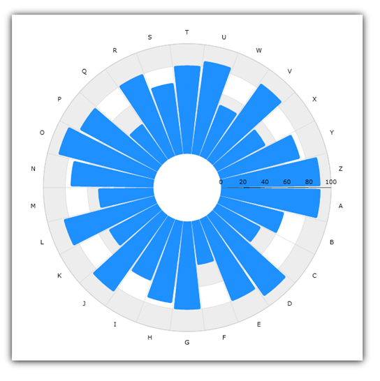
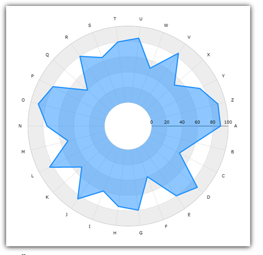

////

|metadata|
{
    "name": "datachart-radial-series-overview",
    "controlName": ["{DataChartName}"],
    "tags": ["Charting","Data Binding","Data Presentation","Sample Data Source"],
    "guid": "98311847-9620-482c-9df3-75a4736d46d1",  
    "buildFlags": [],
    "createdOn": "2014-06-05T19:39:00.5353321Z"
}
|metadata|
////

= Radial Series

This topic explains the common properties for Radial Series in the link:{DataChartLink}.{DataChartName}.html[{DataChartName}]™ control.

The topic is organized as follows:

* <<Introduction,Introduction>>
* <<Series,Types of Radial Series>>
* <<Axes,Radial Axes>>
* <<DataBinding,Data Binding>>
* <<RelatedTopics,Related Topics>>

[[Introduction]]
== Introduction

Radial Series is a group of series that takes data and render it as collection of data points wrapped around a circle (rather than stretching along a horizontal line as link:datachart-category-series-overview.html[Category Series] do). Just like Category Series, Radial Series are also mapping a list of categories from the minimum to the maximum of the extent of the chart, and support the same category grouping mechanisms of Category Series.

[[Series]]
== Types of Radial Series

The {DataChartName} control supports the following types of Radial Series and each of them is discussed in an individual topic:

* link:datachart-radial-area-series.html[Radial Area Series]
* link:datachart-radial-line-series.html[Radial Line Series]
* link:datachart-radial-column-series.html[Radial Column Series]
* link:datachart-radial-pie-series.html[Radial Pie Series]

All these topics demonstrate how to create a specific type of Radial Series and bind data to it.

Figure 1: Sample Radial Pie Series

Figure 2: Sample Radial Column Series

image::images/xamDataChart_Radial_Series_03.png[]

Figure 3: Sample Radial Line Series

Figure 4: Sample Radial Area Series

Every Radial Series have a rough Category Series equivalent as shown in Table 1.

Table 1: Mapping of the Radial Series Types to the Category Series Types

[options="header", cols="a,a"]
|====
|Radial Series Type|Category Series Type

| link:{DataChartLink}.radialareaseries.html[RadialAreaSeries]
| link:{DataChartLink}.areaseries.html[AreaSeries]

| link:{DataChartLink}.radiallineseries.html[RadialLineSeries]
| link:{DataChartLink}.lineseries.html[LineSeries]

| link:{DataChartLink}.radialcolumnseries.html[RadialColumnSeries]
| link:{DataChartLink}.columnseries.html[ColumnSeries]

| link:{DataChartLink}.radialpieseries.html[RadialPieSeries]
| link:{DataChartLink}.columnseries.html[ColumnSeries]

|====

[[Axes]]
== Using Radial Axes

There are various types of radial axes in the {DataChartName} control, but only link:{DataChartLink}.numericradiusaxis.html[NumericRadiusAxis] and link:{DataChartLink}.categoryangleaxis.html[CategoryAngleAxis] can be used with all Radial Series. In addition to that, each of Radial Series must have binding set to one NumericRadiusAxis and one var using link:{DataChartLink}.radialbase{ApiProp}angleaxis.html[AngleAxis] and link:{DataChartLink}.radialbase{ApiProp}valueaxis.html[ValueAxis] properties, respectively. For more information on how to use polar axes, refer to link:datachart-using-category-angle-axis.html[Using Category Angle Axis] and link:datachart-using-numeric-radius-axis.html[Using Numeric Radius Axis] topics. For a list of all supported axis types, see the link:datachart-axes.html[Chart Axes] topic.

[[DataBinding]]
== Data Binding

Similarly to other types of series in the {DataChartName} control, Radial Series also uses  pick:[xaml=" link:{DataChartLink}.series{ApiProp}itemssource.html[ItemsSource]"]  pick:[win-forms,android=" link:{DataChartLink}.series{ApiProp}datasource.html[DataSource]"]  property to bind data. All series can be bound to any object that implements the link:http://msdn.microsoft.com/en-us/library/system.collections.ienumerable.aspx[IEnumerable] interface (e.g. link:http://msdn.microsoft.com/en-us/library/6sh2ey19.aspx[List], link:http://msdn.microsoft.com/en-us/library/ms132397.aspx[Collection], link:http://msdn.microsoft.com/en-us/library/7977ey2c.aspx[Queue], link:http://msdn.microsoft.com/en-us/library/system.collections.stack.aspx[Stack]), however, in case of Radial Series, each item in this object must have one numeric data column which is mapped using the link:{DataChartLink}.anchoredradialseries{ApiProp}valuememberpath.html[ValueMemberPath] property of the series and one category data column which is mapped to the link:{DataChartLink}.axis{ApiProp}label.html[Label] property of the CategoryAngleAxis. For more information on the requirements for the specific types of series, refer to the link:datachart-series-requirements.html[Series Requirements] topic.

An example of object that meets above criteria is the RadialDataSample object which you can download from the link:resources-sample-category-data.html[Sample Category Data] resource and use it in your project. Figure 5 shows how binding data to Radial Series works in the {DataChartName} control.

ifdef::xaml[]

image::images/xamDataChart_Radial_Series_05.png[]

endif::xaml[]

ifdef::win-forms,android[]

endif::win-forms,android[]

Figure 5: Schematic representation of data binding to Radial Series in the {DataChartName} control

[[RelatedTopics]]
== Related Topics

* link:datachart-series-requirements.html[Series Requirements]
* link:datachart-radial-area-series.html[Radial Area Series]
* link:datachart-radial-line-series.html[Radial Line Series]
* link:datachart-radial-column-series.html[Radial Column Series]
* link:datachart-radial-pie-series.html[Radial Pie Series]
* link:datachart-using-category-angle-axis.html[Using Category Angle Axis]
* link:datachart-using-numeric-radius-axis.html[Using Numeric Radius Axis]