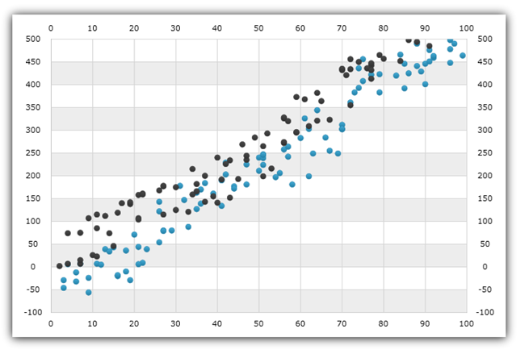
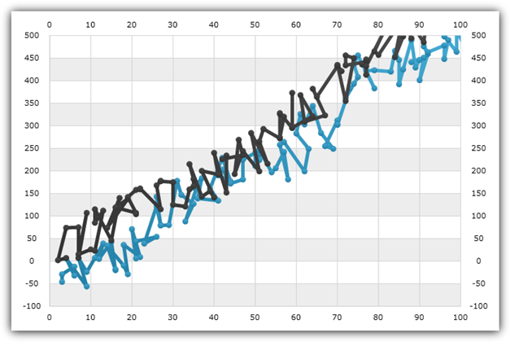
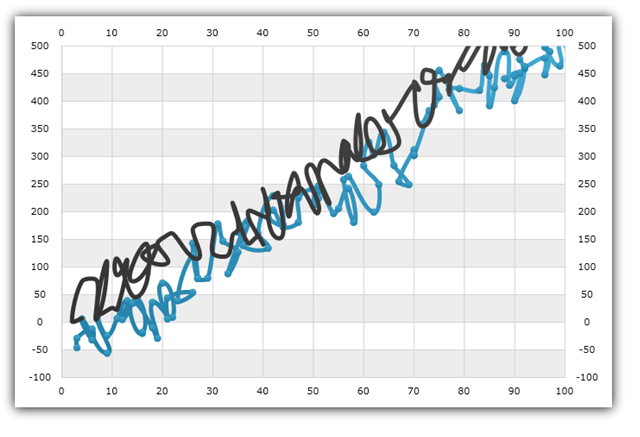
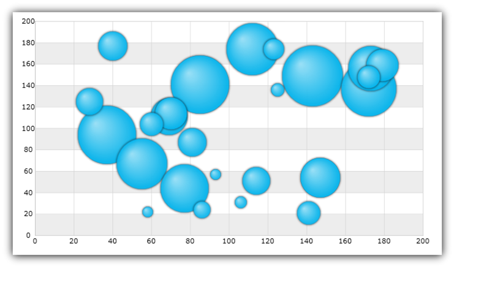
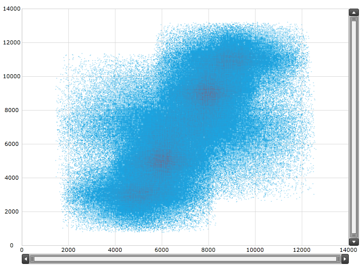

////

|metadata|
{
    "name": "datachart-scatter-series-overview",
    "controlName": ["{DataChartName}"],
    "tags": ["Application Scenarios","Charting","How Do I"],
    "guid": "ae71f00e-36ce-4cda-8960-c7a0f6cab9d1",  
    "buildFlags": [],
    "createdOn": "2014-06-05T19:39:00.5633433Z"
}
|metadata|
////

= Scatter Series

In the {DataChartName}™ control, scatter series are used to show markers to represent the relationship among items in several distinct series of data or to plot data items using x and y coordinates. The x and y coordinates of the data point are determined by two data values. The scatter series draw attention to uneven intervals or clusters of data. These types of series are often used to plot scientific data, and can highlight the deviation of collected data from predicted results. Scatter series can also be used to organize data chronologically (even if the data is not in chronological order).

=== Types of Scatter Series

The {DataChartName} control provides the following types of scatter series

=== Scatter Point Series

The link:{DataChartLink}.scatterseries.html[ScatterPointSeries] displays data as a collection of points, each having the value of X variable determining the position on the horizontal axis and the value of the Y variable determining the position on the vertical axis.

=== Scatter Line Series

The link:{DataChartLink}.scatterlineseries.html[ScatterLineSeries] displays data as a collection of points connected with straight line, each having the value of one variable determining the position on the horizontal axis and the value of the other variable determining the position on the vertical axis

=== Scatter Spline Series

The link:{DataChartLink}.scattersplineseries.html[ScatterSplineSeries] displays data as a collection of points connected with spline, each having the value of one variable determining the position on the horizontal axis and the value of the other variable determining the position on the vertical axis.

ifdef::wpf,win-universal,android,win-forms[]

=== Scatter Bubble Series

The link:{DataChartLink}.bubbleseries.html[BubbleSeries] displays data as a collection of bubbles, each having the value of X variable determining the position on the horizontal axis, the value of the Y variable determining the position on the vertical axis, and the value of the Radius variable determining the size of bubble. For more information on this type of series, refer to the link:datachart-bubble-series.html[Scatter Bubble Series] topic.

endif::wpf,win-universal,android,win-forms[]

ifdef::wpf,win-universal[]

=== Scatter High Density Series

The link:{DataChartLink}.highdensityscatterseries_members.html[HighDensityScatterSeries] displays scatter data ranging from hundreds to millions of data points with very little loading time. Because there are so many data points, the series displays the scatter data as tiny dots as opposed to full size markers, and displays areas with the most data using a higher color density representing a cluster of data points. For more information on this type of series, refer to the link:datachart-scatter-high-density-scatter-series.html[High Density Scatter Series] topic.

endif::wpf,win-universal[]

== Code Example

The following code snippet shows how to add ScatterSeries to the link:{DataChartLink}.{DataChartName}.html[{DataChartName}] control. Note that you can use the same code to create instances of other scatter series by just chaning type of the series. Note that this code example use the link:resources-sample-scatter-data.html[Sample Scatter Data] as data source and you can use it in your project or provide your own data.

ifdef::wpf,win-universal[]

*In XAML:*

[source]
----
<ig:{DataChartName} x:Name="DataChart" >
----

[source]
----
    <ig:{DataChartName}.Axes>
        <ig:NumericXAxis x:Name="xAxis" />
----

[source]
----
        <ig:NumericYAxis x:Name="yAxis" />
    </ig:{DataChartName}.Axes>
    <ig:{DataChartName}.Series>
        <ig:ScatterSeries 
                        ItemsSource="{Binding SampleData}" 
                        XMemberPath="X" 
                        YMemberPath="Y" 
                        XAxis="{Binding ElementName=xAxis}" 
                        YAxis="{Binding ElementName=yAxis}">
        </ig:ScatterSeries>               
    </ig:{DataChartName}.Series>
</ig:{DataChartName}>
----

endif::wpf,win-universal[]

ifdef::xamarin[]

*In XAML:*

[source]
----
<ig:XFDataChart x:Name="DataChart" >
----

[source]
----
    <ig:XFDataChart.Axes>
        <ig:NumericXAxis x:Name="xAxis" />
----

[source]
----
        <ig:NumericYAxis x:Name="yAxis" />
    </ig:XFDataChart.Axes>
    <ig:XFDataChart.Series>
        <ig:ScatterSeries 
                        ItemsSource="{Binding SampleData}" 
                        XMemberPath="X" 
                        YMemberPath="Y" 
                        XAxis="{x:Reference xAxis}" 
                        YAxis="{x:Reference yAxis}">
        </ig:ScatterSeries>               
    </ig:XFDataChart.Series>
</ig:XFDataChart>
----

endif::xamarin[]

ifdef::wpf,win-forms,xamarin[]

*In Visual Basic:*

ifdef::win-forms[]
----
Dim data As New SampleScatterData()
Dim yAxis As New NumericYAxis()
Dim xAxis As New NumericXAxis()
Dim series As New ScatterSeries()
series.DataSource = data
series.ItemsSource = data
series.XMemberPath = "X"
series.YMemberPath = "Y"
series.XAxis = xAxis
series.YAxis = yAxis
Dim chart As New {DataChartName}()
chart.Axes.Add(xAxis)
chart.Axes.Add(yAxis)
chart.Series.Add(series)
----
endif::win-forms[]

ifdef::xaml[]
----
Dim data As New SampleScatterData()
Dim yAxis As New NumericYAxis()
Dim xAxis As New NumericXAxis()
Dim series As New ScatterSeries()
series.DataSource = data
series.ItemsSource = data
series.XMemberPath = "X"
series.YMemberPath = "Y"
series.XAxis = xAxis
series.YAxis = yAxis
Dim chart As New {DataChartName}()
chart.Axes.Add(xAxis)
chart.Axes.Add(yAxis)
chart.Series.Add(series)
----
endif::xaml[]

endif::wpf,win-forms,xamarin[]

ifdef::wpf,win-forms,xamarin[]

*In C#:*

ifdef::win-forms[]
----
var data = new SampleScatterData(); 
var yAxis = new NumericYAxis();
var xAxis = new NumericXAxis();
var series = new ScatterSeries();
series.DataSource = data;
series.ItemsSource = data;
series.XMemberPath = "X";
series.YMemberPath = "Y";
series.XAxis = xAxis;
series.YAxis = yAxis;
 var chart = new {DataChartName}(); 
chart.Axes.Add(xAxis);
chart.Axes.Add(yAxis);
chart.Series.Add(series);
----
endif::win-forms[]

ifdef::xaml[]
----
var data = new SampleScatterData(); 
var yAxis = new NumericYAxis();
var xAxis = new NumericXAxis();
var series = new ScatterSeries();
series.DataSource = data;
series.ItemsSource = data;
series.XMemberPath = "X";
series.YMemberPath = "Y";
series.XAxis = xAxis;
series.YAxis = yAxis;
 var chart = new {DataChartName}(); 
chart.Axes.Add(xAxis);
chart.Axes.Add(yAxis);
chart.Series.Add(series);
----
endif::xaml[]

endif::wpf,win-forms,xamarin[]

ifdef::android[]

*In Java:*

[source,js]
----
ScatterDataSample data = new ScatterDataSample();
NumericYAxis yAxis = new NumericYAxis();
NumericXAxis xAxis = new NumericXAxis();
ScatterSeries series = new ScatterSeries();
series.setDataSource(data);
series.setYMemberPath("Y");
series.setXMemberPath("X");
series.setXAxis(xAxis);
series.setYAxis(yAxis);
chart.addAxis(xAxis);
chart.addAxis(yAxis);
chart.addSeries(series);
----

endif::android[]

== Related Topics

ifdef::wpf,win-universal,android,win-forms[]
* link:datachart-bubble-series.html[Scatter Bubble Series]

endif::wpf,win-universal,android,win-forms[]

ifdef::wpf,win-universal[]
* link:datachart-scatter-high-density-scatter-series.html[High Density Scatter Series]

endif::wpf,win-universal[]

* link:datachart-multiple-series.html[Adding Multiple Series]
* link:datachart-series-requirements.html[Series Requirements]