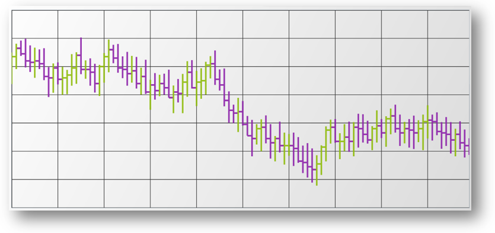

////

|metadata|
{
    "name": "datachart-series-financial-price-series-overview",
    "controlName": ["{DataChartName}"],
    "tags": ["Charting"],
    "guid": "93330a7e-2699-4311-b9c2-1d3df418bf27",  
    "buildFlags": [],
    "createdOn": "2014-06-05T19:39:00.4542971Z"
}
|metadata|
////

= Financial Series

The link:{DataChartLink}.{DataChartName}.html[{DataChartName}]™ control’s link:{DataChartLink}.financialpriceseries.html[FinancialPriceSeries] used to plot stock prices, and show the stock's high, low, open, and close prices over time. In addition, it can display trend lines for stock prices. Financial Price Series is often used in combination with a number of other link:datachart-financial-indicators-overview.html[Financial Indicators] to measure changes and analyze trends of stock prices.

=== Display Modes

The Financial Price Series has two display modes that are configurable by setting enumerable value on the link:{DataChartLink}.financialpriceseries{ApiProp}displaytype.html[DisplayType] property.

=== Candlestick

The link:{DataChartLink}.financialpriceseries.html[FinancialPriceSeries] in  pick:[wpf,win-universal,android=" link:{DataChartLink}.pricedisplaytype.html[Candlestick]"]  pick:[xamarin,win-forms=" link:{DataChartLinkBase}.pricedisplaytype.html[Candlestick]"]  mode is used to plot stock prices, and show the stock's high, low, open and close prices for each day. Each data point is plotted as a vertical column with vertical lines on both the top and bottom. The vertical line indicates the span between high and low values of an investment. The top of the vertical line indicates the highest price during a session and the bottom of the vertical line indicates the lowest price during a session. The vertical columns indicate the span between the opening and closing values of an investment. The columns are filled using Series’ Brush when there is positive value and using Series’ NegativeBrush when there is negative value between the opening and closing values

image::images/xamDataChart_Financial_Price_Series_in_Candlestick_Mode_01.png[]

=== OHLC

The link:{DataChartLink}.financialpriceseries.html[FinancialPriceSeries] in  pick:[wpf,win-universal,android=" link:{DataChartLink}.pricedisplaytype.html[Candlestick]"]  pick:[xamarin,win-forms=" link:{DataChartLinkBase}.pricedisplaytype.html[OHLC]"]  mode is used to plot stock prices, and show the stock's high, low, open and close prices for each day. Each data point is plotted as a vertical line with horizontal perpendicular lines on both the left and right side. The vertical line indicates the span between high and low values of an investment. The top of the vertical line indicates the highest price during a session and the bottom of the vertical line indicates the lowest price during a session. The horizontal lines indicate the span between the opening and closing values of an investment. The horizontal line on the left-hand side of the vertical line indicates the opening value of a session. The horizontal line on the right-hand side of the vertical line indicates the closing value of a session

== Code Example

The following code snippet shows how to add FinancialPriceSeries in Candlestick mode to the DataChart control and bind link:resources-sample-stocks-data.html[Sample Stocks Data] source

ifdef::wpf,win-universal[]

*In XAML:*

----
<ig:{DataChartName} x:Name="DataChart" >
    <ig:{DataChartName}.Axes>
        <ig:NumericYAxis x:Name="yAxis"  />
        <ig:CategoryXAxis x:Name="xAxis" ItemsSource="{Binding}" Label="{}{Date}" />
    </ig:{DataChartName}.Axes>
    <ig:{DataChartName}.Series>
        <ig:FinancialPriceSeries 
                DisplayType="Candlestick"  
                ItemsSource="{Binding}" 
                OpenMemberPath="Open" 
                CloseMemberPath="Close" 
                HighMemberPath="High" 
                LowMemberPath="Low" 
                VolumeMemberPath="Volume" 
                XAxis="{Binding ElementName=xAxis}" 
                YAxis="{Binding ElementName=yAxis}">
        </ig:FinancialPriceSeries>       
    </ig:{DataChartName}.Series>
</ig:{DataChartName}>
----

endif::wpf,win-universal[]

ifdef::xamarin[]

*In XAML:*

----
<ig:XFDataChart x:Name="DataChart" >
    <ig:XFDataChart.Axes>
        <ig:NumericYAxis x:Name="yAxis"  />
        <ig:CategoryXAxis x:Name="xAxis" ItemsSource="{Binding}" Label="Date" />
    </ig:XFDataChart.Axes>
    <ig:XFDataChart.Series>
        <ig:FinancialPriceSeries 
                DisplayType="Candlestick"  
                ItemsSource="{Binding}" 
                OpenMemberPath="Open" 
                CloseMemberPath="Close" 
                HighMemberPath="High" 
                LowMemberPath="Low" 
                VolumeMemberPath="Volume" 
                XAxis="{x:Reference xAxis}" 
                YAxis="{x:Reference yAxis}">
        </ig:FinancialPriceSeries>       
    </ig:XFDataChart.Series>
</ig:XFDataChart>
----

endif::xamarin[]

ifdef::wpf,win-forms,xamarin[]

*In Visual Basic:*

ifdef::win-forms[]
----
Dim data As New FinancialDataSample()
Dim yAxis As New NumericYAxis()
Dim xAxis As New CategoryXAxis()
xAxis.DataSource = data
xAxis.ItemsSource = data
xAxis.Label = "{Date}"
xAxis.Label = "Date"
Dim series As New FinancialPriceSeries()
series.DisplayType = PriceDisplayType.Candlestick
series.DataSource = data
series.ItemsSource = data
series.OpenMemberPath = "Open"
series.HighMemberPath = "High"
series.LowMemberPath = "Low"
series.CloseMemberPath = "Close"
series.VolumeMemberPath = "Volume"
series.XAxis = xAxis
series.YAxis = yAxis
DataChart.Axes.Add(xAxis)
DataChart.Axes.Add(yAxis)
DataChart.Series.Add(series)
----
endif::win-forms[]

ifdef::xaml[]
----
Dim data As New FinancialDataSample()
Dim yAxis As New NumericYAxis()
Dim xAxis As New CategoryXAxis()
xAxis.DataSource = data
xAxis.ItemsSource = data
xAxis.Label = "{Date}"
xAxis.Label = "Date"
Dim series As New FinancialPriceSeries()
series.DisplayType = PriceDisplayType.Candlestick
series.DataSource = data
series.ItemsSource = data
series.OpenMemberPath = "Open"
series.HighMemberPath = "High"
series.LowMemberPath = "Low"
series.CloseMemberPath = "Close"
series.VolumeMemberPath = "Volume"
series.XAxis = xAxis
series.YAxis = yAxis
DataChart.Axes.Add(xAxis)
DataChart.Axes.Add(yAxis)
DataChart.Series.Add(series)
----
endif::xaml[]

ifdef::wpf,win-universal[]
----
Dim data As New FinancialDataSample()
Dim yAxis As New NumericYAxis()
Dim xAxis As New CategoryXAxis()
xAxis.DataSource = data
xAxis.ItemsSource = data
xAxis.Label = "{Date}"
xAxis.Label = "Date"
Dim series As New FinancialPriceSeries()
series.DisplayType = PriceDisplayType.Candlestick
series.DataSource = data
series.ItemsSource = data
series.OpenMemberPath = "Open"
series.HighMemberPath = "High"
series.LowMemberPath = "Low"
series.CloseMemberPath = "Close"
series.VolumeMemberPath = "Volume"
series.XAxis = xAxis
series.YAxis = yAxis
DataChart.Axes.Add(xAxis)
DataChart.Axes.Add(yAxis)
DataChart.Series.Add(series)
----
endif::wpf,win-universal[]

ifdef::xamarin[]
----
Dim data As New FinancialDataSample()
Dim yAxis As New NumericYAxis()
Dim xAxis As New CategoryXAxis()
xAxis.DataSource = data
xAxis.ItemsSource = data
xAxis.Label = "{Date}"
xAxis.Label = "Date"
Dim series As New FinancialPriceSeries()
series.DisplayType = PriceDisplayType.Candlestick
series.DataSource = data
series.ItemsSource = data
series.OpenMemberPath = "Open"
series.HighMemberPath = "High"
series.LowMemberPath = "Low"
series.CloseMemberPath = "Close"
series.VolumeMemberPath = "Volume"
series.XAxis = xAxis
series.YAxis = yAxis
DataChart.Axes.Add(xAxis)
DataChart.Axes.Add(yAxis)
DataChart.Series.Add(series)
----
endif::xamarin[]

endif::wpf,win-forms,xamarin[]

ifdef::wpf,win-forms,xamarin[]

*In C#:*

ifdef::win-forms[]
----
var data = new FinancialDataSample(); 
var yAxis = new NumericYAxis();
var xAxis = new CategoryXAxis();
xAxis.DataSource = data;
xAxis.ItemsSource = data;
xAxis.Label = "{Date}";
xAxis.Label = "Date";
var series = new FinancialPriceSeries();
series.DisplayType = PriceDisplayType.Candlestick; 
series.DataSource = data;
series.ItemsSource = data;
series.OpenMemberPath = "Open";
series.HighMemberPath = "High";
series.LowMemberPath = "Low";
series.CloseMemberPath = "Close";
series.VolumeMemberPath = "Volume";
series.XAxis = xAxis;
series.YAxis = yAxis;
DataChart.Axes.Add(xAxis);
DataChart.Axes.Add(yAxis);
DataChart.Series.Add(series);
----
endif::win-forms[]

ifdef::xaml[]
----
var data = new FinancialDataSample(); 
var yAxis = new NumericYAxis();
var xAxis = new CategoryXAxis();
xAxis.DataSource = data;
xAxis.ItemsSource = data;
xAxis.Label = "{Date}";
xAxis.Label = "Date";
var series = new FinancialPriceSeries();
series.DisplayType = PriceDisplayType.Candlestick; 
series.DataSource = data;
series.ItemsSource = data;
series.OpenMemberPath = "Open";
series.HighMemberPath = "High";
series.LowMemberPath = "Low";
series.CloseMemberPath = "Close";
series.VolumeMemberPath = "Volume";
series.XAxis = xAxis;
series.YAxis = yAxis;
DataChart.Axes.Add(xAxis);
DataChart.Axes.Add(yAxis);
DataChart.Series.Add(series);
----
endif::xaml[]

ifdef::wpf,win-universal[]
----
var data = new FinancialDataSample(); 
var yAxis = new NumericYAxis();
var xAxis = new CategoryXAxis();
xAxis.DataSource = data;
xAxis.ItemsSource = data;
xAxis.Label = "{Date}";
xAxis.Label = "Date";
var series = new FinancialPriceSeries();
series.DisplayType = PriceDisplayType.Candlestick; 
series.DataSource = data;
series.ItemsSource = data;
series.OpenMemberPath = "Open";
series.HighMemberPath = "High";
series.LowMemberPath = "Low";
series.CloseMemberPath = "Close";
series.VolumeMemberPath = "Volume";
series.XAxis = xAxis;
series.YAxis = yAxis;
DataChart.Axes.Add(xAxis);
DataChart.Axes.Add(yAxis);
DataChart.Series.Add(series);
----
endif::wpf,win-universal[]

ifdef::xamarin[]
----
var data = new FinancialDataSample(); 
var yAxis = new NumericYAxis();
var xAxis = new CategoryXAxis();
xAxis.DataSource = data;
xAxis.ItemsSource = data;
xAxis.Label = "{Date}";
xAxis.Label = "Date";
var series = new FinancialPriceSeries();
series.DisplayType = PriceDisplayType.Candlestick; 
series.DataSource = data;
series.ItemsSource = data;
series.OpenMemberPath = "Open";
series.HighMemberPath = "High";
series.LowMemberPath = "Low";
series.CloseMemberPath = "Close";
series.VolumeMemberPath = "Volume";
series.XAxis = xAxis;
series.YAxis = yAxis;
DataChart.Axes.Add(xAxis);
DataChart.Axes.Add(yAxis);
DataChart.Series.Add(series);
----
endif::xamarin[]

endif::wpf,win-forms,xamarin[]

ifdef::android[]

*In Java:*

[source,js]
----
DataChartView chart = new DataChartView(rootView.getContext());
StockPriceData data = new StockPriceData();
NumericYAxis yAxis = new NumericYAxis();
CategoryXAxis xAxis = new CategoryXAxis();
xAxis.setDataSource(data);
xAxis.setLabel("Date");
FinancialPriceSeries series = new FinancialPriceSeries();
series.setDisplayType(PriceDisplayType.CANDLESTICK);
series.setDataSource(data);
series.setOpenMemberPath("Open");
series.setHighMemberPath("High");
series.setLowMemberPath("Low");
series.setCloseMemberPath("Close");
series.setVolumeMemberPath("Volume");
series.setXAxis(xAxis);
series.setYAxis(yAxis);
chart.addAxis(xAxis);
chart.addAxis(yAxis);
chart.addSeries(series);
----

endif::android[]