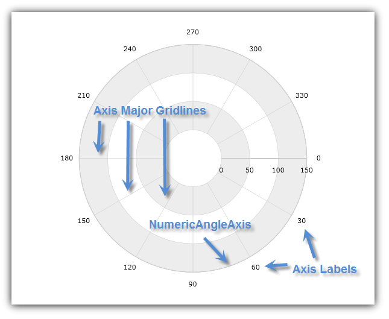
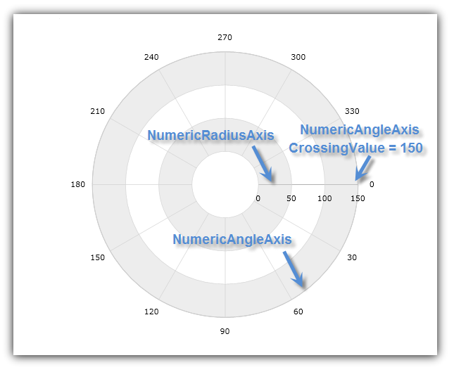
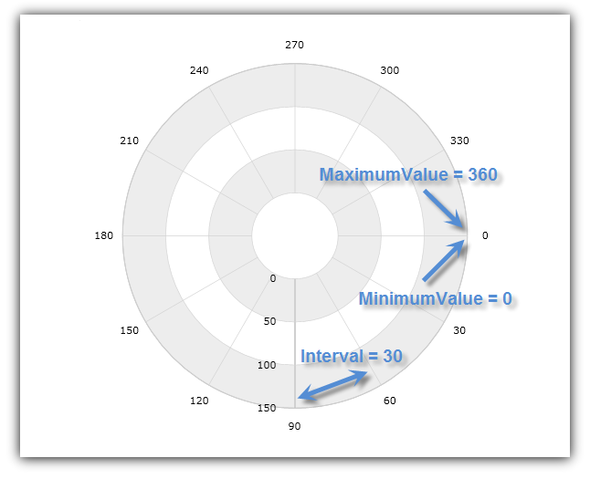
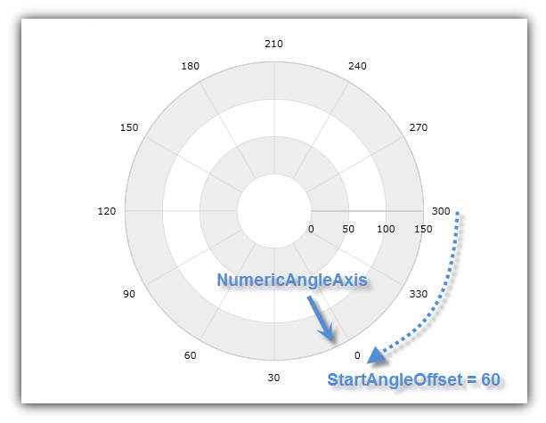

////

|metadata|
{
    "name": "datachart-using-numeric-angle-axis",
    "controlName": ["{DataChartName}"],
    "tags": ["Charting","How Do I"],
    "guid": "c9676734-3439-422f-b396-661f6455b3a5",  
    "buildFlags": [],
    "createdOn": "2014-06-05T19:39:00.60436Z"
}
|metadata|
////

= Using Numeric Angle Axis

This topic demonstrates, with code examples, how to use Numeric Angle Axis in the link:{DataChartLink}.{DataChartName}.html[{DataChartName}]™ control.

The topic is organized as follows:

* <<Introduction,Introduction>>
* <<AxisCrossingProperties,Axis Crossing Properties>>
* <<AxisRangeProperties,Axis Range Properties>>
* <<AxisOffset,Axis Offset>>
* <<RelatedTopics,Related Topics>>

[[Introduction]]
== Introduction

The link:{DataChartLink}.numericangleaxis.html[NumericAngleAxis] has a shape of a circle surrounding the center of chart with major gridlines that look like radial lines starting from the center of the chart and pointing outwards. (Figure 1)

Figure 1: Sample implementation of the NumericAngleAxis shape

This type of axis can be used only with link:datachart-polar-series-overview.html[Polar Series] (in combination with link:{DataChartLink}.numericradiusaxis.html[NumericRadiusAxis]) instead of the link:{DataChartLink}.categoryangleaxis.html[CategoryAngleAxis] (which is used only with link:datachart-radial-series-overview.html[Radial Series]). For more information on what axis types are required by a specific series, refer to the link:datachart-series-requirements.html[Series Requirements] topic.

[[AxisCrossingProperties]]
== Axis Crossing Properties

The NumericAngleAxis has the following axis crossing properties:

link:{DataChartLink}.axis{ApiProp}crossingvalue.html[CrossingValue] – the radius or distance from the beginning of the NumericRadiusAxis. This value determines the location of intersection of the NumericAngleAxis on the NumericRadiusAxis. Increasing the value of the CrossingValue property will move the NumericAngleAxis farther from the center of the chart and decreasing it will move the angle axis closer to the center along the radius axis. For example, if the NumericRadiusAxis has a range value from 0 to 100 and a value of 50 is set on the CrossingValue property of the NumericAngleAxis then the angle axis will cross the radius axis at value of 50. By default, the crossing value of the angle is set to the maximum value of radius axis, which means that the angle axis will be rendered at the outer ring of the chart

link:{DataChartLink}.axis{ApiProp}crossingaxis.html[CrossingAxis] – the axis in the {DataChartName} control’s Axes collection that crosses the NumericAngleAxis. This property must be bound to a NumericRadiusAxis if there is more than one NumericAngleAxis and one NumericRadiusAxis in the {DataChartName} control’s Axes collection. If you don’t specify the crossing axis, then the angle axis will assume the first axis of the NumericRadiusAxis type in the chart’s  pick:[wpf,win-universal,win-forms=" link:{DataChartLink}.{DataChartName}{ApiProp}axes.html[Axes]"]  pick:[android=" link:{DataChartLink}.{DataChartName}~addaxis.html[Axes]"]  collection is the correct crossing axis.

The following code snippet shows how to use the CrossingAxis and CrossingValue properties of the NumericAngleAxis in the {DataChartName} control. It sets the intersection of NumericAngleAxis with NumericRadiusAxis at radius of 150 from the beginning of the NumericRadiusAxis. The result is shown in Figure 2 below.

ifdef::wpf,win-universal[]

*In XAML:*

----
<ig:{DataChartName} x:Name="DataChart" >
    <ig:{DataChartName}.Axes>
        <ig:NumericRadiusAxis x:Name="numericRadiusAxis"  
                              CrossingAxis="{Binding ElementName=numericAngleAxis}"
                              CrossingValue="0" >
        </ig:NumericRadiusAxis>
        <ig:NumericAngleAxis x:Name="numericAngleAxis"
                             CrossingAxis="{Binding ElementName=numericRadiusAxis}"
                             CrossingValue="150" >
        </ig:NumericAngleAxis>
    </ig:{DataChartName}.Axes>
</ig:{DataChartName}>
----

endif::wpf,win-universal[]

ifdef::xamarin[]

*In XAML:*

----
<ig:{DataChartName} x:Name="DataChart" >
    <ig:{DataChartName}.Axes>
        <ig:NumericRadiusAxis x:Name="numericRadiusAxis"  
                              CrossingAxis="{x:Reference numericAngleAxis}"
                              CrossingValue="0" >
        </ig:NumericRadiusAxis>
        <ig:NumericAngleAxis x:Name="numericAngleAxis"
                             CrossingAxis="{x:Reference numericRadiusAxis}"
                             CrossingValue="150" >
        </ig:NumericAngleAxis>
    </ig:{DataChartName}.Axes>
</ig:{DataChartName}>
----

endif::xamarin[]

ifdef::wpf[]

*In Visual Basic:*

----
Dim DataChart As New {DataChartName}()
Dim numericAngleAxis As New NumericAngleAxis()
Dim numericRadiusAxis As New NumericRadiusAxis()
numericRadiusAxis.CrossingAxis = numericAngleAxis
numericRadiusAxis.CrossingValue = 0
numericAngleAxis.CrossingAxis = numericRadiusAxis
numericAngleAxis.CrossingValue = 150
DataChart.Axes.Add(numericAngleAxis)
DataChart.Axes.Add(numericRadiusAxis)
----

endif::wpf[]

ifdef::win-forms[]

*In Visual Basic:*

----
Dim DataChart As New {DataChartName}()
Dim numericAngleAxis As New NumericAngleAxis()
Dim numericRadiusAxis As New NumericRadiusAxis()
numericRadiusAxis.CrossingAxis = numericAngleAxis
numericRadiusAxis.CrossingValue = 0
numericAngleAxis.CrossingAxis = numericRadiusAxis
numericAngleAxis.CrossingValue = 150
DataChart.Axes.Add(numericAngleAxis)
DataChart.Axes.Add(numericRadiusAxis)
----

endif::win-forms[]

ifdef::xamarin[]

*In Visual Basic:*

----
Dim DataChart As New {DataChartName}()
Dim numericAngleAxis As New NumericAngleAxis()
Dim numericRadiusAxis As New NumericRadiusAxis()
numericRadiusAxis.CrossingAxis = numericAngleAxis
numericRadiusAxis.CrossingValue = 0
numericAngleAxis.CrossingAxis = numericRadiusAxis
numericAngleAxis.CrossingValue = 150
DataChart.Axes.Add(numericAngleAxis)
DataChart.Axes.Add(numericRadiusAxis)
----

endif::xamarin[]

ifdef::wpf[]

*In C#:*

----
var DataChart = new {DataChartName}();
var numericAngleAxis = new NumericAngleAxis();
var numericRadiusAxis = new NumericRadiusAxis();
numericRadiusAxis.CrossingAxis = numericAngleAxis;
numericRadiusAxis.CrossingValue = 0;
numericAngleAxis.CrossingAxis = numericRadiusAxis;
numericAngleAxis.CrossingValue = 150;
DataChart.Axes.Add(numericAngleAxis);
DataChart.Axes.Add(numericRadiusAxis);
----

endif::wpf[]

ifdef::win-forms[]

*In C#:*

----
var DataChart = new {DataChartName}();
var numericAngleAxis = new NumericAngleAxis();
var numericRadiusAxis = new NumericRadiusAxis();
numericRadiusAxis.CrossingAxis = numericAngleAxis;
numericRadiusAxis.CrossingValue = 0;
numericAngleAxis.CrossingAxis = numericRadiusAxis;
numericAngleAxis.CrossingValue = 150;
DataChart.Axes.Add(numericAngleAxis);
DataChart.Axes.Add(numericRadiusAxis);
----

endif::win-forms[]

ifdef::xamarin[]

*In C#:*

----
var DataChart = new {DataChartName}();
var numericAngleAxis = new NumericAngleAxis();
var numericRadiusAxis = new NumericRadiusAxis();
numericRadiusAxis.CrossingAxis = numericAngleAxis;
numericRadiusAxis.CrossingValue = 0;
numericAngleAxis.CrossingAxis = numericRadiusAxis;
numericAngleAxis.CrossingValue = 150;
DataChart.Axes.Add(numericAngleAxis);
DataChart.Axes.Add(numericRadiusAxis);
----

endif::xamarin[]

ifdef::android[]

*In Java:*

[source,js]
----
DataChartView dataChart = new DataChartView(root.getContext());
NumericAngleAxis numericAngleAxis = new NumericAngleAxis();
NumericRadiusAxis numericRadiusAxis = new NumericRadiusAxis();
numericRadiusAxis.setCrossingAxis(numericAngleAxis);
numericRadiusAxis.setCrossingValue(0.0);
numericAngleAxis.setCrossingAxis(numericRadiusAxis);
numericAngleAxis.setCrossingValue(150);
dataChart.addAxis(numericAngleAxis);
dataChart.addAxis(numericRadiusAxis);
----

endif::android[]

Figure 2: The {DataChartName} control with NumericAngleAxis crossing at 150 radius value of NumericRadiusAxis

[[AxisRangeProperties]]
== Axis Range Properties

The NumericAngleAxis has the following range properties:

link:{DataChartLink}.numericaxisbase{ApiProp}minimumvalue.html[MinimumValue] – the position at which the axis begins

link:{DataChartLink}.numericaxisbase{ApiProp}maximumvalue.html[MaximumValue] – the position at which the axis ends

link:{DataChartLink}.numericaxisbase{ApiProp}interval.html[Interval] – the interval between the consecutive major gridlines or angular separation between radial lines starting from the center of the chart.

By default, the {DataChartName} uses auto range which means that the MinimumValue property will be set to a data point with the smallest angular data column and the MaximumValue property will be set to a data points with the largest angular data column. However, manually setting a value range on the NumericAngleAxis will hide all data points with angular data column outside this range. For example, if a collection of data points with angular data column varying from 0 to 360 is bound to a series and a value range from 50 (MinimumValue) to 100 (MaximumValue) is set on the NumericAngleAxis, then the chart will only show data points with angular data column between 50 and 100.

The following code snippet shows how to use range values with the NumericAngleAxis in the {DataChartName} control. It sets angle range between 0 and 360 and intervals of major gridlines every 30 degrees. The result is shown in Figure 3 below.

ifdef::xaml[]

*In XAML:*

----
<ig:{DataChartName} x:Name="DataChart" >
    <ig:{DataChartName}.Axes>
        <ig:NumericAngleAxis x:Name="numericAngleAxis"  
                             MinimumValue="0"
                             MaximumValue="360"
                             Interval="30">
        </ig:NumericAngleAxis>
    </ig:{DataChartName}.Axes>
</ig:{DataChartName}>
----

endif::xaml[]

ifdef::wpf[]

*In Visual Basic:*

----
Dim DataChart As New {DataChartName}()
Dim numericAngleAxis As New NumericAngleAxis()
numericAngleAxis.MinimumValue = 0
numericAngleAxis.MaximumValue = 360
numericAngleAxis.Interval = 50
DataChart.Axes.Add(numericAngleAxis)
----

endif::wpf[]

ifdef::win-forms[]

*In Visual Basic:*

----
Dim DataChart As New {DataChartName}()
Dim numericAngleAxis As New NumericAngleAxis()
numericAngleAxis.MinimumValue = 0
numericAngleAxis.MaximumValue = 360
numericAngleAxis.Interval = 50
DataChart.Axes.Add(numericAngleAxis)
----

endif::win-forms[]

ifdef::xamarin[]

*In Visual Basic:*

----
Dim DataChart As New {DataChartName}()
Dim numericAngleAxis As New NumericAngleAxis()
numericAngleAxis.MinimumValue = 0
numericAngleAxis.MaximumValue = 360
numericAngleAxis.Interval = 50
DataChart.Axes.Add(numericAngleAxis)
----

endif::xamarin[]

ifdef::wpf[]

*In C#:*

----
var DataChart = new {DataChartName}();
var numericAngleAxis = new NumericRadiusAxis();
numericAngleAxis.MinimumValue = 0;
numericAngleAxis.MaximumValue = 360;
numericAngleAxis.Interval = 30;
DataChart.Axes.Add(numericAngleAxis);
----

endif::wpf[]

ifdef::win-forms[]

*In C#:*

----
var DataChart = new {DataChartName}();
var numericAngleAxis = new NumericRadiusAxis();
numericAngleAxis.MinimumValue = 0;
numericAngleAxis.MaximumValue = 360;
numericAngleAxis.Interval = 30;
DataChart.Axes.Add(numericAngleAxis);
----

endif::win-forms[]

ifdef::xamarin[]

*In C#:*

----
var DataChart = new {DataChartName}();
var numericAngleAxis = new NumericRadiusAxis();
numericAngleAxis.MinimumValue = 0;
numericAngleAxis.MaximumValue = 360;
numericAngleAxis.Interval = 30;
DataChart.Axes.Add(numericAngleAxis);
----

endif::xamarin[]

ifdef::android[]

*In Java:*

[source,js]
----
DataChartView dataChart = new DataChartView(rootView.getContext());
numericAngleAxis numericAngleAxis = new NumericAngleAxis();
numericAngleAxis.setMinimumValue(0.0);
numericAngleAxis.setMaximumValue(360);
numericAngleAxis.setInterval(50);
dataChart.addAxis(numericAngleAxis);
----

endif::android[]

Figure 3: NumericAngleAxis with range value between 0 and 260 and interval of 30

[[AxisOffset]]
== Axis Offset

The NumericAngleAxis always starts from the 3 o’clock position (the right hand side of the chart). However, this can be changed by setting the NumericAngleAxis object’s link:{DataChartLink}.numericangleaxis{ApiProp}startangleoffset.html[StartAngleOffset] property to the angle that will be used to offset the starting axis location in a clockwise direction. For example, a value of 90 set on the StartAngleOffset property will position the starting point for the NumericAngleAxis at the 6 o’clock position (the bottom of the chart) and a value of 270 will start this axis at the 12 o’clock position (the top of the chart). The axis index usually increases clockwise, but you can set link:{DataChartLink}.axis{ApiProp}isinverted.html[IsInverted] to true on the NumericAngleAxis in order to make the axis indices increase counter-clockwise instead.

The following code snippets show how to offset the starting point of the NumericAngleAxis in the {DataChartName} control by 60 degrees. The result is shown in Figure 4 below.

ifdef::xaml[]

*In XAML:*

----
<ig:NumericAngleAxis x:Name="numericAngleAxis"  
                   StartAngleOffset="60">
</ig:NumericAngleAxis>
----

endif::xaml[]

ifdef::wpf[]

*In Visual Basic:*

----
Dim numericAngleAxis As New NumericAngleAxis()
numericAngleAxis.StartAngleOffset = 60
----

endif::wpf[]

ifdef::win-forms[]

*In Visual Basic:*

----
Dim numericAngleAxis As New NumericAngleAxis()
numericAngleAxis.StartAngleOffset = 60
----

endif::win-forms[]

ifdef::xamarin[]

*In Visual Basic:*

----
Dim numericAngleAxis As New NumericAngleAxis()
numericAngleAxis.StartAngleOffset = 60
----

endif::xamarin[]

ifdef::wpf[]

*In C#:*

----
var numericAngleAxis = new NumericAngleAxis();
numericAngleAxis.StartAngleOffset = 60;
----

endif::wpf[]

ifdef::win-forms[]

*In C#:*

----
var numericAngleAxis = new NumericAngleAxis();
numericAngleAxis.StartAngleOffset = 60;
----

endif::win-forms[]

ifdef::xamarin[]

*In C#:*

----
var numericAngleAxis = new NumericAngleAxis();
numericAngleAxis.StartAngleOffset = 60;
----

endif::xamarin[]

ifdef::android[]

*In Java:*

[source,js]
----
DataChartView dataChart = new DataChartView(rootView.getContext());
numericAngleAxis numericAngleAxis = new NumericAngleAxis();
numericAngleAxis.setStartAngleOffset(60);
dataChart.addAxis(numericAngleAxis);
----

endif::android[]

Figure 4: NumericAngleAxis with 60 degrees offset for starting angle value

[[RelatedTopics]]
== Related Topics

* link:datachart-series-requirements.html[Series Requirements]
* link:datachart-polar-series-overview.html[Polar Series]