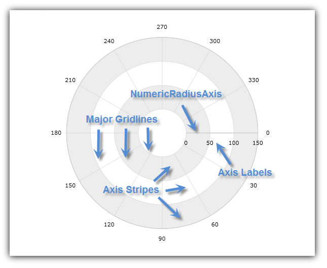
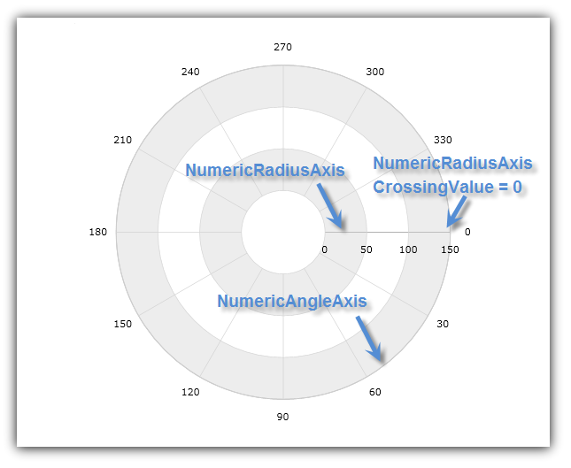
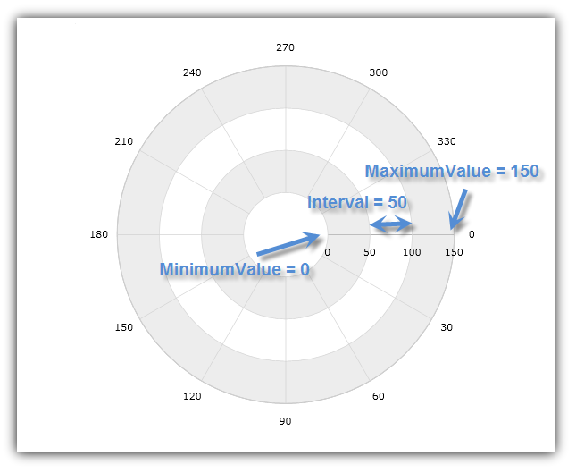
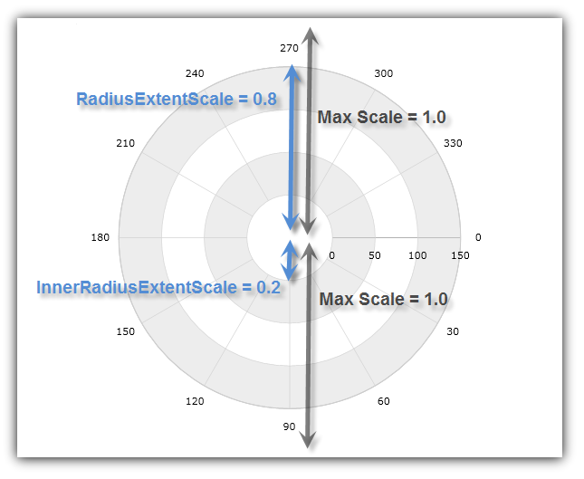

////
|metadata|
{
    "name": "datachart-using-numeric-radius-axis",
    "controlName": ["{DataChartName}"],
    "tags": ["Application Scenarios","Charting"],
    "guid": "e8841c1a-ff2e-4ffd-b0cc-9e5afcbbaa72",
    "buildFlags": [],
    "createdOn": "2014-06-05T19:39:00.6063608Z"
}
|metadata|
////

= Using Numeric Radius Axis

This topic demonstrates, with code examples, how to use Numeric Radius Axis in the link:{DataChartLink}.{DataChartName}.html[{DataChartName}]™ control.

The topic is organized as follows:

* <<Introduction,Introduction>>
* <<AxisCrossingProperties,Axis Crossing Properties>>
* <<AxisRangeProperties,Axis Range Properties>>
* <<AxisExtentScales,Axis Extent Scales>>
* <<RelatedTopics,Related Topics>>

[[Introduction]]
== Introduction

The link:{DataChartLink}.numericradiusaxis.html[NumericRadiusAxis] shape of the {DataChartName}™ control is a shape of a straight line starting from center of chart and pointing outwards to the boundary of chart plot area. The major gridlines of this axis look like circles with increasing radius values. (Figure 1)

Figure 1: Sample implementation of the NumericRadiusAxis shape

This type of axis can be used only with link:datachart-polar-series-overview.html[Polar Series] (in combination with link:{DataChartLink}.numericangleaxis.html[NumericAngleAxis]) or with link:datachart-radial-series-overview.html[Radial Series] (in combination with link:{DataChartLink}.categoryangleaxis.html[CategoryAngleAxis]). For more information on what axis types are required by a specific series, refer to the link:datachart-series-requirements.html[Series Requirements] topic.

[[AxisCrossingProperties]]
== Axis Crossing Properties

The NumericRadiusAxis has the following axis crossing properties:

link:{DataChartLink}.axis{ApiProp}crossingvalue.html[CrossingValue] – the direction to which the NumericRadiusAxis is pointed. The valid range is from 0 to 360. By the default, this value is set to zero which corresponds to the 3 o’clock position on the CategoryAngleAxis or NumericAngleAxis. The value of the CrossingValue property indicates the number of degrees with which to shift the NumericRadiusAxis clockwise from the 3 o’clock position. For example, a value of 90 set on CrossingValue property orients the NumericRadiusAxis at the 6 o’clock position and a value of 270 – at the 12 o’clock position.

link:{DataChartLink}.axis{ApiProp}crossingaxis.html[CrossingAxis] – the axis in the {DataChartName} control’s 
ifdef::xamarin[]
link:{DataChartLink}.axescollection.html[Axes]
endif::xamarin[]
ifdef::wpf,win-universal,win-forms[]
link:{DataChartLink}.{DataChartName}{ApiProp}axes.html[Axes]
endif::wpf,win-universal,win-forms[]
ifdef::android[]
link:{DataChartLink}.{DataChartName}~addaxis.html[Axes]  
endif::android[]

collection that crosses the NumericRadiusAxis. This property must be bound to a NumericAngleAxis (Polar Series) or CategoryAngleAxis (Radial Series), and vice-versa, if there is more than one NumericRadiusAxis and one NumericAngleAxis or CategoryAngleAxis in the Axes collection of the {DataChartName} control.

Table 1: Axis Types that can be bound to the CrossingAxis property

[options="header", cols="a,a"]
|====
|Axis Type|Target Type

| link:{DataChartLink}.numericradiusaxis.html[NumericRadiusAxis]
| link:{DataChartLink}.numericangleaxis.html[NumericAngleAxis] or link:{DataChartLink}.categoryangleaxis.html[CategoryAngleAxis]

| link:{DataChartLink}.numericangleaxis.html[NumericAngleAxis]
| link:{DataChartLink}.numericradiusaxis.html[NumericRadiusAxis]

| link:{DataChartLink}.categoryangleaxis.html[CategoryAngleAxis]
| link:{DataChartLink}.numericradiusaxis.html[NumericRadiusAxis]

|====

The following code snippets show how to use the CrossingAxis and CrossingValue properties with NumericRadiusAxis in the {DataChartName} control. It sets the intersection of NumericRadiusAxis with NumericAngleAxis at angle of zero degrees from the beginning of NumericAngleAxis. The result is shown in Figure 2 below.

ifdef::xaml[]

*In XAML:*

----
<ig:{DataChartName} x:Name="DataChart" >
    <ig:{DataChartName}.Axes>
        <ig:NumericRadiusAxis x:Name="numericRadiusAxis"  
                              CrossingAxis="{Binding ElementName=numericAngleAxis}"
                              CrossingValue="0" >
        </ig:NumericRadiusAxis>
        <ig:NumericAngleAxis x:Name="numericAngleAxis"
                             CrossingAxis="{Binding ElementName=numericRadiusAxis}"
                             CrossingValue="150" >
        </ig:NumericAngleAxis>
    </ig:{DataChartName}.Axes>
</ig:{DataChartName}>
----

endif::xaml[]

ifdef::wpf[]

*In Visual Basic:*

----
Dim DataChart As New {DataChartName}()
Dim numericAngleAxis As New NumericAngleAxis()
Dim numericRadiusAxis As New NumericRadiusAxis()
numericRadiusAxis.CrossingAxis = numericAngleAxis
numericRadiusAxis.CrossingValue = 0
numericAngleAxis.CrossingAxis = numericRadiusAxis
numericAngleAxis.CrossingValue = 150
DataChart.Axes.Add(numericAngleAxis)
DataChart.Axes.Add(numericRadiusAxis)
----

endif::wpf[]

ifdef::win-forms[]

*In Visual Basic:*

----
Dim DataChart As New {DataChartName}()
Dim numericAngleAxis As New NumericAngleAxis()
Dim numericRadiusAxis As New NumericRadiusAxis()
numericRadiusAxis.CrossingAxis = numericAngleAxis
numericRadiusAxis.CrossingValue = 0
numericAngleAxis.CrossingAxis = numericRadiusAxis
numericAngleAxis.CrossingValue = 150
DataChart.Axes.Add(numericAngleAxis)
DataChart.Axes.Add(numericRadiusAxis)
----

endif::win-forms[]

ifdef::xamarin[]

*In Visual Basic:*

----
Dim DataChart As New {DataChartName}()
Dim numericAngleAxis As New NumericAngleAxis()
Dim numericRadiusAxis As New NumericRadiusAxis()
numericRadiusAxis.CrossingAxis = numericAngleAxis
numericRadiusAxis.CrossingValue = 0
numericAngleAxis.CrossingAxis = numericRadiusAxis
numericAngleAxis.CrossingValue = 150
DataChart.Axes.Add(numericAngleAxis)
DataChart.Axes.Add(numericRadiusAxis)
----

endif::xamarin[]

ifdef::wpf[]

*In C#:*

----
var DataChart = new {DataChartName}();
var numericAngleAxis = new NumericAngleAxis();
var numericRadiusAxis = new NumericRadiusAxis();
numericRadiusAxis.CrossingAxis = numericAngleAxis;
numericRadiusAxis.CrossingValue = 0;
numericAngleAxis.CrossingAxis = numericRadiusAxis;
numericAngleAxis.CrossingValue = 150;
DataChart.Axes.Add(numericAngleAxis);
DataChart.Axes.Add(numericRadiusAxis);
----

endif::wpf[]

ifdef::win-forms[]

*In C#:*

----
var DataChart = new {DataChartName}();
var numericAngleAxis = new NumericAngleAxis();
var numericRadiusAxis = new NumericRadiusAxis();
numericRadiusAxis.CrossingAxis = numericAngleAxis;
numericRadiusAxis.CrossingValue = 0;
numericAngleAxis.CrossingAxis = numericRadiusAxis;
numericAngleAxis.CrossingValue = 150;
DataChart.Axes.Add(numericAngleAxis);
DataChart.Axes.Add(numericRadiusAxis);
----

endif::win-forms[]

ifdef::xamarin[]

*In C#:*

----
var DataChart = new {DataChartName}();
var numericAngleAxis = new NumericAngleAxis();
var numericRadiusAxis = new NumericRadiusAxis();
numericRadiusAxis.CrossingAxis = numericAngleAxis;
numericRadiusAxis.CrossingValue = 0;
numericAngleAxis.CrossingAxis = numericRadiusAxis;
numericAngleAxis.CrossingValue = 150;
DataChart.Axes.Add(numericAngleAxis);
DataChart.Axes.Add(numericRadiusAxis);
----

endif::xamarin[]

ifdef::android[]

*In Java:*

[source,js]
----
DataChartView dataChart = new DataChartView(root.getContext());
NumericAngleAxis numericAngleAxis = new NumericAngleAxis();
NumericRadiusAxis numericRadiusAxis = new NumericRadiusAxis();
numericRadiusAxis.setCrossingAxis(numericAngleAxis);
numericRadiusAxis.setCrossingValue(0.0);
numericAngleAxis.setCrossingAxis(numericRadiusAxis);
numericAngleAxis.setCrossingValue(150);
dataChart.addAxis(numericRadiusAxis);
dataChart.addAxis(numericAngleAxis);
----

endif::android[]

Figure 2: The {DataChartName} control with NumericRadiusAxis crossing at the 3 o’clock position of NumericAngleAxis

[[AxisRangeProperties]]
== Axis Range Properties

The NumericRadiusAxis has the following range properties:

link:{DataChartLink}.numericaxisbase{ApiProp}minimumvalue.html[MinimumValue] – the position at which the axis begins

link:{DataChartLink}.numericaxisbase{ApiProp}maximumvalue.html[MaximumValue] – the position at which the axis ends

link:{DataChartLink}.numericaxisbase{ApiProp}interval.html[Interval] – the interval between the consecutive major gridlines or radius rings of the NumericRadiusAxis

By default, data charts use auto range, which means that the MinimumValue property will be set to the data point with the smallest radius data column and the MaximumValue property will be set to the data points with the largest radius data column. However, manually setting a value range on NumericRadiusAxis will hide all data points with radius data column outside this range. For example, if a collection of data points, with a radius data column varying from 0 to 200 bound to a series and a value range of 50 (MinimumValue) and 100 (MaximumValue), is set on NumericRadiusAxis, then the chart will only show data points with radius data column between 50 and 100.

The following code snippets show how to use range values with NumericRadiusAxis in the {DataChartName} control. It sets the radius axis range between 0 and 150 and the intervals of the major gridlines to 50. The result is shown in Figure 3 below.

ifdef::xaml[]

*In XAML:*

----
<ig:{DataChartName} x:Name="DataChart" >
    <ig:{DataChartName}.Axes>
        <ig:NumericRadiusAxis x:Name="numericRadiusAxis"  
                              MinimumValue="0"
                              MaximumValue="150"
                              Interval="50">
        </ig:NumericRadiusAxis>
    </ig:{DataChartName}.Axes>
</ig:{DataChartName}>
----

endif::xaml[]

ifdef::wpf[]

*In Visual Basic:*

----
Dim DataChart As New {DataChartName}()
Dim numericRadiusAxis As New NumericRadiusAxis()
numericRadiusAxis.MinimumValue = 0
numericRadiusAxis.MaximumValue = 150
numericRadiusAxis.Interval = 50
DataChart.Axes.Add(numericRadiusAxis)
----

endif::wpf[]

ifdef::win-forms[]

*In Visual Basic:*

----
Dim DataChart As New {DataChartName}()
Dim numericRadiusAxis As New NumericRadiusAxis()
numericRadiusAxis.MinimumValue = 0
numericRadiusAxis.MaximumValue = 150
numericRadiusAxis.Interval = 50
DataChart.Axes.Add(numericRadiusAxis)
----

endif::win-forms[]

ifdef::xamarin[]

*In Visual Basic:*

----
Dim DataChart As New {DataChartName}()
Dim numericRadiusAxis As New NumericRadiusAxis()
numericRadiusAxis.MinimumValue = 0
numericRadiusAxis.MaximumValue = 150
numericRadiusAxis.Interval = 50
DataChart.Axes.Add(numericRadiusAxis)
----

endif::xamarin[]

ifdef::wpf[]

*In C#:*

----
var DataChart = new {DataChartName}();
var numericRadiusAxis = new NumericRadiusAxis();
numericRadiusAxis.MinimumValue = 0;
numericRadiusAxis.MaximumValue = 150;
numericRadiusAxis.Interval = 50;
DataChart.Axes.Add(numericRadiusAxis);
----

endif::wpf[]

ifdef::win-forms[]

*In C#:*

----
var DataChart = new {DataChartName}();
var numericRadiusAxis = new NumericRadiusAxis();
numericRadiusAxis.MinimumValue = 0;
numericRadiusAxis.MaximumValue = 150;
numericRadiusAxis.Interval = 50;
DataChart.Axes.Add(numericRadiusAxis);
----

endif::win-forms[]

ifdef::xamarin[]

*In C#:*

----
var DataChart = new {DataChartName}();
var numericRadiusAxis = new NumericRadiusAxis();
numericRadiusAxis.MinimumValue = 0;
numericRadiusAxis.MaximumValue = 150;
numericRadiusAxis.Interval = 50;
DataChart.Axes.Add(numericRadiusAxis);
----

endif::xamarin[]

ifdef::android[]

*In Java:*

[source,js]
----
DataChartView dataChart = new DataChartView(root.getContext());
NumericRadiusAxis numericRadiusAxis = new NumericRadiusAxis();
numericRadiusAxis.setMinimumValue(0);
numericRadiusAxis.setMaximumValue(150);
numericRadiusAxis.setInterval(50);
dataChart.addAxis(numericRadiusAxis);
----

endif::android[]

Figure 3: NumericRadiusAxis with range value between 0 and 150 and interval of 50

[[AxisExtentScales]]
== Axis Extent Scales

The NumericRadiusAxis has two unique properties for configuring the axis scale:

link:{DataChartLink}.numericradiusaxis{ApiProp}radiusextentscale.html[RadiusExtentScale] – the percentage of the outer radius extent to use as the maximum radius or how far the maximum radius extents from the center of the chart. The valid range is from 0.0 to 1.0.

link:{DataChartLink}.numericradiusaxis{ApiProp}innerradiusextentscale.html[InnerRadiusExtentScale] – the percentage of the inner radius extent to use as the minimum radius or how big blank space should be at the center of the chart. For example, a value of zero set on the InnerRadiusExtentScale property will result in no blank space in the center of chart. The valid range is from 0.0 to 1.0.

The value for the RadiusExtentScale property should always be higher than the value for InnerRadiusExtentScale property in order for the chart to render correctly and display radius lines and axis labels.

The following code snippets show how to use radius extent scales with the NumericRadiusAxis in the {DataChartName} control. It increases the inner radius extent to 20% of the chart radius and decreases the outer radius extent to 80% of the chart radius implements. This renders a blank space in the center of the chart and makes space for the labels outside the numerical angle axis. The result is shown in Figure 4 below.

ifdef::xaml[]

*In XAML:*

----
<ig:{DataChartName} x:Name="DataChart" >
    <ig:{DataChartName}.Axes>
        <ig:NumericRadiusAxis x:Name="numericRadiusAxis"  
                              RadiusExtentScale="0.8"
                              InnerRadiusExtentScale="0.2" >
        </ig:NumericRadiusAxis>
    </ig:{DataChartName}.Axes>
</ig:{DataChartName}>
----

endif::xaml[]

ifdef::wpf[]

*In Visual Basic:*

----
Dim DataChart As New {DataChartName}()
Dim numericRadiusAxis As New NumericRadiusAxis()
numericRadiusAxis.RadiusExtentScale = 0.8
numericRadiusAxis.InnerRadiusExtentScale = 0.2
DataChart.Axes.Add(numericRadiusAxis)
----

endif::wpf[]

ifdef::win-forms[]

*In Visual Basic:*

----
Dim DataChart As New {DataChartName}()
Dim numericRadiusAxis As New NumericRadiusAxis()
numericRadiusAxis.RadiusExtentScale = 0.8
numericRadiusAxis.InnerRadiusExtentScale = 0.2
DataChart.Axes.Add(numericRadiusAxis)
----

endif::win-forms[]

ifdef::xamarin[]

*In Visual Basic:*

----
Dim DataChart As New {DataChartName}()
Dim numericRadiusAxis As New NumericRadiusAxis()
numericRadiusAxis.RadiusExtentScale = 0.8
numericRadiusAxis.InnerRadiusExtentScale = 0.2
DataChart.Axes.Add(numericRadiusAxis)
----

endif::xamarin[]

ifdef::wpf[]

*In C#:*

----
var DataChart = new {DataChartName}();
var numericRadiusAxis = new NumericRadiusAxis();
numericRadiusAxis.RadiusExtentScale = 0.8;
numericRadiusAxis.InnerRadiusExtentScale = 0.2;
DataChart.Axes.Add(numericRadiusAxis);
----

endif::wpf[]

ifdef::win-forms[]

*In C#:*

----
var DataChart = new {DataChartName}();
var numericRadiusAxis = new NumericRadiusAxis();
numericRadiusAxis.RadiusExtentScale = 0.8;
numericRadiusAxis.InnerRadiusExtentScale = 0.2;
DataChart.Axes.Add(numericRadiusAxis);
----

endif::win-forms[]

ifdef::xamarin[]

*In C#:*

----
var DataChart = new {DataChartName}();
var numericRadiusAxis = new NumericRadiusAxis();
numericRadiusAxis.RadiusExtentScale = 0.8;
numericRadiusAxis.InnerRadiusExtentScale = 0.2;
DataChart.Axes.Add(numericRadiusAxis);
----

endif::xamarin[]

ifdef::android[]

*In Java:*

[source,js]
----
DataChartView dataChart = new DataChartView(root.getContext());
NumericRadiusAxis numericRadiusAxis = new NumericRadiusAxis();
numericRadiusAxis.setRadiusExtentScale(0.8);
numericRadiusAxis.setInnerRadiusExtentScale(0.2);
dataChart.addAxis(numericRadiusAxis);
----

endif::android[]

Figure 4: NumericRadiusAxis with radius scale extenting between 20% and 80% of chart radius

[[RelatedTopics]]
== Related Topics

* link:datachart-series-requirements.html[Series Requirements]
* link:datachart-polar-series-overview.html[Polar Series]
* link:datachart-radial-series-overview.html[Radial Series]